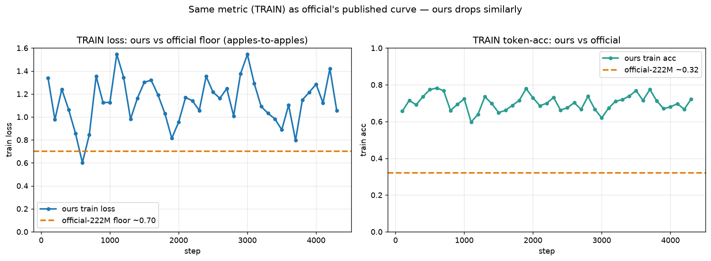
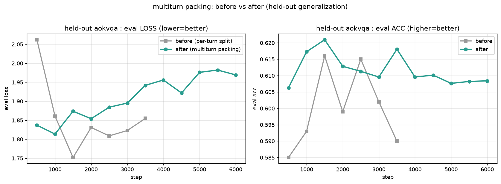
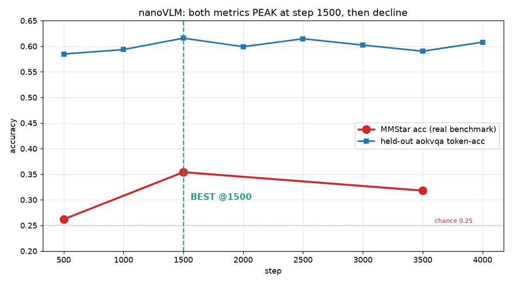
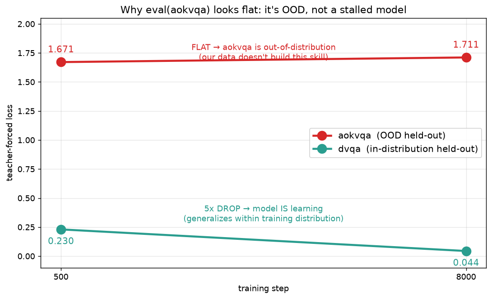
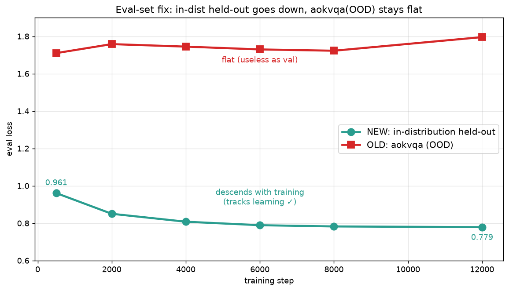
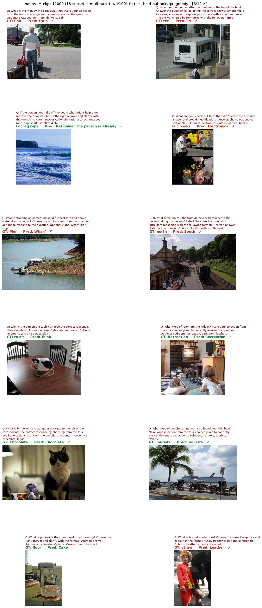
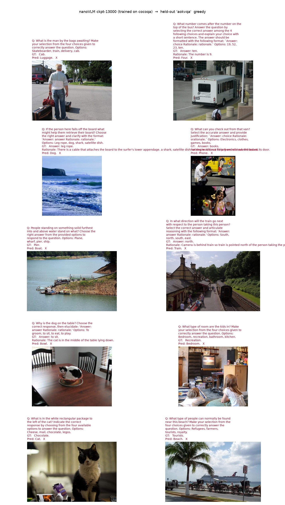
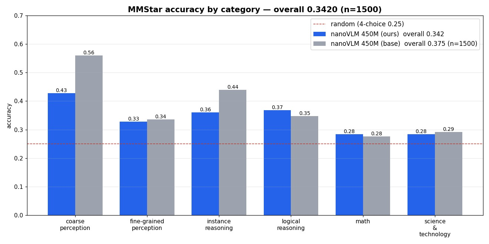

# nanoVLM — 코드 기반 전체 플로우

HuggingFace `nanoVLM` 구현을 **실제 코드 흐름** 그대로 따라가는 문서다.
학습 1스텝과 추론 1회가 코드에서 어떤 함수를 어떤 순서로 통과하는지 추적한다.

> 이 저장소는 **추론 배포본**이다. 학습 스크립트(`training/`)·하이퍼파라미터(`args/`)·
> 데이터 빌더는 들어 있지 않으므로, 본문에서 그런 파일을 가리키는 링크는 학습 저장소
> [Pierrot-VLM-Lab](https://github.com/Pierrot-vision/Pierrot-VLM-Lab) 로 연결된다.

> 백본 요약: **SigLIP2 비전 인코더 → 픽셀셔플 + 선형 프로젝터 → SmolLM2(Llama 계열) 언어 모델**.
> PaliGemma 계열과 달리 **prefix-LM 마스크가 없고**, 채팅 템플릿 기반 **일반 causal LM** 으로
> assistant 턴에만 손실을 건다. 전체 모델이 순수 PyTorch ~750줄로 끝난다.

---

## 0. 파일 지도

```
nanoVLM/
├── train.py                        # 학습 진입점 (raw PyTorch DDP 루프)
├── generate.py                     # 추론 진입점
├── evaluation.py / run_evaluation.py  # lmms-eval 연동
└── models/
│   ├── config.py                   # VLMConfig(모델 구조) / TrainConfig(실험 설정)
│   ├── vision_transformer.py       # ViT 비전 인코더 (SigLIP2 호환)
│   ├── language_model.py           # SmolLM2 계열 LM (RoPE + GQA + KVCache)
│   ├── modality_projector.py       # 픽셀셔플 + 선형 프로젝터
│   ├── vision_language_model.py    # 최상위: 병합 + forward + generate + save/load
│   └── utils.py                    # top-k/top-p 샘플링 등
└── data/
    ├── processors.py               # 토크나이저 + 이미지 프로세서 + 이미지 문자열 생성
    ├── custom_transforms.py        # DynamicResize / SplitImage / Global+Split
    ├── datasets.py                 # VQADataset (채팅 템플릿 + 손실 마스크)
    ├── collators.py                # VQACollator (좌측 패딩 + labels=-100)
    ├── advanced_datasets.py        # ConstantLengthDataset (greedy knapsack 패킹)
    └── data_utils.py               # DDP 동기화 dataloader
```

두 종류의 "config" 를 구분하는 것이 이해의 핵심이다:

| 종류 | 클래스 | 어디서 오나 | 무엇 |
|---|---|---|---|
| **모델 구조** | `VLMConfig` | [config.py](https://github.com/huggingface/nanoVLM/blob/4e0c0961846135c2217f95e54cb4c2d66eb55e42/models/config.py) | vit/lm hidden, 레이어 수, 토큰 수, 백본 repo id |
| **실험 설정** | `TrainConfig` | [config.py](https://github.com/huggingface/nanoVLM/blob/4e0c0961846135c2217f95e54cb4c2d66eb55e42/models/config.py) | lr(3그룹), batch, 스텝 수, 데이터셋, 평가 |

> PaliGemma2(Pierrot) 와 달리 nanoVLM 은 `args/paligemma2.py` 같은 단일 소스가 아니라 **두 dataclass**
> (`VLMConfig`/`TrainConfig`)를 쓰고, 일부만 argparse 로 오버라이드한다([train.py:636](https://github.com/huggingface/nanoVLM/blob/4e0c0961846135c2217f95e54cb4c2d66eb55e42/train.py#L636)).

---

## 1. 학습 전체 플로우 (train.py 진입 → 저장)

```
torchrun train.py
   │
   ├─(a) vlm_cfg = VLMConfig(); train_cfg = TrainConfig()   # 두 config 생성 + argparse 오버라이드
   │
   ├─(b) get_dataloaders(train_cfg, vlm_cfg)                # ── 데이터 파이프라인 (3절)
   │        FineVision 로드 → VQADataset → ConstantLengthDataset(패킹) → DataLoader
   │
   ├─(c) 모델 생성                                          # ── (2절)
   │        resume_from_vlm_checkpoint → VLM.from_pretrained (전체 재개)
   │        아니면 → VisionLanguageModel(cfg, load_backbone=True)  # 백본만 HF에서 로드
   │
   ├─(d) optimizer = AdamW( [MP, vision, language] 3개 param group, 각기 다른 lr )
   │        lr=0 인 그룹은 requires_grad=False 로 동결
   │
   └─(e) while global_step < max_training_steps:            # raw PyTorch 루프 (5절)
              for batch: model(input_ids, images, ...).loss → backward → step
              주기적 evaluate / save_pretrained(step_*) / sbatch eval.slurm
              종료 후 best 모델을 push_to_hub
```

관련 코드: [train.py](https://github.com/huggingface/nanoVLM/blob/4e0c0961846135c2217f95e54cb4c2d66eb55e42/train.py) · [vision_language_model.py](https://github.com/huggingface/nanoVLM/blob/4e0c0961846135c2217f95e54cb4c2d66eb55e42/models/vision_language_model.py)

---

## 2. 모델 생성 — `VisionLanguageModel(cfg, load_backbone=True)`

[vision_language_model.py:22](https://github.com/huggingface/nanoVLM/blob/4e0c0961846135c2217f95e54cb4c2d66eb55e42/models/vision_language_model.py#L22) `__init__`:

```
load_backbone=True (스크래치 학습 시작):
   self.vision_encoder = ViT.from_pretrained(cfg)          # SigLIP2 가중치 HF 로드 [2.1]
   self.decoder        = LanguageModel.from_pretrained(cfg) # SmolLM2 가중치 HF 로드 [2.2]
   self.MP             = ModalityProjector(cfg)             # 랜덤 초기화 (유일하게 새로 학습)

load_backbone=False (체크포인트 재개 / from_pretrained):
   세 모듈 모두 랜덤 구조만 만든 뒤 → model.safetensors 로 통째 로드

공통:
   self.tokenizer = get_tokenizer(...)   # 특수토큰(<|image|> 등 66개) 추가된 토크나이저
```

- **핵심 설계**: 비전·언어 백본은 **사전학습 가중치**, 프로젝터(MP)만 **랜덤**.
  그래서 학습은 세 그룹에 **서로 다른 lr** 을 준다(MP 크게, 백본 작게 — [train.py:309](https://github.com/huggingface/nanoVLM/blob/4e0c0961846135c2217f95e54cb4c2d66eb55e42/train.py#L309)).
- **저장/로드**: `save_pretrained` → `config.json`(asdict) + `model.safetensors`.
  `from_pretrained` → 로컬 폴더 or HF Hub 자동 판별 후 `load_model` ([L185](https://github.com/huggingface/nanoVLM/blob/4e0c0961846135c2217f95e54cb4c2d66eb55e42/models/vision_language_model.py#L185)).

### 2.1 ViT 백본 로드 (`ViT.from_pretrained`)
[vision_transformer.py:171](https://github.com/huggingface/nanoVLM/blob/4e0c0961846135c2217f95e54cb4c2d66eb55e42/models/vision_transformer.py#L171). HF `SiglipVisionConfig` 를 읽어
`cfg` 의 vit_* 필드를 **덮어쓴 뒤**(hidden/레이어/헤드/패치/이미지크기), HF safetensors 를
우리 모듈 이름으로 **키 매핑**해서 복사한다. 특히 HF 는 q/k/v 분리, 우리는 `qkv_proj` 통합이라
**q,k,v 를 concat** 해서 하나로 합친다([L233](https://github.com/huggingface/nanoVLM/blob/4e0c0961846135c2217f95e54cb4c2d66eb55e42/models/vision_transformer.py#L233)).

### 2.2 LM 백본 로드 (`LanguageModel.from_pretrained`)
[language_model.py:538](https://github.com/huggingface/nanoVLM/blob/4e0c0961846135c2217f95e54cb4c2d66eb55e42/models/language_model.py#L538). HF `AutoConfig` 로 lm_* 덮어쓰기 후
`model.layers.N.*` → `blocks.N.*` 매핑으로 복사. **어휘 확장이 핵심**:
VLM 은 특수토큰 66개를 더한 `lm_vocab_size`(49152+66) 를 쓰므로, 사전학습 임베딩을
**앞부분에 복사하고 뒤 66개는 정규분포로 새로 초기화**한다([L626](https://github.com/huggingface/nanoVLM/blob/4e0c0961846135c2217f95e54cb4c2d66eb55e42/models/language_model.py#L626)).
`lm_tie_weights=True` 면 `head.weight ↔ token_embedding.weight` 공유([L676](https://github.com/huggingface/nanoVLM/blob/4e0c0961846135c2217f95e54cb4c2d66eb55e42/models/language_model.py#L676)).

---

## 3. 데이터 → 배치 플로우

### 3.1 데이터 형식 (FineVision, 멀티턴 채팅)
```json
{"images": [PIL, ...],
 "texts": [{"user": "질문...", "assistant": "정답..."}, ...],
 "relevance_ratings": [...], "visual_dependency_ratings": [...], ...}
```
- `texts`: user/assistant 멀티턴. **assistant 턴만 손실** 대상.
- `*_ratings`: 품질 점수. `TrainConfig.*_min_rating` 미만 턴은 **drop** ([datasets.py:33](https://github.com/huggingface/nanoVLM/blob/4e0c0961846135c2217f95e54cb4c2d66eb55e42/data/datasets.py#L33)).

### 3.2 이미지 전처리 ([custom_transforms.py](https://github.com/huggingface/nanoVLM/blob/4e0c0961846135c2217f95e54cb4c2d66eb55e42/data/custom_transforms.py))
`get_image_processor` = `DynamicResize → ToTensor → GlobalAndSplitImages`:

```
DynamicResize        : 긴 변 ≤ max_img_size, 양 변 patch(=vit_img_size 512) 배수로 리사이즈
GlobalAndSplitImages : 512×512 타일로 분할(SplitImage) + 축소한 global 썸네일 1장 prepend
   → 반환: (patches[global+타일들], grid=(n_h, n_w))
```
- 큰 이미지는 **여러 512 타일 + global 1장**으로 쪼개진다(멀티 크롭). 1타일이면 global 생략.
- PaliGemma2 의 고정 224/448/896 과 달리 **동적 해상도·타일링**이 특징.

### 3.3 이미지 토큰 문자열 ([processors.py:27](https://github.com/huggingface/nanoVLM/blob/4e0c0961846135c2217f95e54cb4c2d66eb55e42/data/processors.py#L27))
프로세서가 프롬프트 앞에 붙일 **placeholder 문자열**을 만든다:
```
<|global_image|> <|image|>×64        # global 썸네일 = 64 토큰
<row_1_col_1>    <|image|>×64        # 각 타일 앞에 위치 토큰 + 64개 이미지 토큰
<row_1_col_2>    <|image|>×64
...
```
- `<|image|>` 하나당 프로젝터가 만들 이미지 임베딩 1개. **타일당 64개** (= `mp_image_token_length`).
- `64` 의 근거: 512/16=32 → 32×32=1024 패치, 픽셀셔플 4배 → 1024/4²=**64** ([4.2]).

### 3.4 시퀀스 + 손실 마스크 ([datasets.py:80](https://github.com/huggingface/nanoVLM/blob/4e0c0961846135c2217f95e54cb4c2d66eb55e42/data/datasets.py#L80) `VQADataset`)
채팅 템플릿을 적용해 토큰화하고, **assistant 턴 구간만 mask=1** 로 만든다:
```
apply_chat_template(messages) → input_ids
mask = 0으로 초기화 → 각 assistant 턴의 (prefix_len 이후 ~ 턴 끝)만 1
labels = input_ids.masked_fill(~mask, -100).roll(-1)   # 다음 토큰 예측용 시프트
labels[-1] = -100
```
- `prefix_len` = `<|im_start|>assistant\n` 같은 헤더 길이(손실 제외) — [datasets.py:23](https://github.com/huggingface/nanoVLM/blob/4e0c0961846135c2217f95e54cb4c2d66eb55e42/data/datasets.py#L23).
- **이미 여기서 `roll(-1)` 시프트**를 해두므로, forward 의 손실은 시프트 없이 그대로 CE.

프로세서/데이터셋이 만드는 텐서:

| 텐서 | 의미 |
|---|---|
| `images` | 샘플별 **타일 텐서 리스트** (개수 가변) |
| `input_ids` (L,) | `<|image|>` placeholder 포함 전체 시퀀스 |
| `attention_mask` (L,) | 1=유효, 0=pad |
| `labels` (L,) | assistant 토큰만 정답 id, 나머지 `-100` (시프트 완료) |

<a id="chatml"></a>

#### 3.4.1 "ChatML" 이란 — 다른 두 모델과의 위치 비교

README 비교표의 `시퀀스/마스킹` 행에서 nanoVLM 은 **ChatML** 로 표기돼 있다. 이 행은
**같은 층위가 아니라** 두 축이 섞여 있으니 구분해서 읽어야 한다:

| 축 | 무엇을 정하나 | nanoVLM | PaliGemma2 | SmolVLM2 |
|---|---|---|---|---|
| **① 시퀀스 표기법** | role/턴을 어떤 마크업으로 쓰나 | **ChatML** — `<\|im_start\|>` / `<\|im_end\|>` 특수토큰 | `<bos>` + `\n` 구분 (role 개념 없음) | 평문 `User:` / `Assistant:` |
| **② 어텐션 마스크** | 누가 누구를 볼 수 있나 | **일반 causal** | prefix-LM (4D 커스텀) | 일반 causal |

**ChatML 은 마스크가 아니라 표기 규약이다.** OpenAI 에서 유래한 대화 마크업으로,
role 경계를 특수토큰으로 명시한다:

```
<|im_start|>user\n {이미지 placeholder 문자열}{질문}<|im_end|>\n<|im_start|>assistant\n {정답}<|im_end|>\n
└──────────────── labels = -100 ────────────────┘ └──────── labels = 정답 id ────────┘
```

- 문자열을 손으로 붙이지 않고 **토크나이저의 `apply_chat_template`** 이 만든다(3.4).
- role 이 특수토큰으로 박혀 있어 **멀티턴 대화**를 그대로 표현할 수 있다. 실제로
  nanoVLM 은 턴마다 assistant 구간만 mask=1 로 켜서 **여러 턴에 동시에 손실**을 건다
  (PaliGemma2 는 prefix/suffix 단일 쌍 구조라 멀티턴 표현력이 없다).
- 헤더(`<|im_start|>assistant\n`)는 `prefix_len` 만큼 손실에서 제외한다.

**마스킹은 평범한 causal 이다.** PaliGemma 계열처럼 이미지+프롬프트를 양방향으로 여는
`(B,1,L,L)` 4D 마스크를 만들지 않는다. 이미지 토큰도 causal 안에서 처리된다.
- **장점**: 마스크 텐서를 만들 필요가 없어 SDPA 의 `is_causal` 최적화를 그대로 탄다.
  긴 시퀀스에서 PaliGemma2 의 밀집 prefix mask 메모리 부담이 없다.
- **단점**: 앞쪽 이미지 패치가 뒤쪽 패치를 못 본다(이해 태스크에서 prefix-LM 대비 불리할 수 있음).
- 이 성질 덕분에 **시퀀스 패킹**(3.5)이 자연스럽게 성립한다 — 여러 샘플을 한 시퀀스에
  이어붙여도 causal 이라 앞 샘플이 뒤 샘플에 영향을 주지 않는다(PaliGemma2 는 1샘플=1시퀀스).

**공통점**: 세 모델 모두 **손실 마스킹 원리는 동일** — 이미지·프롬프트·pad = `-100`,
정답(assistant/suffix) 토큰에만 cross-entropy. 단 nanoVLM 은 라벨을 데이터셋 단계에서
이미 `roll(-1)` 시프트해 둔다(3.4).

### 3.5 시퀀스 패킹 — `ConstantLengthDataset` ([advanced_datasets.py](https://github.com/huggingface/nanoVLM/blob/4e0c0961846135c2217f95e54cb4c2d66eb55e42/data/advanced_datasets.py))
짧은 샘플들을 **고정 길이(`lm_max_length`)로 묶어** 패딩 낭비를 줄인다:
```
백그라운드 스레드가 raw 샘플 buffer 채움 (너무 길거나 이미지 과다 샘플 skip)
 → _balanced_greedy_knapsack : 길이+이미지수 두 제약으로 그리디 knapsack 배분
 → _pack_one_group           : 한 knapsack 의 샘플들을 이어붙여 seq_length 시퀀스 1개 생성
```
- 제약: `max_sample_length`(개별), `max_images_per_example`, `max_images_per_knapsack`.
- PaliGemma2 의 1샘플=1시퀀스와 달리 **여러 샘플을 한 시퀀스에 패킹**한다(cauldron 스타일).

### 3.6 Collate ([collators.py](https://github.com/huggingface/nanoVLM/blob/4e0c0961846135c2217f95e54cb4c2d66eb55e42/data/collators.py) `VQACollator`)
배치를 **좌측 패딩**(`pad=(max-len, 0)`)해 stack. labels 패딩은 **`-100`** 으로 채워 손실 제외.
`images` 는 stack 하지 않고 **리스트로 유지**(샘플마다 타일 수가 달라서).

### 3.7 DDP 동기화 ([data_utils.py](https://github.com/huggingface/nanoVLM/blob/4e0c0961846135c2217f95e54cb4c2d66eb55e42/data/data_utils.py))
`synchronized_dataloader_step`: 패킹 결과가 rank마다 개수가 달라 한 rank가 먼저 소진되면
DDP 데드락이 난다. `all_reduce(MIN)` 으로 **한 rank라도 소진되면 전원 정지**시킨다.
이미지 0개 배치도 걸러 파라미터 미사용으로 인한 DDP 데드락을 막는다.

---

## 4. 모델 forward — `VisionLanguageModel.forward`

[vision_language_model.py:62](https://github.com/huggingface/nanoVLM/blob/4e0c0961846135c2217f95e54cb4c2d66eb55e42/models/vision_language_model.py#L62) `forward(input_ids, images, attention_mask, targets)`:

```
(1) 텍스트 임베딩
    token_embd = decoder.token_embedding(input_ids)  # <|image|> 자리도 임시 임베딩  [4.0]

(2) 이미지 인코딩 (images 있으면)
    images_tensor = _process_images(images)          # 리스트의 모든 타일을 cat → (N,3,512,512)
    image_embd = vision_encoder(images_tensor)       # ViT      (N,1024,768)          [4.1]
    image_embd = MP(image_embd)                      # 픽셀셔플+선형 (N,64,960)        [4.2]

(3) 이미지 병합 (_replace_img_tokens_with_embd)      #                                  [4.3]
    mask = (input_ids == image_token_id)
    token_embd[mask] = image_embd.view(-1, D)        # <|image|> 자리를 순서대로 교체

(4) 언어 모델
    logits, _ = decoder(token_embd, attention_mask)  # SmolLM2, 임베딩 입력 모드         [4.4]

(5) 손실 (targets 있을 때)                            #                                  [4.5]
    logits = decoder.head(logits)                    # 임베딩 → vocab logits (여기서만 head)
    loss = cross_entropy(logits, targets, ignore_index=-100)   # 시프트는 3.4에서 이미 완료
    return logits, loss
```

### 4.0 텍스트와 이미지는 **별개 경로**로 인코딩된다
`ViT` 는 **이미지만**, `token_embedding` 은 **텍스트만** 인코딩한 뒤 병합한다.
PaliGemma2 와 개념은 같지만 병합 방식이 다르다(scatter+sqrt 트릭 없음).

```
이미지  images(타일 리스트) ─► ViT(vision_encoder) ─► ModalityProjector ─┐
                             (패치→특징, 1024토큰)   (픽셀셔플로 64토큰, 960차원) │ 병합
                                                                              ▼ boolean mask 대입
텍스트  input_ids ──────────► token_embedding (nn.Embedding, LM 안) ─► 텍스트 임베딩 ┘  <|image|> 자리에
                             (토큰 id → 960 벡터)                                     이미지 특징 삽입
```

| # | 단계 | 코드 |
|---|---|---|
| ① | 텍스트: 토큰 id → 임베딩 | [vision_language_model.py:64](https://github.com/huggingface/nanoVLM/blob/4e0c0961846135c2217f95e54cb4c2d66eb55e42/models/vision_language_model.py#L64) `token_embedding(input_ids)` |
| ② | 타일 패치 → 특징 인코딩 | [vision_language_model.py:67](https://github.com/huggingface/nanoVLM/blob/4e0c0961846135c2217f95e54cb4c2d66eb55e42/models/vision_language_model.py#L67) `vision_encoder(images_tensor)` |
| ③ | 픽셀셔플 + 960차원 투영 | [vision_language_model.py:68](https://github.com/huggingface/nanoVLM/blob/4e0c0961846135c2217f95e54cb4c2d66eb55e42/models/vision_language_model.py#L68) `MP(image_embd)` |
| ④ | `<|image|>` 자리에 대입 | [vision_language_model.py:36-49](https://github.com/huggingface/nanoVLM/blob/4e0c0961846135c2217f95e54cb4c2d66eb55e42/models/vision_language_model.py#L36-L49) `_replace_img_tokens_with_embd` |

> `generate`(추론)에서도 동일한 ①~④ 가 프리필에 반복된다: [vision_language_model.py:85-92](https://github.com/huggingface/nanoVLM/blob/4e0c0961846135c2217f95e54cb4c2d66eb55e42/models/vision_language_model.py#L85-L92).

### 4.1 ViT 비전 인코더 ([vision_transformer.py](https://github.com/huggingface/nanoVLM/blob/4e0c0961846135c2217f95e54cb4c2d66eb55e42/models/vision_transformer.py))
```
pixel_values (N,3,512,512)
  → Conv2d(patch=16, stride=16)  → 패치 (N,1024,768)   # CLS 없음(vit_cls_flag=False)
  → + 학습형 위치 임베딩
  → 12 × [pre-norm 셀프어텐션(마스크 없음, 완전 양방향) + MLP(gelu-tanh)]
  → post LayerNorm  (전체 시퀀스 유지, mean pooling 안 함)
  ⇒ (N,1024,768)
```
- SigLIP 계열: **CLS 토큰 없음**, `qkv_proj` 통합, SDPA(`is_causal=False`) 사용.

<a id="projector"></a>
### 4.2 픽셀셔플 프로젝터 ([modality_projector.py](https://github.com/huggingface/nanoVLM/blob/4e0c0961846135c2217f95e54cb4c2d66eb55e42/models/modality_projector.py))
```
x (N,1024,768)
  → pixel_shuffle(factor=4)  : 32×32 격자를 4×4 블록으로 묶어 공간→채널
                               (N, 64, 768×16=12288)      # 토큰 1024→64, 채널 768→12288
  → Linear(12288 → 960)      : LM hidden 차원으로 투영     (N,64,960)
```
- **토큰 수를 16배 압축**(1024→64)해 LM 시퀀스 부담을 줄이는 게 핵심.
- `mp_image_token_length=64` 는 여기 출력 토큰 수와 정확히 일치해야 한다(3.3 placeholder 개수).

### 4.3 이미지 병합 (`_replace_img_tokens_with_embd`)
`input_ids == image_token_id` 불리언 마스크 위치에 `image_embd` 를 **순서대로 flat 대입**.
PaliGemma2 의 `masked_scatter` + `/sqrt(hidden)` 스케일 트릭은 **없다**(SmolLM2는 임베딩 스케일업이 없음).
멀티 이미지·타일도 flatten 순서로 자연스럽게 채워진다.

<a id="decoder"></a>

### 4.4 SmolLM2 언어 모델 ([language_model.py](https://github.com/huggingface/nanoVLM/blob/4e0c0961846135c2217f95e54cb4c2d66eb55e42/models/language_model.py))
```
inputs_embeds (lm_use_tokens=False → 임베딩을 그대로 입력)
  → 32 × LanguageModelBlock
  → 최종 RMSNorm
  → (head 는 forward 밖에서: VLM.forward 가 손실 계산 직전에만 적용)
```
**LanguageModelBlock** (Llama 스타일, pre-norm 2개):
```
h ─┬─ RMSNorm(norm1) ─ GQA self_attn ─┬─ (+)
   └────── residual ──────────────────┘
h ─┬─ RMSNorm(norm2) ─ MLP(SwiGLU) ───┬─ (+)
   └────── residual ──────────────────┘
```
**self_attn** (`LanguageModelGroupedQueryAttention`):
- **GQA**: Q 15헤드 / KV 5헤드 → `repeat_interleave` 로 KV 확장
- **RoPE**: Q,K 회전. 길이 초과 시 inv_freq 스케일 다운(동적 확장)
- **causal**: SDPA `is_causal`(프리필 시) + padding additive 마스크. soft-capping 없음
- **KVCache**: 블록마다 `{'key','value'}` dict 를 시퀀스 축으로 concat ([L239](https://github.com/huggingface/nanoVLM/blob/4e0c0961846135c2217f95e54cb4c2d66eb55e42/models/language_model.py#L239))

> Gemma2 와 달리 **soft-capping / sliding window / 4-RMSNorm sandwich 없음** — 순수 Llama형.
> `lm_use_tokens=False` 라서 VLM 백본으로 쓸 때 LM 은 **임베딩 in / 임베딩 out**, head 는 밖에서 적용.

### 4.5 손실
```
logits = decoder.head(logits)          # 임베딩 → vocab
loss = cross_entropy(logits.reshape(-1, V), targets.reshape(-1), ignore_index=-100)
```
`targets`(labels)는 3.4 에서 이미 **시프트 + assistant 외 -100** 처리됨 → **assistant 토큰에만** 손실.

---

## 5. 학습 루프 — `train()` (raw PyTorch DDP)

[train.py:264](https://github.com/huggingface/nanoVLM/blob/4e0c0961846135c2217f95e54cb4c2d66eb55e42/train.py#L264). **Accelerate/Lightning 미사용** — `torch.distributed` 를 직접 다룬다.

```
준비:
   AdamW( 3 param group: MP / vision / language, 각기 다른 lr )   # lr=0 → 동결
   model.to(device); (선택) torch.compile; DDP wrap
   autocast(bf16)

while global_step < max_training_steps:
   for i, batch in synchronized_dataloader_step(iter_train_loader):   # 3.7 DDP 동기화
      is_update_step = (i+1) % grad_accum == 0
      with autocast(bf16), (no_sync if 누적중):
         _, loss = model(input_ids, images, attention_mask, targets=labels)   # 4절
      loss = loss / grad_accum
      loss.backward()
      if is_update_step:
         clip_grad_norm_(max_grad_norm)
         각 param group lr = get_lr(global_step)   # warmup(3%) + cosine, 그룹별 max_lr
         optimizer.step(); zero_grad()
         global_step += 1
      # 주기적: evaluate(val 64배치) → save_pretrained(step_*) → sbatch eval.slurm → wandb 로그

종료: best_val_loss 체크포인트를 from_pretrained 후 push_to_hub
```

- **유효 배치** = `batch_size × grad_accum × GPU수` (+ 각 시퀀스가 여러 샘플 패킹됨)
- **LR 스케줄**: Karpathy식 warmup+cosine([train.py:249](https://github.com/huggingface/nanoVLM/blob/4e0c0961846135c2217f95e54cb4c2d66eb55e42/train.py#L249)), 그룹별로 개별 적용.
- **DDP 최적화**: 누적 중간 스텝은 `model.no_sync()` 로 grad all-reduce 생략([train.py:389](https://github.com/huggingface/nanoVLM/blob/4e0c0961846135c2217f95e54cb4c2d66eb55e42/train.py#L389)).
- **평가**: in-loop val loss + 별도 `eval.slurm` 잡으로 lmms-eval(mmstar/docvqa/...) 비동기 실행.

---

## 6. 추론 전체 플로우 (generate.py)

```
python generate.py --hf_model lusxvr/nanoVLM-230M-8k --image assets/image.png --prompt "What is this?"
   │
   ├─ VisionLanguageModel.from_pretrained(source)     # 2절 (로컬/HF 자동)
   ├─ image_processor(img) → (타일들, grid)            # 3.2 DynamicResize+Split
   ├─ image_string = get_image_string(...)            # 3.3 placeholder 문자열
   ├─ apply_chat_template([{user: image_string+prompt}], add_generation_prompt=True)
   └─ model.generate(tokens, img_t, max_new_tokens)   # KV 캐시 autoregressive
```

`generate` ([vision_language_model.py:82](https://github.com/huggingface/nanoVLM/blob/4e0c0961846135c2217f95e54cb4c2d66eb55e42/models/vision_language_model.py#L82)):
```
프리필(step 0):
   이미지 병합된 token_embd + attention_mask → decoder(start_pos=0)
   KVCache 저장, 마지막 토큰 임베딩 → head → logits → 다음 토큰
   (lm_use_tokens=False 이므로 head 를 여기서 명시 적용)

디코드(step ≥ 1):
   새 토큰 1개만 임베딩, KVCache 재사용, start_pos=현재 위치, attention_mask 1칸 확장
   greedy(argmax) 또는 top-k/top-p 샘플링([utils.py](https://github.com/huggingface/nanoVLM/blob/4e0c0961846135c2217f95e54cb4c2d66eb55e42/models/utils.py))

후처리:
   첫 <eos> 이후 토큰을 전부 eos로 마스킹 → batch_decode(skip_special_tokens=True)
```

### 6.1 KV 캐시 상세 (`kv_cache`)

nanoVLM 은 **별도 `KVCache` 클래스가 없다.** 그냥 **블록별 dict 의 파이썬 리스트**를 forward 인자로
넘기며 갱신한다([language_model.py:419](https://github.com/huggingface/nanoVLM/blob/4e0c0961846135c2217f95e54cb4c2d66eb55e42/models/language_model.py#L419) `forward(..., kv_cache, start_pos)`).

```
자료구조:  kv_cache = [ {'key': K_i, 'value': V_i}, ... ]   # 블록 i마다 dict 1개
           K_i, V_i shape = (B, n_kv_heads=5, T_누적, head_dim)

블록 GQA.forward ([language_model.py:207]):
   is_prefill = (block_kv_cache is None)
   q,k,v ← 현재 입력 x 에서 계산 → RoPE 적용
   if 캐시 있음:                       # 디코드
       k = cat([cache['key'],  k_rotated], dim=2)   # 시퀀스 축으로 이어붙임
       v = cat([cache['value'], v_curr],   dim=2)
   else:                               # 프리필
       k, v = k_rotated, v_curr
   cache['key'], cache['value'] = k, v              # 갱신해서 그대로 반환
   k,v ← repeat_interleave(n_kv_groups)             # GQA 확장은 캐시 "밖"에서
```

구현 포인트 4가지:
- **회전된 K 를 캐싱**한다(`k_rotated`). RoPE 를 삽입 시점에 한 번만 적용해 저장하므로 재계산 없음
  ([language_model.py:244](https://github.com/huggingface/nanoVLM/blob/4e0c0961846135c2217f95e54cb4c2d66eb55e42/models/language_model.py#L244)). GQA 의 `repeat_interleave` 는 캐시 후에 하므로
  **캐시는 5헤드(KV) 크기**로 작게 유지된다([language_model.py:255](https://github.com/huggingface/nanoVLM/blob/4e0c0961846135c2217f95e54cb4c2d66eb55e42/models/language_model.py#L255)).
- **`start_pos` ↔ RoPE 연동**: 캐시엔 위치 정보가 없다. 대신 디코드 때 `start_pos=현재_누적_길이` 를 줘서
  새 토큰의 position_ids 를 맞춘다([language_model.py:464](https://github.com/huggingface/nanoVLM/blob/4e0c0961846135c2217f95e54cb4c2d66eb55e42/models/language_model.py#L464), 호출부 [vision_language_model.py:130](https://github.com/huggingface/nanoVLM/blob/4e0c0961846135c2217f95e54cb4c2d66eb55e42/models/vision_language_model.py#L130)).
- **`is_causal` 자동 전환**: `is_causal = (T_curr == T_kv and T_curr > 1)` — 프리필(멀티토큰)만 True,
  디코드(토큰 1개)는 False. 새 토큰은 캐시 전체를 봐도 자연히 causal 이라 마스크 불필요([language_model.py:272](https://github.com/huggingface/nanoVLM/blob/4e0c0961846135c2217f95e54cb4c2d66eb55e42/models/language_model.py#L272)).
- **패딩 마스크만 별도 처리**: `attention_mask[:, :T_kv]` 를 additive 마스크로 변환해 pad 키 차단
  ([language_model.py:266](https://github.com/huggingface/nanoVLM/blob/4e0c0961846135c2217f95e54cb4c2d66eb55e42/models/language_model.py#L266)). 디코드마다 mask 를 1칸씩 확장([vision_language_model.py:135](https://github.com/huggingface/nanoVLM/blob/4e0c0961846135c2217f95e54cb4c2d66eb55e42/models/vision_language_model.py#L135)).

> 캐시는 **길이 상한·eviction 이 없다** — 매 스텝 concat 으로 무한히 자란다(nano 답게 단순).
> 별도 `KVCache` 객체를 두는 PaliGemma2(gemma2.py) 와 달리, nanoVLM 은 **dict 리스트**만으로 끝낸다.

---

## 7. 텐서 shape 흐름 요약 (SigLIP2-B/16-512 + SmolLM2-360M 기준)

```
이미지  타일 (N,3,512,512)
  └ ViT         → (N,1024,768)
  └ 픽셀셔플     → (N,64,12288)
  └ Linear      → (N,64,960)          ─┐
텍스트  input_ids (L,)                  │ 병합
  └ token_embed → (L,960)             ─┘ <|image|> 자리(타일당 64개) 교체
               → SmolLM2 32층 → (L,960)
               → head → logits (L,vocab)
               → CE(ignore=-100, 시프트 완료) → loss (스칼라)
```

| 이름 | 값 (기본 config) |
|---|---|
| 이미지 크기 / 패치 | 512 / 16 → 타일당 패치 **1024** |
| 픽셀셔플 배수 | 4 → 이미지 토큰 **64/타일** (`mp_image_token_length`) |
| ViT hidden / 레이어 / 헤드 | 768 / 12 / 12 |
| SmolLM2 hidden / 중간 / 레이어 | 960 / 2560 / 32 |
| SmolLM2 헤드 (Q/KV) | 15 / 5 (GQA) |
| vocab | 49152 + **66**(특수토큰) = 49218 |
| 특수토큰 | `<|image|>`, `<|global_image|>`, `<row_i_col_j>`(8×8) |

---

## 8. 한눈에 보는 전체 그림

```
        VLMConfig(구조) + TrainConfig(실험)
                        │
        ┌───────────────┴──────────────────┐
        ▼                                   ▼
   VisionLanguageModel                 train() ── raw PyTorch DDP 루프
   ├ ViT.from_pretrained (SigLIP2)      └ for batch: model(...).loss
   ├ LM.from_pretrained (SmolLM2)           ├ backward / clip / step (3 lr group)
   │   └ 어휘 +66 확장 + weight tie          └ save_pretrained(step_*) → push_to_hub
   ├ ModalityProjector (랜덤, 학습대상)            │
   └ tokenizer (+특수토큰 66개)                    ▼
        │                            checkpoints/<run>/step_*/{config.json, model.safetensors}
        └── FineVision → VQADataset → ConstantLengthDataset(knapsack 패킹) → VQACollator
                                                        │
                                                        ▼
                              generate.py: from_pretrained → generate (KV캐시)
```

**PaliGemma2(Pierrot) 와의 핵심 차이 5가지**:
1. **prefix-LM 마스크 없음** → 일반 causal + **채팅 템플릿 assistant 턴만 손실** ([3.4], [4.5])
2. **픽셀셔플로 이미지 토큰 16배 압축**(1024→64) + **동적 해상도·타일링** ([4.2], [3.2])
3. **`sqrt(hidden)` 스케일 트릭 없음** — 불리언 마스크 대입으로 병합 ([4.3])
4. **여러 샘플을 한 시퀀스에 knapsack 패킹**(ConstantLengthDataset) ([3.5])
5. **3개 param group 서로 다른 lr**(MP/vision/language) + raw PyTorch DDP(Accelerate 미사용) ([5])

---

## 9. 원조(v0.1/222M) → 현재(450M) 네트워크 수정 이력

> **먼저 사실 확인**: 로컬 nanoVLM 클론은 upstream `huggingface/nanoVLM`(origin/main)과
> **완전히 동일**하다(`git diff origin/main` 비어 있음, working tree clean). **로컬에서 손댄 네트워크 코드는 없다.**
>
> 아래는 nanoVLM **저자들이 직접 바꾼** "원조 v0.1(222M) → 현재(450M)" 변경 이력 중,
> 데이터/파일 구조가 아니라 **실제 모델 네트워크(forward) 자체를 수정한** 부분만 추린 것이다.
> 근거: [README.md](https://github.com/huggingface/nanoVLM/blob/4e0c0961846135c2217f95e54cb4c2d66eb55e42/README.md) 의 2025-06-04 breaking-change 노트 + 현재 코드.

### 9.1 (핵심) 이미지·텍스트 임베딩 **결합 방식** 교체
README가 명시한 breaking change 의 본체다. *"이미지·텍스트 임베딩을 결합하는 방식을 리팩터링했다."*

| | 원조 v0.1 (222M) | 현재 (450M) |
|---|---|---|
| 결합 방법 | 이미지 임베딩을 텍스트 **앞에 concat**(고정 prefix) | `<\|image\|>` placeholder 를 `input_ids` 에 심고 **그 자리에 in-place 대입** |
| 이미지 토큰 수 | 샘플당 **고정** | 타일 수만큼 **가변**(멀티 이미지 OK) |
| 결과 | 1샘플=1시퀀스만 가능 | **여러 샘플·이미지 패킹 가능**([3.5] knapsack의 전제) |

- 현재 구현: [`_replace_img_tokens_with_embd`](https://github.com/huggingface/nanoVLM/blob/4e0c0961846135c2217f95e54cb4c2d66eb55e42/models/vision_language_model.py#L36) — `mask=(input_ids==image_token_id)` 위치에 flat 대입.
- 이 한 줄의 변경이 [3.5]의 시퀀스 패킹, [3.3]의 `<|image|>` placeholder 문자열 방식을 가능하게 한 **뿌리**다.
  (원조는 임베딩을 물리적으로 이어붙였기 때문에 패킹이 불가능했다.)

### 9.2 픽셀셔플 + 타일링 도입 (프로젝터·비전 경로 변경)
원조는 **224 단일 이미지 → 고정 패치 수**였으나, 현재는:
- 입력: 동적 512 타일 분할 + global 썸네일([3.2]) → **가변 개수 타일**이 ViT로 들어감.
- 프로젝터: 단순 선형이 아니라 [`pixel_shuffle`](https://github.com/huggingface/nanoVLM/blob/4e0c0961846135c2217f95e54cb4c2d66eb55e42/models/modality_projector.py#L23) 로 **1024→64 토큰 압축** 후 선형([4.2]).

→ nn.Module `forward` 자체가 바뀐 실제 네트워크 수정이다(공간→채널 재배열 연산 추가).

### 9.3 LM 이중 모드 — `lm_use_tokens=False` 로 head 외부화
LM 이 **임베딩 in / 임베딩 out** 모드를 갖도록 forward 를 수정([language_model.py:457](https://github.com/huggingface/nanoVLM/blob/4e0c0961846135c2217f95e54cb4c2d66eb55e42/models/language_model.py#L457), [L477](https://github.com/huggingface/nanoVLM/blob/4e0c0961846135c2217f95e54cb4c2d66eb55e42/models/language_model.py#L477)).
VLM 백본으로 쓸 때 `head` 를 LM 밖(손실 직전)에서 적용([vision_language_model.py:75](https://github.com/huggingface/nanoVLM/blob/4e0c0961846135c2217f95e54cb4c2d66eb55e42/models/vision_language_model.py#L75)) → 병합된 이미지 임베딩을 그대로 흘려보낼 수 있게 하는 네트워크 레벨 스위치.

### 9.4 어휘 확장 + 임베딩 이식 수술
특수토큰(`<|image|>`, `<|global_image|>`, `<row_i_col_j>` 8×8) 추가로 vocab 이 커지면서,
`from_pretrained` 가 **사전학습 임베딩을 앞부분에 복사 + 나머지 신규 토큰만 정규분포 재초기화 + head 동기화**
하도록 수정([language_model.py:626-638](https://github.com/huggingface/nanoVLM/blob/4e0c0961846135c2217f95e54cb4c2d66eb55e42/models/language_model.py#L626-L638)). vanilla `load_state_dict` 를 그대로 못 쓰는 지점.

### 9.5 참조 구현(vanilla) 대비 네트워크 세부 수정
표준 SigLIP/Llama 구현을 그대로 쓰지 않고 손본 곳(수학은 동일하나 forward 코드가 다름):

| 부위 | 표준(참조) | nanoVLM 수정 | 코드 |
|---|---|---|---|
| ViT QKV | HF SigLIP: `q/k/v` 분리 | **`qkv_proj` 융합** (로드 시 concat) | [vision_transformer.py:58](https://github.com/huggingface/nanoVLM/blob/4e0c0961846135c2217f95e54cb4c2d66eb55e42/models/vision_transformer.py#L58), [L233](https://github.com/huggingface/nanoVLM/blob/4e0c0961846135c2217f95e54cb4c2d66eb55e42/models/vision_transformer.py#L233) |
| ViT 출력 | CLS 풀링 or mean | **CLS 없음, 전체 패치 시퀀스 반환** | [vision_transformer.py:162-166](https://github.com/huggingface/nanoVLM/blob/4e0c0961846135c2217f95e54cb4c2d66eb55e42/models/vision_transformer.py#L162-L166) |
| RoPE | 고정 inv_freq | **동적 스케일링**(길이 초과 시 `inv_freq/scale`) | [language_model.py:87-92](https://github.com/huggingface/nanoVLM/blob/4e0c0961846135c2217f95e54cb4c2d66eb55e42/models/language_model.py#L87-L92) |
| GQA | — | `repeat_interleave` 로 KV 확장, **soft-capping·sliding window 없음**(Gemma2와 대비) | [language_model.py:255](https://github.com/huggingface/nanoVLM/blob/4e0c0961846135c2217f95e54cb4c2d66eb55e42/models/language_model.py#L255) |

> 요약: **로컬 저장소에는 별도 개조가 없다.** 위 9.1~9.5 는 nanoVLM 저자들이 원조 대비 바꾼
> 네트워크 수정이며, 그중 **9.1(임베딩 결합 방식)** 이 나머지 패킹·타일링을 가능하게 한 핵심 변경이다.

---

# 10. Pierrot_VLM 이식 & 학습 실험 로그 (2026-07-31 ~ 08-01)

원조 nanoVLM 을 Pierrot_VLM 플러그인으로 이식하고 FineVision 으로 스크래치 학습을 돌린
전 과정의 실험 노트. **"loss 가 원조만큼 안 떨어진다 → nanoVLM 이 문제 아니냐"** 는 의심을
코드 리뷰로 추적해 실제 원인(멀티턴 패킹 + 과적합)을 찾고 고친 기록이 핵심이다.

## 10.1 이식 개요

`pierrot/models/nanovlm/` 에 독립 플러그인으로 이식(기존 paligemma2 학습 무영향).
- 모델: [modeling/vision_transformer.py](../pierrot/models/nanovlm/modeling/vision_transformer.py) · [language_model.py](../pierrot/models/nanovlm/modeling/language_model.py) · [modality_projector.py](../pierrot/models/nanovlm/modeling/modality_projector.py) · [vision_language_model.py](../pierrot/models/nanovlm/modeling/vision_language_model.py)
- 데이터/프로세서: [processor.py](../pierrot/models/nanovlm/processor.py) · [transforms.py](../pierrot/models/nanovlm/transforms.py) · [dataset.py](https://github.com/Pierrot-vision/Pierrot-VLM-Lab/blob/main/pierrot/models/nanovlm/dataset.py)
- 로드/스펙: [weights.py](../pierrot/models/nanovlm/weights.py) · [spec.py](https://github.com/Pierrot-vision/Pierrot-VLM-Lab/blob/main/pierrot/models/nanovlm/spec.py)
- 엔트리: [training/train_nanovlm.py](https://github.com/Pierrot-vision/Pierrot-VLM-Lab/blob/main/training/train_nanovlm.py) · [infer/infer_nanovlm.py](../infer/infer_nanovlm.py) · 설정 단일소스 [args/nanovlm.py](https://github.com/Pierrot-vision/Pierrot-VLM-Lab/blob/main/args/nanovlm.py)
- 공유: [pierrot/data/finevision.py](https://github.com/Pierrot-vision/Pierrot-VLM-Lab/blob/main/pierrot/data/finevision.py)(FineVision, smolvlm2 와 공유) · [pierrot/data/detection.py](https://github.com/Pierrot-vision/Pierrot-VLM-Lab/blob/main/pierrot/data/detection.py)
- forward 계약: 학습 `{loss, token_acc}` / 추론 `{logits}`. 옵티마이저는 3그룹 LR(mp/vision/language) 훅.

## 10.2 데이터 인프라 — 스트리밍 지옥 → 로컬 캐시

FineVision(`HuggingFaceM4/FineVision`, 185 subset / **4.65TB**)을 학습 소스로 사용.

- **⚠ 스트리밍(iterable=True) 실패**: 500MB parquet 샤드를 매 스텝 받다 연결이 끊겨
  `IncompleteRead` 무한 재시도 → **GPU 0%**. 특히 `allava_laion`(734샤드/367GB)·`allava_vflan`(186/93GB)이
  전체 940샤드 중 920개를 차지하는 원흉.
- **✅ 해결 = 로컬 사전 다운로드 + 비스트리밍 캐시**:
  [scripts/download_finevision_local.py](https://github.com/Pierrot-vision/Pierrot-VLM-Lab/blob/main/scripts/download_finevision_local.py)(snapshot_download, 재개/재시도) 로
  필요 subset parquet 만 `/data1/hf_cache`(HF_HOME) 에 받아두고, `finevision_iterable=False`(캐시 모드)로 로컬 읽기.
  → 모든 샤드가 캐시에 있으면 load_dataset 은 큰 GET 없이 작은 etag 확인만 함(재다운로드 0MB 확인).
- **디스크 함정**: 캐시 모드는 subset config '전체'를 arrow 로 빌드 → parquet 만큼 arrow 가 또 쌓임.
  전체(4.65TB)+arrow(~4.65TB)=~9.3TB 라 불가능 → **거대 subset 제외**하고 중소형만 선별.
- **arrow 프리워밍**: [scripts/prewarm_finevision_arrow.py](https://github.com/Pierrot-vision/Pierrot-VLM-Lab/blob/main/scripts/prewarm_finevision_arrow.py) 로 18 subset arrow 를
  미리 구워 첫 학습 시작의 "Generating train split" 스톨(~15–25분) 제거.

## 10.3 학습셋 변천

| 단계 | subset | 비고 |
|---|---|---|
| 초기 | cocoqa 단일 | train loss 0.0002 / acc 1.0 **암기**, held-out 전부 오답 → **데이터 문제**(모델 아님) |
| 확장1 | QA 12개 | cocoqa,clevr,chartqa,dvqa,docvqa,figureqa,textvqa,scienceqa,ai2d_merged,infographic_vqa,ocrvqa,mmevol |
| 확장2 | + 대화형 6개 | LLaVA_Instruct_150K, sharegpt4o, sharegpt4v(sam), cambrian(filtered)_processed, image_textualization(filtered), visualwebinstruct(filtered) → **일반 주제 대화** 능력 |

- 공통 설정: `max_img_size=1024`(원조 2048 축소, 속도), batch 8 × grad_accum 8 × 분산 = **eff batch 512**(원조와 동일),
  `max_steps=12000`(원조 40000), held-out eval = `aokvqa`(학습에 없음).

## 10.4 평가 하니스 — MMStar 자체 구현

[eval/eval_nanovlm_bench.py](../eval/eval_nanovlm_bench.py) 신규. 원조는 무거운 lmms-eval 을 쓰지만
MMStar(1500 객관식, 정답 내장)는 자체 채점 가능.
- **2모드**: `likelihood`(각 선택지 로그확률 argmax — 장황한 초기 모델도 공정, 권장) / `generate`(원조 프로토콜, 글자 생성).
  초기 체크포인트는 generate 가 심하게 과소평가(ckpt500: gen **7%** vs loglik **30%**).
- accelerate 체크포인트(checkpoint-N: config.json 없이 model.safetensors만)도 로드 — args 로 아키텍처 세우고
  가중치 얹은 뒤 **`model.tie_weights()` 필수**(head↔embed tying 이라 head 미저장).
- eval 은 **fp32 가중치 + bf16 autocast**(순수 bf16 은 RoPE cos/sin=fp32 가 q,k 승격 → SDPA dtype 불일치로 죽음).
- 결과: `results/nanovlm/` 에 JSON + 큰폰트 단일 HTML(이미지 썸네일 포함).

## 10.5 "loss 가 원조만큼 안 떨어진다" → 5-way 코드 리뷰

의심: 우리 loss 바닥이 ~1.1 인데 원조는 ~0.7. **데이터가 문제 아니면 비슷하게 떨어져야 하는데 아니다 → 포트 결함?**

먼저 원조 loss 곡선(`nanoVLM/assets/nanoVLM-222M-loss.png`)을 정확히 읽음:
그건 **train batch_loss**(4.5→~0.7@**30k**) + train acc(→0.32)이며 **val/OOD 곡선은 없다**.
→ **같은 스텝이면 우리≈원조**(원조도 5k 에서 batch_loss≈1.0, 우리 4.6k≈1.1). 0.7 은 원조가 40k 까지 갈아서 도달.
즉 "우리 1.1 vs 원조 0.7" 은 우리 4.6k 를 원조 30k 와 비교한 **불공정 대조**였다.



그 위에서 원조(`nanoVLM` 로컬 체크아웃) 대비 **컴포넌트별 병렬 코드 리뷰 5개** 실시:

| 컴포넌트 | 결과 |
|---|---|
| 모달리티 프로젝터 + 이미지토큰 병합 | ✅ 등가(픽셀셔플 reshape, 64토큰/타일, id 배선) |
| 비전 인코더 + 전처리 | ✅ 라인 단위 동일(정규화 ToTensor만, 타일 순서) — max_img 1024만 의도적 |
| 언어모델 + 어텐션 | ✅ 등가(RoPE·GQA·RMSNorm·SwiGLU·좌측패딩 SDPA 오차 6e-8·weight tying) |
| loss 수학(시프트/마스킹) | ✅ 등가(원조 `roll(-1)`+무시프트 = 우리 미시프트+내부시프트, off-by-one 없음, 이미지/프롬프트 -100) |
| 옵티마이저/LR/파라미터그룹 | ✅ LR값·3그룹배정·코사인 스케줄 모양 동일. **but** max_steps 12k vs 40k, weight_decay 0 vs 0.01 |

**결론: 모델 포트는 정상.** loss 갭의 원인은 (1) 학습길이 12k vs 40k, (2) 아래 멀티턴 패킹, (3) max_img·데이터캡·weight_decay.

## 10.6 발견된 유일한 실제 결함 — 멀티턴 패킹 & 수정 ★

loss/라벨 리뷰가 찾은 진짜 divergence(모델 아니라 **데이터 파이프라인**):

| | 원조 | 우리(수정 전) |
|---|---|---|
| 멀티턴 대화 | `[u0,a0,u1,a1,…]` **한 시퀀스**, 이미지 1회, 모든 assistant 를 **이전 문맥과 함께** 감독 | 턴마다 **독립 샘플**로 쪼갬, 이전 대화 없음 |

→ 뒤 턴("왜?","다른 건?")이 문맥을 잃어 예측 불가 → loss floor↑ + 대화형 데이터 신호 오염.

**수정**(테스트 finevision 11/11·nanovlm 19/19·smolvlm2 33/33 통과):
- [processor.py](../pierrot/models/nanovlm/processor.py) `encode_chat` 추가 — 대화 전체 1시퀀스, 각 assistant 스팬만 -100 라벨 노출(실측: 2턴에서 두 답 `<|im_end|>` 만 감독).
- [finevision.py](https://github.com/Pierrot-vision/Pierrot-VLM-Lab/blob/main/pierrot/data/finevision.py) `turn='all'` → **대화당 1샘플** `{image, turns:[...]}`(1턴이면 기존 `{prefix,suffix}` collapse).
- [dataset.py](https://github.com/Pierrot-vision/Pierrot-VLM-Lab/blob/main/pierrot/models/nanovlm/dataset.py) collate 가 `turns` 분기 → `encode_chat`.
- smolvlm2 는 `turn='first'` 라 공유 파이프라인 무영향.

## 10.7 과적합 발견 & 대응

멀티턴 수정 후 재학습(step 0, 삭제 후 클린). 초반 개선은 실측됨:

| step | eval acc 전→후 | eval loss 전→후 |
|---|---|---|
| 500 | .585 → **.606** | 2.06 → **1.84** |
| 1000 | .593 → **.617** | 1.86 → **1.81** |



**그러나** eval acc 는 ~0.61 로 유지되는데 eval loss 는 계속 상승(1.81→**1.98**@6000) — train loss(1.16)만 하락.
= **과확신(overconfidence) 과적합**(정확도 붕괴 아님, 못 맞히는 토큰에서 확신만 커짐).
- 원인: 유니크 데이터 ~56만/epoch 인데 12k 스텝이면 **~5 epoch** 반복. 원조는 전체 2400만을 스트리밍해 **1 epoch 미만**이라 과적합 없음.
- **대응(다음 run config 수정)**:
  - `weight_decay` 0 → **0.01**(원조 일치, 정규화)
  - `finevision_max_samples` 40k → **100k**(유니크 데이터↑ → epoch↓ → 암기↓)

## 10.8 결과 요약 (MMStar / 능력)

| checkpoint | MMStar(likelihood, 500문항) | 비고 |
|---|---|---|
| ckpt-500 | 26.2% | chance 25% 바로 위 |
| ckpt-1500 | **35.4%** | **best**(eval_loss 도 최저) |
| ckpt-3500 | 31.8% | 하락(과적합) |



- 두 독립 지표(MMStar + aokvqa)가 **모두 step 1500 정점 후 하락** → 노이즈 아님, OOD 일반화 포화.
- 450M 급 소형 VLM 으로 35% 는 정상 범위(30~45%). **모델은 확실히 학습함**(26→35 은 실제 능력 향상).

## 10.9 열린 과제 / 다음

- 과적합 완화 재학습(weight_decay 0.01 + max_samples 100k + 멀티턴 패킹) 결과 검증 — eval loss 상승이 멈추는지.
- 원조 수치 근접하려면: max_steps 40k + max_img 2048 + 유니크 데이터 추가 확대(GPU 시간 3배+).
- 공개 `lusxvr/nanoVLM-450M` 는 repo 내려가 외부 천장 비교 불가(222M 은 구 파이프라인이라 우리 포트에 로드 불가).

> 운영 원칙: **학습 프로세스는 사용자가 직접 실행/중지**(나는 kill/launch 안 함).
> 데이터 다운로드·arrow 프리워밍·eval·삭제(학습 종료 확인 후)는 백그라운드로 수행.

## 10.10 완성 run 결과 (멀티턴 + wd0.01 + max_samples100k, step 12000 완주)

3가지 수정을 모두 적용해 스크래치(백본 시작)로 12000스텝 완주.
- train loss 1.6 → **0.918**, train acc **0.742**
- **과적합 폭주 제거** ✅: eval(aokvqa) 1.82~1.93 안정(수정 전 multiturn-only 는 1.81→**1.98** 상승했음). weight_decay 0.01 + 유니크 데이터 2.5배(40k→100k, epoch ~7→~4) 효과.
- **but eval(aokvqa) 가 flat**(best 가 최이른 step 500) → "왜 안 내려가나" 조사 착수.


## 10.11 평가셋 결함 진단 — aokvqa 는 OOD

같은 run 의 초기 vs 후기 체크포인트로 **OOD vs in-distribution** loss 대조:

| checkpoint | aokvqa (OOD) | dvqa held-out (in-dist) |
|---|---|---|
| step 500 | 1.671 | 0.230 |
| step 8000 | 1.711 (flat) | **0.044** (5배↓) |



- **in-dist 는 계속 급락 → 모델은 확실히 학습·일반화 중.** aokvqa 만 flat.
- **원인**: aokvqa 타입(열린 상식추론)은 학습셋(차트·OCR·문서·캡션)에 **없다**. projector 가 ~step500 에 정렬되며 백본(SmolLM2)의 잠재 추론력을 풀어놓은 수준(1.67)에서 멈추고, 이후 학습 데이터가 그 스킬을 못 키움(오히려 특화로 미세 상승).
- **결론**: aokvqa 는 held-out(누수X)이지만 **학습이 키우는 스킬을 안 재므로 val 로 부적합**.

## 10.12 평가셋 교체 — in-distribution held-out

[finevision.py](https://github.com/Pierrot-vision/Pierrot-VLM-Lab/blob/main/pierrot/data/finevision.py) eval 경로 수정: `finevision_eval_subset='heldout'` →
**학습 subset 들의 '미학습 tail'**(offset=max_samples 이후, 학습이 안 본 구간)에서 소량씩 뽑아 ConcatDataset.
- max_samples 보다 행이 적은 subset 은 tail 이 비어 자동 스킵(누수 방지) → 현재 5개 대형 subset(dvqa/mmevol/ocrvqa/LLaVA/visualweb) 혼합.
- **소급 검증**(같은 완성 run 체크포인트에 새 eval 적용): in-dist held-out **0.961 → 0.779** 하강 vs aokvqa 1.71 flat. **평가셋만 바꿔도 곡선이 제대로 내려간다** → 평가셋 문제였음 확정.
- **역할 분리**(원본 nanoVLM 방식): 학습추적 val = in-dist held-out(조기종료·체크포인트 선택) / 능력 벤치 = MMStar·aokvqa([eval/eval_nanovlm_bench.py](../eval/eval_nanovlm_bench.py)).



## 10.13 정성 샘플 — held-out aokvqa (OOD)

held-out aokvqa greedy 추론 12샘플 그리드(이미지+Q+GT+Pred).
- **ckpt-12000(수정본)**: to sit / Recreation / Chocolate / Tourists 등 이미지 근거로 정확히 맞힘(엄밀 ~4~6/12).
- **옛 ckpt-13000(cocoqa-only)**: 0/10, 이미지 무관 헛답(Luggage/Four/Dog/Boat...).
- 아직 틀리는 것(Cab→Train, north→South)은 세밀한 상식추론 필요 → 학습 믹스가 약한 축(10.11).





## 10.14 남은 과제

- **aokvqa/MMStar(추론) 능력을 올리려면**: 차트/OCR 말고 **추론형 VQA 소스**(A-OKVQA train, VQAv2, GQA, 상식VQA)를 믹스에 추가.
- in-dist held-out 커버리지: 현재 5개 대형 subset 편향 → max_samples 를 각 subset 총행수보다 작게 두면 더 많은 subset 이 tail 기여.
- 원본 수치 근접: max_steps 40k + max_img 2048(GPU 시간 3배+).

## 10.15 "스텝이 너무 적었나?" → 아니오, 데이터로 이미 수렴

in-dist held-out 의 스텝별 한계효용(같은 완성 run):

| 구간 | in-dist eval loss | 개선 |
|---|---|---|
| 500 → 2000 | 0.961 → 0.850 | −0.111 |
| 2000 → 4000 | → 0.808 | −0.042 |
| 4000 → 6000 | → 0.789 | −0.019 |
| 6000 → 8000 | → 0.783 | −0.006 |
| **8000 → 12000** | → 0.779 | **−0.004** (거의 정지) |

- **~step 8000 에 수렴** — 마지막 4000스텝이 얻은 건 0.004. 12000 이 모자란 게 아니라 이 데이터로는 이미 다 배움.
- **스텝과 데이터는 커플링**: 원본 40000스텝은 전체 FineVision(2400만, 1 epoch 미만)에 맞춘 것. 우리 12000스텝 = 유니크 ~100만 기준 **~6 epoch**. 데이터 그대로 스텝만 40k 로 늘리면 ~20 epoch = **과적합만 심화**.
- **진짜 레버 = 데이터 양·다양성**(스텝 아님). 40k 가 의미 있으려면 유니크 데이터를 원본 스케일로 먼저 키워야 함.

## 10.16 in-dist vs OOD 정성 대조 — 모델 품질 vs 커리큘럼

같은 ckpt-12000, 두 평가셋 나란히:

| 평가셋 | 정답 | 성격 | 결과 이미지 |
|---|---|---|---|
| **in-dist held-out (dvqa 미학습 tail)** | **10/10 ✓** | 차트 읽기·개수·min/max | 아래 |
| **aokvqa (OOD)** | ~4~6/12 | 다단계 상식·공간·의도 추론 | 10.13 |


- in-dist 에선 "값 1억 미만 막대 그룹 수→Five", "가장 적게 팔린 것→King", "10 넘는 알고리즘 수→Three" 등 **전부 정확** — 실제로 차트를 읽고 센다.
- **"평가셋 많이 틀림" = aokvqa(OOD) 한정.** 모델은 가르친 만큼 정확히 배웠고(dvqa loss 0.044), aokvqa 오답은 **안 가르친 추론**이라 그런 것(모델 품질 아니라 데이터 커리큘럼 문제). → 10.14 의 추론형 소스 추가로 귀결.

## 10.17 공식 base 대조 — `lusxvr/nanoVLM` (2026-08-04)

우리 nanoVLM(백본+랜덤커넥터 → FineVision 12k step)을 **정확한 공식 원본** `lusxvr/nanoVLM`
(= 우리와 동일 구조: SmolLM2-360M + siglip2-base-patch16-512, 450M)과 **같은 harness**
(MMStar 1500, likelihood)로 비교했다.

| 모델 | 초기화 | MMStar 전체 |
|---|---|---|
| nanoVLM 450M (ours) | 백본 + 랜덤 커넥터 → FineVision | 34.20% (513/1500) |
| **nanoVLM 450M (base)** | 공식 원본 `lusxvr/nanoVLM` | **37.53%** (563/1500) |
| — random(4지선다) | — | 25% |



- **ours(34.2) < base(37.5), ~3.3점 격차.** 공식은 특히 coarse perception(0.56 vs 0.43)·instance
  reasoning(0.44 vs 0.36)에서 앞선다.

**★ 왜 낮은가 — 원인은 데이터(양·다양성)가 지배적, 스텝·코드 아님:**

| | base (공식 배포본) | ours |
|---|---|---|
| 데이터 | **FineVision 전체 24M · 200+ 소스** | **18 소스 · ~100만**(차트/OCR 편향) |
| 시퀀스 패킹 | **8192(한 시퀀스에 다중 샘플)** | 없음(1샘플/시퀀스, max 4096, 초과 drop) |
| 스텝 | 20,000 (유효배치 512, 원조 대규모 GPU ~20h) | 12,000 |
| 해상도 | 2048 | 1024 |

- **데이터가 거의 전부** — 우리 믹스엔 **MMStar 가 재는 일반 추론 소스가 빠져** 있다(=10.11 의 aokvqa OOD 진단과 동일 축). base 는 24M(추론 포함)을 패킹으로 **1 epoch 이상** 관측한다.
- **스텝은 부차적·데이터 종속** — 우리 데이터로는 이미 **step ~8000 에 수렴**(10.15). 스텝만 늘리면 과적합. 스텝은 base 처럼 대량 데이터가 뒤에 있어야 유효하다.
- **코드/모델 결함 아님** — 5-way 리뷰에서 전 컴포넌트 원조와 등가(10.5) + SmolVLM2 는 우리 재구현 코드로 공식 base 를 돌려도 42.4%(공식과 동일 → 코드 충실성 확인).
- 참고: ours 34.2% ≈ 옛 **222M 의 the_cauldron 170만 학습 35.3%** — 데이터 규모 대비 정상적 결과.
- ⚠ **정정**: 앞서 언급한 'base=40,000 step' 은 repo config 기본값을 오인한 것. **실제 배포본은 20,000 step + 8192 시퀀스 패킹 + 전체 FineVision**(FineVision 논문 [arXiv:2510.17269](https://arxiv.org/abs/2510.17269)). → 갭 축소 레버는 스텝이 아니라 **데이터 확대(24M/200소스·추론 포함) + 시퀀스 패킹 도입**(10.14).
- **함정(수정함) ★** — 공식 nanoVLM safetensors 는 **tie 된 임베딩을 dedup** 해 `decoder.head.weight`
  하나만 저장하고 `decoder.token_embedding.weight` 를 뺀다. 우리 strict 로더가 이를 "누락"으로 거부했는데,
  [weights.py](../pierrot/models/nanovlm/weights.py) `load_pretrained` 에서 **로드 전 두 임베딩을 미러링**해
  해결(우리 model.pt 는 둘 다 있어 무해). 이 수정으로 공식 nanoVLM 체크포인트가 바로 로드된다.
- SmolVLM2(2.2B)까지 포함한 4모델 통합 비교는 [README](https://github.com/Pierrot-vision/Pierrot-VLM-Lab/blob/main/README.md#-통합-평가--mmstar-ours-vs-공식-base) / [LAB/smolvlm2.md](smolvlm2.md) 9.5.
