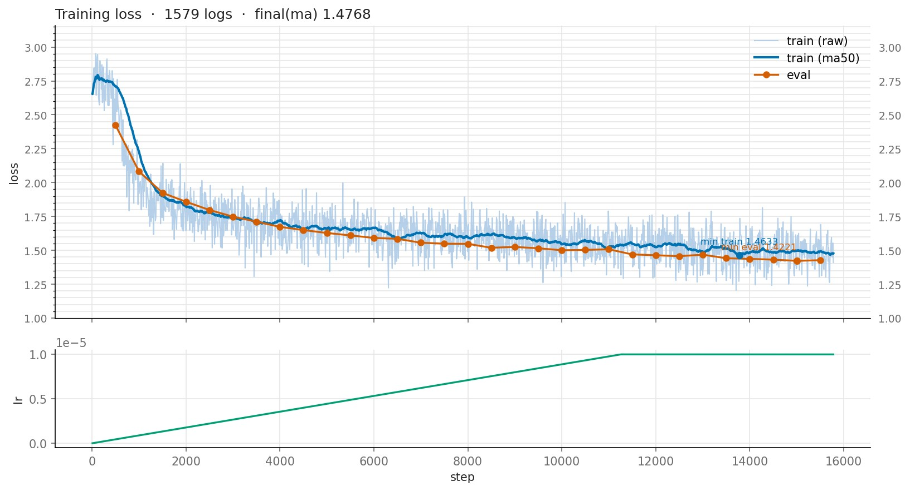
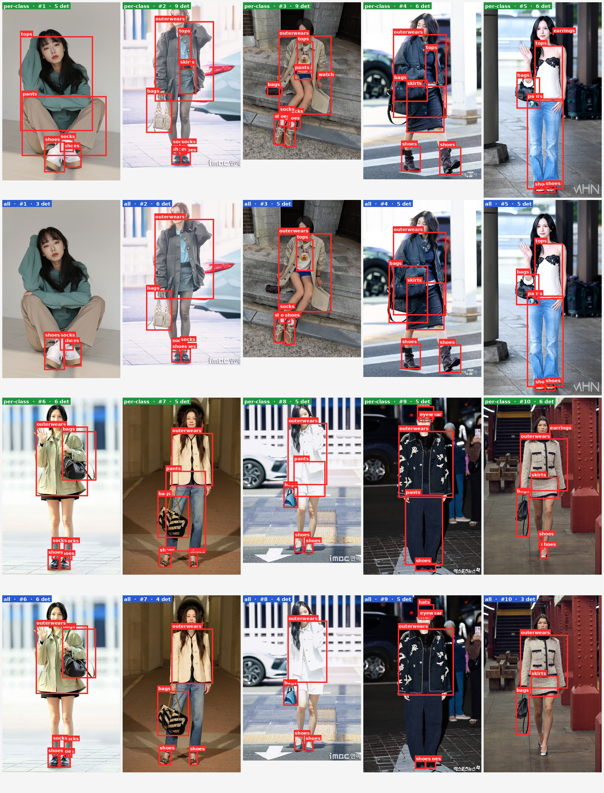

# PaliGemma2 — 코드 기반 전체 플로우

Pierrot-VLM-Lab 의 PaliGemma2 구현을 **실제 코드 흐름** 그대로 따라가는 문서다.
학습 1스텝과 추론 1회가 코드에서 어떤 함수를 어떤 순서로 통과하는지 추적한다.

> 이 저장소는 **추론 배포본**이다. 학습 스크립트(`training/`)·하이퍼파라미터(`args/`)·
> 데이터 빌더는 들어 있지 않으므로, 본문에서 그런 파일을 가리키는 링크는 학습 저장소
> [Pierrot-VLM-Lab](https://github.com/Pierrot-vision/Pierrot-VLM-Lab) 로 연결된다.

> 백본 요약: **SigLIP-So400m 비전 인코더 → 선형 프로젝터 → Gemma2 언어 모델**.
> PaliGemma v1 과 거의 동일하고 **언어 모델만 Gemma1 → Gemma2** 로 바뀐 것.

---

## 0. 파일 지도

```
Pierrot_VLM/
├── args/paligemma2.py          # 하이퍼파라미터 단일 소스 (PARAMS dict → 평탄한 args)
├── training/train_paligemma2.py # 학습 진입점
├── infer/infer_paligemma2.py   # 추론 진입점
└── pierrot/
    ├── core/                       # 모델-비의존 학습 인프라
    │   ├── registry.py             #   ModelSpec 인터페이스 + 레지스트리
    │   ├── engine.py               #   Trainer (Accelerate 학습 루프)
    │   └── scheduler.py            #   warmup + cosine LR
    └── models/paligemma2/
        ├── config.py               # SiglipConfig / Gemma2Config / PaliGemma2Config
        ├── modeling/
        │   ├── siglip.py           #   비전 인코더
        │   ├── gemma2.py           #   언어 모델 (+ KVCache)
        │   ├── projector.py        #   멀티모달 프로젝터
        │   └── paligemma2.py       #   최상위: 병합 + prefix-LM 마스크 + loss + generate
        ├── processor.py            # 이미지/프롬프트 전처리 + 라벨 생성
        ├── dataset.py              # JSONL 데이터셋 + collate
        ├── weights.py              # HF Hub 다운로드 + safetensors 로드
        └── spec.py                 # 레지스트리 어댑터 (@register_model)
```

두 종류의 "config" 를 구분하는 것이 이해의 핵심이다:

| 종류 | 클래스 | 어디서 오나 | 무엇 |
|---|---|---|---|
| **실험 설정** | `args` (평탄 네임스페이스) | [args/paligemma2.py](https://github.com/Pierrot-vision/Pierrot-VLM-Lab/blob/main/args/paligemma2.py) | lr, batch, epochs, 어느 체크포인트, 동결 여부 |
| **모델 구조** | `PaliGemma2Config` 등 | 체크포인트 `config.json` | hidden_size, 레이어 수, head 수... (자동) |

---

## 1. 학습 전체 플로우 (training/train_paligemma2.py 진입 → 저장)

```
python training/train_paligemma2.py
   │
   ├─(a) from args import args               # args/paligemma2.py 의 PARAMS → 평탄한 args
   │
   ├─(b) spec = get_model_spec("paligemma2") # registry.py 에서 어댑터 조회
   │
   ├─(c) model, processor = spec.build(args) # ── 모델/프로세서 생성 (2절)
   │        args.pretrained 있으면 → 공개 가중치 로드 (파인튜닝)
   │        args.pretrained None  → 랜덤 초기화 (스크래치)
   │
   ├─(d) train_ds = spec.build_dataset(args,"train",processor)  # JSONL 데이터셋
   │     collate  = spec.collate_fn(processor, args)            # 배치 → 텐서 (3절)
   │     train_loader = DataLoader(train_ds, collate_fn=collate, ...)
   │
   └─(e) Trainer(model, train_loader, args, ...).fit()          # Accelerate 루프 (5절)
              └─ 학습 종료 후 outputs/final/ 에 model.pt + config.json + tokenizer 저장
```

관련 코드: [training/train_paligemma2.py](https://github.com/Pierrot-vision/Pierrot-VLM-Lab/blob/main/training/train_paligemma2.py) · [spec.py](https://github.com/Pierrot-vision/Pierrot-VLM-Lab/blob/main/pierrot/models/paligemma2/spec.py) · [engine.py](https://github.com/Pierrot-vision/Pierrot-VLM-Lab/blob/main/pierrot/core/engine.py)

---

## 2. 모델 생성 — `spec.build(args)`

[spec.py](https://github.com/Pierrot-vision/Pierrot-VLM-Lab/blob/main/pierrot/models/paligemma2/spec.py) 의 `PaliGemma2Spec.build`:

```
args.pretrained 가 있으면 (파인튜닝/추론):
   weights.load_pretrained(args.pretrained)
      1) resolve_model_dir()   : HF Hub id 면 snapshot_download 로 다운로드
      2) config_from_json()    : config.json → PaliGemma2Config (모델 구조 확정)
      3) build_processor()     : 토크나이저 로드 → PaliGemma2Processor
      4) config.image_token_index = processor.image_token_id   # <image> id 일치 보장
      5) PaliGemma2ForConditionalGeneration(config)            # 스크래치 모델 인스턴스
      6) _load_state_dict()    : *.safetensors (또는 model.pt) → state_dict
         model.load_state_dict(state, strict=False); model.tie_weights()

args.pretrained 가 None 이면 (스크래치):
   _config_from_extra(model_extra) → PaliGemma2Config (기본/오버라이드)
   build_model_from_config(config)  → 랜덤 초기화 모델

공통 마무리:
   _apply_freezing(model, args)             # freeze_vision / freeze_projector
   if args.gradient_checkpointing: model.gradient_checkpointing_enable()
```

- **HF 키 호환**: 모듈 이름을 `vision_tower` / `multi_modal_projector` /
  `language_model.model.layers.N.self_attn.q_proj` … 로 HF 체크포인트와 동일하게 맞춰
  `load_state_dict(strict=False)` 로 공개 가중치가 그대로 들어간다.
- **weight tying**: `lm_head.weight` ↔ `embed_tokens.weight` 공유 (tie_weights).

관련 코드: [weights.py](../pierrot/models/paligemma2/weights.py) · [config.py](../pierrot/models/paligemma2/config.py)

---

## 3. 데이터 → 배치 플로우

### 3.1 데이터 형식 (JSONL)
```json
{"image": "images/cat.jpg", "prefix": "caption en", "suffix": "A cat on a table."}
```
- `prefix`: 프롬프트(모델 입력, **손실 X**, 양방향 attention)
- `suffix`: 정답(모델 생성, **손실 O**, causal attention)

### 3.2 Dataset ([dataset.py](https://github.com/Pierrot-vision/Pierrot-VLM-Lab/blob/main/pierrot/models/paligemma2/dataset.py))
`JsonlVLMDataset.__getitem__` → `{"image": PIL, "prefix": str, "suffix": str}`

### 3.3 Collate + Processor ([processor.py](../pierrot/models/paligemma2/processor.py))
`make_collate_fn` 이 배치를 `processor(images, text=prefix, suffix=suffix)` 로 넘긴다.
프로세서가 한 샘플을 다음 시퀀스로 만든다:

```
[<image> × N] [<bos>] [prefix 토큰...] [\n]   [suffix 토큰...] [<eos>]
└──────────── prefix (token_type=0) ────────┘ └──── suffix (token_type=1) ────┘
    labels = -100 (손실 제외)                       labels = 정답 토큰 id (손실 O)
```

프로세서가 만들어 배치로 stack 하는 텐서:

| 텐서 | 의미 |
|---|---|
| `pixel_values` (B,3,H,W) | 정규화된 이미지 (resize→/255→(x-0.5)/0.5) |
| `input_ids` (B,L) | 위 시퀀스, 뒤쪽 pad |
| `attention_mask` (B,L) | 1=유효, 0=pad |
| `token_type_ids` (B,L) | 0=prefix, 1=suffix (prefix-LM 마스크 재료) |
| `labels` (B,L) | prefix/이미지/pad=-100, suffix=정답 id |

`N` = 이미지 토큰 수 = `(image_size // patch_size)²` (224/14 → **256**).

### 3.4 검출(detection) — 어떤 모델로 학습하나

**검출 전용 모델/head 는 없다.** 캡셔닝과 **완전히 동일한 `PaliGemma2ForConditionalGeneration`
전체 모델**([paligemma2.py](../pierrot/models/paligemma2/modeling/paligemma2.py))을 그대로
파인튜닝한다. 검출은 박스를 **`<loc>` 좌표 토큰으로 생성하는 텍스트 생성 태스크**일 뿐이라,
4절의 forward·suffix-only 손실 경로를 캡셔닝과 그대로 공유한다. 캡셔닝과 **다른 것은 데이터뿐**
(prefix=`detect ...`, suffix=`<loc>` 토큰 열).

**베이스 체크포인트(= 전이 시작점)** 는 [args/paligemma2.py](https://github.com/Pierrot-vision/Pierrot-VLM-Lab/blob/main/args/paligemma2.py) 의 `pretrained` 하나로 정한다:

```python
'pretrained' : 'google/paligemma2-3b-pt-896',   # 896 Stage 3 전이 베이스 (기본)
#              'google/paligemma2-3b-pt-448'     #  → 448 자동 전환
#              'google/paligemma2-3b-pt-224'     #  → 224 자동 전환
```

- 해상도(이미지 리사이즈·이미지 토큰 수)는 이 체크포인트의 `config.json` 에서 **자동**으로
  온다(위치 임베딩에 묶여 있어 별도 설정 불필요). 검출은 작은 객체·조밀한 박스 정밀도 때문에
  고해상도 `pt-896`(Stage 3) 또는 `pt-448` 를 권장한다.

**데이터 → 시퀀스 변환** ([dataset.py](https://github.com/Pierrot-vision/Pierrot-VLM-Lab/blob/main/pierrot/models/paligemma2/dataset.py) `bbox_to_loc_tokens`):
```
prefix : detect {클래스1} ; {클래스2} ; ...
suffix : <locYMIN><locXMIN><locYMAX><locXMAX> {클래스} ; ...
         └ 원본 W/H 대비 1024 bins(0~1023)로 clamp, 순서 = y_min, x_min, y_max, x_max
```
- `<loc0000>..<loc1023>` 1024개 좌표 토큰은 프로세서가 토크나이저에 특수토큰으로 추가한다
  ([processor.py](../pierrot/models/paligemma2/processor.py)).
- 시퀀스 구성·라벨(-100)·마스크는 3.3 과 동일 → **`<loc>` 토큰(suffix)에만** 손실이 걸린다.
- 출력(loc 토큰 → 박스) 역변환은 `detection.parse_detections` 참고.

**검출용 주요 설정**([args/paligemma2.py](https://github.com/Pierrot-vision/Pierrot-VLM-Lab/blob/main/args/paligemma2.py)):

| 키 | 의미 |
|---|---|
| `dataset_format='coco'` | Roboflow 스타일 COCO 검출 데이터 사용 |
| `detect_prompt=None` | None → 데이터셋 전체 클래스로 prefix 자동 구성 |
| `detect_prompt_mode='per_class'` | 896 길이·클래스 불균형엔 per_class 권장 |
| `max_objects=20` | 객체 수 초과 이미지 skip(896 시퀀스 초과 방지) |

즉 **stage(해상도)** 는 `pretrained` 의 `pt-896/448/224` 로, **학습 모델**은 캡셔닝과 같은
`PaliGemma2ForConditionalGeneration` 전체로 결정된다. 실행은 캡셔닝과 동일(`python training/train_paligemma2.py`).

---

## 4. 모델 forward — `PaliGemma2ForConditionalGeneration.forward`

[paligemma2.py](../pierrot/models/paligemma2/modeling/paligemma2.py) 의 `forward(input_ids, pixel_values, attention_mask, token_type_ids, labels)`:

```
(1) 텍스트 임베딩
    inputs_embeds = embed_tokens(input_ids)          # <image> 자리는 임시 임베딩

(2) 비전 → 프로젝터
    feats = vision_tower(pixel_values)               # SigLIP  (B,256,1152)   [4.1]
    feats = multi_modal_projector(feats)             # 선형    (B,256,2304)

(3) 이미지 병합 (_merge_image_features)              # [4.2]
    scaled = feats / sqrt(hidden)                    # 정규화 상쇄 트릭
    inputs_embeds.masked_scatter(<image>위치, scaled)

(4) prefix-LM 4D 마스크 생성 (_build_prefixlm_mask)  # [4.3]
    position_ids = _position_ids(attention_mask)

(5) 언어 모델
    logits = language_model(mask, position_ids, inputs_embeds)   # Gemma2  [4.4]

(6) 손실 (labels 있을 때)                             # [4.5]
    shift 후 cross_entropy(ignore_index=-100)  → suffix 토큰만 학습
    return {"logits", "loss"}
```

### 4.0 텍스트와 이미지는 **별개 경로**로 인코딩된다
`SiglipVisionModel` 은 **이미지만** 인코딩한다. 텍스트는 언어 모델의 임베딩
테이블(`embed_tokens`)이 따로 처리한다. 둘은 서로 다른 경로로 인코딩된 뒤 병합된다.

```
이미지  pixel_values ─► SiglipVisionModel(vision_tower) ─► MultiModalProjector ─┐
                        (패치 → 특징 인코딩)                 (차원 2304로 맞춤)     │ 병합
                                                                                  ▼ masked_scatter
텍스트  input_ids ─────► embed_tokens (nn.Embedding, 언어 모델 안) ─► 텍스트 임베딩 ┘  <image> 자리에
                        (토큰 id → 벡터)                                            이미지 특징 삽입
```

각 화살표에 해당하는 `forward` 코드 라인 (`generate` 프리필도 동일 순서):

| # | 다이어그램 단계 | 코드 |
|---|---|---|
| ① | 텍스트: 토큰 id → 임베딩 | [paligemma2.py:161](../pierrot/models/paligemma2/modeling/paligemma2.py#L161) `embed_tokens(input_ids)` |
| ② | 이미지 패치 → 특징 인코딩 | [paligemma2.py:164](../pierrot/models/paligemma2/modeling/paligemma2.py#L164) `vision_tower(pixel_values)` |
| ③ | 차원 2304로 투영 | [paligemma2.py:166](../pierrot/models/paligemma2/modeling/paligemma2.py#L166) `multi_modal_projector(...)` |
| ④ | `<image>` 자리에 삽입 (masked_scatter) | [paligemma2.py:168](../pierrot/models/paligemma2/modeling/paligemma2.py#L168) 호출 → [구현 L76-94](../pierrot/models/paligemma2/modeling/paligemma2.py#L76-L94) `_merge_image_features` |

> `generate`(추론)에서도 동일한 ①~④ 가 프리필 단계에 반복된다: [paligemma2.py:238-244](../pierrot/models/paligemma2/modeling/paligemma2.py#L238-L244).

| 대상 | 인코딩 담당 | 파일 |
|---|---|---|
| **이미지** | `SiglipVisionModel` → `MultiModalProjector` | [siglip.py](../pierrot/models/paligemma2/modeling/siglip.py) |
| **텍스트** | `embed_tokens` (Gemma2 내부 임베딩) | [gemma2.py](../pierrot/models/paligemma2/modeling/gemma2.py) |
| **병합** | `_merge_image_features` (scatter) | [paligemma2.py](../pierrot/models/paligemma2/modeling/paligemma2.py) |

주의: `SiglipVisionModel` 에는 텍스트가 입력조차 되지 않는다. `forward` 의
`inputs_embeds = embed_tokens(input_ids)` 가 텍스트 인코딩이고,
`vision_tower(pixel_values)` 가 이미지 인코딩이며, 이 둘을 `_merge_image_features` 가
`<image>` placeholder(256개) 자리에서 합친다.

### 4.1 SigLIP 비전 인코더 ([siglip.py](../pierrot/models/paligemma2/modeling/siglip.py))
```
pixel_values (B,3,224,224)
  → Conv2d(patch=14, stride=14)  → 패치 (B,256,1152)
  → + 학습형 위치 임베딩 (CLS 없음)
  → 27 × [pre-norm 셀프어텐션(마스크 없음, 완전 양방향) + MLP(gelu-tanh)]
  → post_layernorm
  ⇒ (B,256,1152)
```

<a id="projector"></a>
### 4.1.1 멀티모달 프로젝터 (Linear)

SigLIP 패치 특징 `(B, 256, 1152)` 을 **단일 선형층**(`nn.Linear`, 활성화·정규화 없음)으로
Gemma2 임베딩 차원 `2304` 에 투영한다([projector.py](../pierrot/models/paligemma2/modeling/projector.py)).
토큰 수(256)는 그대로 두고 **차원만** 맞춘다 — 세 모델 중 가장 단순한 프로젝터다.

### 4.2 이미지 병합 + `sqrt(hidden)` 상쇄
Gemma2 는 임베딩 전체에 `× sqrt(hidden)` 정규화를 한다([4.4]).
그래서 이미지 특징만 미리 `/ sqrt(hidden)` 해서 넣으면, 정규화와 상쇄되어
**텍스트 토큰만 스케일업되고 이미지 토큰은 원 스케일**로 유지된다.
병합은 `masked_scatter` 로 `<image>` 자리(총 B×256개)에 순서대로 채운다.

### 4.3 prefix-LM 마스크 (`_build_prefixlm_mask`)
query i 가 key j 를 볼 수 있는 조건:
```
allowed[i,j] = j가 유효토큰 AND ( j가 prefix  OR  j ≤ i(causal) )
```
- **이미지+prefix** 끼리: 서로 완전 **양방향** (j가 prefix 이면 항상 허용)
- **suffix**: 이전 토큰만 보는 **causal**, 단 prefix 전체는 볼 수 있음
- **pad 키**: 차단. pad 쿼리 행은 NaN 방지를 위해 대각선(self)만 허용
- 결과: `(B,1,L,L)` additive 마스크 (허용=0, 차단=`min_dtype`)

```
        key:  img  prefix   suffix   pad
query        ┌──────────────┬───────┬────┐
 img/prefix  │  양방향(0)   │ 차단  │차단│   ← 미래 suffix 못 봄
 suffix      │  전부 0      │causal │차단│   ← 이전 suffix + prefix 전부
 pad         │        (대각선만 0, 나머지 차단)  │
             └──────────────┴───────┴────┘
```

<a id="prefix-lm"></a>

#### 4.3.1 왜 "prefix-LM" 인가 — 다른 두 모델과의 위치 비교

README 비교표의 `시퀀스/마스킹` 행(`prefix-LM` / `ChatML` / `챗 템플릿(일반 causal)`)은
**같은 층위가 아니다**. 정확히는 두 가지 축이 섞여 있다:

| 축 | 무엇을 정하나 | PaliGemma2 | nanoVLM | SmolVLM2 |
|---|---|---|---|---|
| **① 시퀀스 표기법** | role/턴을 어떤 마크업으로 쓰나 | `<bos>` + `\n` 구분 (role 개념 없음) | **ChatML** — `<\|im_start\|>user/assistant` 특수토큰 | **평문 챗 템플릿** — `User:` / `Assistant:` |
| **② 어텐션 마스크** | 누가 누구를 볼 수 있나 | **prefix-LM (4D 커스텀)** | 일반 causal | 일반 causal |

즉 실제 갈림길은 **"prefix-LM 마스크를 쓰는가(PaliGemma2) vs 안 쓰는가(나머지 둘)"** 이고,
ChatML / 챗 템플릿은 마스크가 아니라 **문자열 표기 관습**의 차이일 뿐이다(둘 다 일반 causal).

**PaliGemma2 가 prefix-LM 을 쓰는 이유** — 이미지와 프롬프트는 "생성 대상"이 아니라
"주어진 조건"이다. causal 로 묶으면 앞쪽 이미지 패치가 뒤쪽 패치를 못 보지만, prefix-LM 은
이미지+프롬프트 구역을 **인코더처럼 완전 양방향**으로 열어 이미지 전체 맥락을 쓰게 한다.
정답(suffix)만 causal 이라 생성 능력은 그대로 유지된다.

**대가**: 마스크를 `(B,1,L,L)` **밀집 텐서로 직접 만들어야 한다**(`_build_prefixlm_mask`).
896에서 L≈4096+ 이라 이 마스크 자체가 큰 메모리를 먹고, SDPA 의 `is_causal` 최적화 경로도
못 탄다. 일반 causal 인 nanoVLM/SmolVLM2 는 이 비용이 없다.
(→ README 가 FlexAttention 도입을 "밀집 prefix mask 희소화"로 언급하는 배경이 이것이다.)

**공통점**: 세 모델 모두 **손실 마스킹은 동일**하다 — 이미지·prefix·pad = `-100`,
정답(suffix/assistant) 토큰에만 cross-entropy([4.5]).

### 4.4 Gemma2 언어 모델 ([gemma2.py](../pierrot/models/paligemma2/modeling/gemma2.py))
```
inputs_embeds
  → × sqrt(hidden)                         # 임베딩 정규화 ([4.2]와 상쇄)
  → 26 × Gemma2DecoderLayer                # 아래 레이어 구조
  → 최종 RMSNorm
  → lm_head  → logits
  → tanh(logits/30)*30                     # final logit soft-capping
```
**Gemma2DecoderLayer** (Gemma1 과 다른 핵심):
```
h ─┬─ input_layernorm ─ self_attn ─ post_attention_layernorm ─┬─ (+)  ← 4개의
   └────────────────── residual ───────────────────────────────┘        RMSNorm
h ─┬─ pre_feedforward_layernorm ─ MLP(GeGLU) ─ post_feedforward_layernorm ─┬─ (+)  sandwich
   └────────────────────────── residual ──────────────────────────────────┘
```
**self_attn** (`Gemma2Attention`):
- **GQA**: Q 8헤드 / KV 4헤드 → `repeat_kv` 로 KV 확장
- **RoPE**: Q,K 회전 (float32 계산)
- **스케일**: `1/sqrt(query_pre_attn_scalar)` (2B=256)
- **local/global 교차**: 짝수 레이어=sliding window(4096), 홀수=global
- **attn soft-capping**: `tanh(score/50)*50` → 마스크 더하기 → softmax(float32)

### 4.5 손실 (suffix-only)
```
shift_logits = logits[:, :-1]     # 다음 토큰 예측용 한 칸 시프트
shift_labels = labels[:, 1:]
loss = cross_entropy(shift_logits, shift_labels, ignore_index=-100)
```
labels 에서 prefix/이미지/pad 는 이미 `-100` 이라 **정답(suffix) 토큰에만** 손실이 걸린다.

---

## 5. 학습 루프 — `Trainer.fit` (Accelerate)

[engine.py](https://github.com/Pierrot-vision/Pierrot-VLM-Lab/blob/main/pierrot/core/engine.py). **PyTorch Lightning 미사용** — 루프를 직접 작성하되
디바이스/정밀도/누적/분산/체크포인트만 Accelerate 에 위임한다.

```
__init__:
   Accelerator(mixed_precision=bf16, gradient_accumulation_steps=grad_accum)
   optimizer = AdamW(trainable params, lr, weight_decay)
   model, optimizer, train_loader = accelerator.prepare(...)     # DDP/정밀도 래핑
   scheduler = warmup + cosine (수동 step)

fit():
   for epoch, for batch in train_loader:
      with accelerator.accumulate(model):          # grad accumulation 관리
         loss = model(**batch)["loss"]             # 4절 forward
         accelerator.backward(loss)
         if sync_gradients: clip_grad_norm_(max_grad_norm)
         optimizer.step(); optimizer.zero_grad()
      if sync_gradients:                            # 실제 업데이트 경계
         scheduler.step(); global_step += 1
         _on_step_end():  로그 / (주기적) evaluate / save_state
   저장: save_pretrained("outputs/final")          # model.pt + config.json + tokenizer
```

- **유효 배치** = `batch_size × grad_accum × GPU수`
- `save_state()` → 재개용 전체 상태(optimizer/scheduler 포함, `checkpoint-<step>/`)
- `save_pretrained()` → 추론용 (`model.pt` + `config.json` + tokenizer)
- 재개: `args.resume_from` 지정 시 `accelerator.load_state`

관련: [scheduler.py](https://github.com/Pierrot-vision/Pierrot-VLM-Lab/blob/main/pierrot/core/scheduler.py)

---

## 6. 추론 전체 플로우 (infer/infer_paligemma2.py)

```
python infer/infer_paligemma2.py --model google/paligemma2-3b-pt-224 --image cat.jpg --prompt "caption en"
   │
   ├─ load_pretrained(model)               # 2절과 동일 (Hub 다운로드/로컬 로드)
   ├─ inputs = processor([image], text=[prompt])   # suffix 없음 → labels 없음
   └─ model.generate(...)                  # KV 캐시 autoregressive (아래)
```

`generate` ([paligemma2.py](../pierrot/models/paligemma2/modeling/paligemma2.py)):
```
프리필(step 0):
   이미지 병합된 inputs_embeds + prefix-LM 마스크(전부 prefix=양방향) → 언어 모델
   KVCache 에 K/V 저장, 마지막 토큰 logits → 다음 토큰

디코드(step ≥ 1):
   새 토큰 1개만 임베딩, 마스크=0(캐시 전체 참조), position=현재 위치
   KVCache.update 로 K/V 이어붙임 → 다음 토큰
   greedy(argmax) 또는 top-p 샘플링, <eos> 만나면 종료
```
`KVCache` ([gemma2.py](../pierrot/models/paligemma2/modeling/gemma2.py)): 레이어별 K/V 를 시퀀스 축으로 concat.

디코드 후 프롬프트 길이 이후 토큰만 `tokenizer.decode` 하여 출력.

---

## 7. 텐서 shape 흐름 요약 (224px, 2B 기준)

```
이미지  (B,3,224,224)
  └ SigLIP     → (B,256,1152)
  └ Projector  → (B,256,2304)         ─┐
텍스트  input_ids (B,L)                 │ 병합
  └ embed      → (B,L,2304)           ─┘ <image> 자리(256개) 교체
               → Gemma2 26층 → (B,L,2304)
               → lm_head → logits (B,L,vocab)
               → shift + CE(ignore=-100) → loss (스칼라)
```

| 이름 | 값 (paligemma2-3b-pt-224) |
|---|---|
| 이미지 크기 / 패치 | 224 / 14 → 이미지 토큰 **256** |
| SigLIP hidden / 레이어 / 헤드 | 1152 / 27 / 16 |
| Gemma2 hidden / 레이어 | 2304 / 26 |
| Gemma2 헤드 (Q/KV) | 8 / 4 (GQA) · head_dim 256 |
| soft-capping (attn / final) | 50 / 30 |
| sliding window | 4096 (짝수 레이어) |

---

## 8. 한눈에 보는 전체 그림

```
                 args/paligemma2.py (PARAMS 단일 소스)
                        │  args.lr, args.pretrained, ...
        ┌───────────────┴──────────────────┐
        ▼                                   ▼
   spec.build(args)                    Trainer(args)  ── Accelerate 루프
   ├ weights.load_pretrained            └ for batch: model(**batch).loss
   │   └ HF Hub 다운로드 → safetensors        ├ backward / clip / step
   ├ PaliGemma2ForConditionalGeneration       └ save_pretrained(final)
   │   ├ SiglipVisionModel                          │
   │   ├ MultiModalProjector                        ▼
   │   └ Gemma2ForCausalLM              outputs/final/{model.pt, config.json, tokenizer}
   └ PaliGemma2Processor                            │
        │                                           ▼
        └────── DataLoader(collate) ─────►  infer/infer_paligemma2.py: load_pretrained → generate
```

**핵심 3가지** (참조 구현 대비 이 프로젝트가 학습을 위해 새로 넣은 것):
1. 패딩 지원 **prefix-LM 마스크** ([4.3])
2. **suffix-only 손실** (prefix/이미지 = -100) ([4.5])
3. **사전학습 가중치 로드**로 파인튜닝 시작점 제공 ([2])

---
# 9. 검출 학습 실험 노트

"코드가 어떻게 도는가"가 아니라 **"왜 이렇게 구성했는가"** 를 남긴다.

> **한 줄 요약** — `per_class` 프롬프트로 검출을 학습했더니 모델이 *"물어본 건 무조건 있다"* 를
> 배워버렸다. 추론 필터로는 못 고쳐서, **negative 샘플을 데이터에 넣고 학습을 처음부터 새로 돌리는 중**이다.

---

## 9.1 데이터셋

**COCO 형식**의 패션 검출 데이터셋(train / valid split), **22 클래스**.

| 구분 | 클래스 |
|---|---|
| 옷 8종 | outerwears, tops, dresses, pants, skirts, shoes, socks, tights |
| 소품 14종 | bags, hats, earrings, necklaces, bracelets, rings, brooches, hair accessory, eyewear, ties, scarves & muffler, watch, gloves, belt |

규모는 **train 약 36만 장 / 120만 region**, **valid 약 4.3만 장 / 15만 region**
(region = 박스 하나, 이미지당 평균 3.3개).

실험 설계를 좌우한 성질은 두 가지다.

| 성질 | 내용 | 영향 |
|---|---|---|
| **클래스 불균형 ~70배** | shoes 26만 region ↔ brooches 3.6천 region | → `per_class` 채택 ([9.2](#92-설계-선택-3가지)) |
| **42%가 region 1개** | 쇼핑몰 상품컷 위주 | → 도메인 갭 ([9.8](#98-관찰-2--학습셋의-도메인-갭)) |

---

## 9.2 설계 선택 3가지

### ① 프롬프트 모드 = `per_class`

| 모드 | 프롬프트 | 한 이미지 = | 문제 |
|---|---|---|---|
| `all` | `detect outerwears;tops;…` (22개) | 1 샘플 | 896 토큰 예산 초과 |
| `present` | 존재 클래스만 나열 | 1 샘플 | "나열된 건 반드시 있다"를 학습 |
| **`per_class`** ✅ | `detect eyewear` (하나씩) | 존재 클래스 수 | 샘플 22배 ↑ |

**이유 2가지**

```
① 토큰 예산    이미지 4,096 + max_length 4,352  →  텍스트에 남는 건 256 토큰뿐
                'all' 로 22클래스 나열 = prefix 만으로 예산 소진
                'per_class' = "detect eyewear" 3~4 토큰

② 불균형       'all'      → 이미지 단위 샘플링 → shoes 가 72배 더 뽑힘
                per_class → (이미지 × 클래스) → 희소 클래스도 제 몫
```

### ② 검증셋 = 클래스당 10장 균형 (`eval_samples_per_class=10`)

불균형 그대로 평가하면 **eval loss 가 사실상 shoes 성능**이 된다. 22 × 10 = 220 샘플.

### ③ 해상도 = `pt-896`

작은 객체(반지·귀걸이) 때문에 고해상도가 필요하다. 대가는 이미지 토큰 4,096개.

---

## 9.3 `per_class` 의 함정 — negative 가 왜 필요한가

**이 실험의 핵심 발견이다.**

`per_class` 는 "있는 클래스"만 물어본다. `detect eyewear` 프롬프트는 **안경이 있는 이미지에서만**
만들어진다. 그래서 모델이 배우는 건 이것이다:

```
        학습에서 본 것                        모델이 내린 결론
   ┌──────────────────────┐          ┌──────────────────────────┐
   │ detect eyewear → 박스 │          │ "detect X" 가 들어오면    │
   │ detect eyewear → 박스 │   ═══▶   │  → 무조건 X 박스를 뱉는다 │
   │ detect eyewear → 박스 │          │                          │
   └──────────────────────┘          └──────────────────────────┘
        "없음" 을 뱉는 법은 한 번도 안 배운다
```

### 증거 — 부재 객체의 conf 가 존재 객체와 겹친다

안경도 시계도 장갑도 없는 사진(det_test_1)에 22 클래스를 물어본 결과:

| 클래스 | conf | cls | 실제 |
|---|---|---|---|
| eyewear | 0.9932 | 0.9988 | ✗ 없음 |
| watch | 0.9946 | 0.9990 | ✗ 없음 |
| gloves | 0.9933 | 0.9986 | ✗ 없음 |
| belt | 0.9962 | 0.9998 | ✗ 없음 |
| *(참고) 존재 객체* | *0.9996 ~ 1.0000* | | ✓ |

**부재(0.993~0.999)와 존재(0.9996~1.0000)의 구간이 겹친다.**
모델에게 "없다"를 표현할 출력 자체가 없어서 **어떤 임계값을 잡아도 경계가 생기지 않는다.**
10장에서 후보가 **235개** 나왔다(실제 객체는 장당 5~8개).

### 추론 필터로는 왜 못 고치나

[9.6](#96-추론측-필터--임시방편) 의 액세서리 loc 관문은 *"없는 걸 지어낼 때 좌표가 흔들린다"* 는
경험칙에 기댄 **우회로**다. 경계가 흐린 물건에서는 진짜까지 잘린다 —
실제로 bags·hats 를 관문에서 빼야 했다. 근본적으로 **모델이 "없음"을 뱉을 수 있어야** 한다.

### 해법 — negative 샘플

```python
'detect_negative_ratio' : 1.0     # positive 와 같은 수만큼
```

#### 무엇이 negative 인가

**그 클래스가 "없는" 이미지에 굳이 그 클래스를 물어보는 샘플**이다.
정답은 빈 문자열 — suffix 에 `<loc>` 이 하나도 없고 `<eos>` 만 남는다.

| | prefix | suffix | 이미지 |
|---|---|---|---|
| **positive** | `detect eyewear` | `<loc0512><loc0301>…eyewear` | 안경 **있는** 사진 |
| **negative** | `detect eyewear` | *(빈 문자열 → `<eos>` 만)* | 안경 **없는** 사진 |

같은 프롬프트가 정답이 갈리는 두 상황에서 모두 등장한다는 게 핵심이다.
모델은 프롬프트만 보고는 답을 정할 수 없고 **이미지를 봐야** 한다.

#### 의미 — 모델의 과제가 바뀐다

```
   before :  "박스를 어떻게 그릴까"          ← 존재는 이미 전제
   after  :  "박스를 그릴지 말지 판단하고 → 그린다"
```

손실 관점에서는 **`<eos>` 를 첫 토큰으로 뱉는 법을 배우는 것**이다.
suffix-only 손실([4.5])이 걸리므로, negative 샘플의 학습 신호는
*"이 이미지 + 이 프롬프트에서는 `<loc>` 이 아니라 `<eos>` 가 와야 한다"* 하나로 압축된다.
[9.3](#93-per_class-의-함정--negative-가-왜-필요한가) 서두에서 본
"부재/존재 conf 구간 겹침"이 풀리는 지점이 여기다.

#### 구성 방법 ([`_build_negatives`](https://github.com/Pierrot-vision/Pierrot-VLM-Lab/blob/main/pierrot/data/detection.py))

```
① 이미지마다 "없는 클래스" 목록을 만든다
      absent[클래스] = 그 클래스가 없는 이미지 인덱스들

② 목표 개수를 정한다
      target  = positive 수 × ratio          (ratio=1.0 → 96.4만)
      per_cls = target ÷ 22                  (클래스당 43,820개 균등)

③ 클래스마다 자기 풀에서 per_cls 개를 뽑는다
      rng.shuffle(pool) → pool[:per_cls]     (seed 고정 = 재현 가능)

④ 전체를 섞고 target 개로 자른다
      → 인덱스 항목 (이미지, 클래스, is_negative=True)
```

`_resolve` 에서 `is_negative` 면 박스를 **빈 리스트**로 만들어 suffix 가 비게 한다:

```python
boxes = [] if is_negative else [b for b, l in zip(...) if l == cls]
```

#### 규모 (train 기준)

| | 샘플 수 |
|---|---|
| positive (이미지 × 존재 클래스) | 964,041 |
| negative (ratio 1.0) | 964,041 |
| **합계 / 1 에폭** | **1,928,082** |

1차 학습 대비 **에폭당 샘플이 2배**가 된다. `steps_per_epoch` 이 달라지므로
중단된 학습을 `resume_from` 으로 이어붙이면 스케줄이 어긋난다 — 데이터 구성이 바뀌면
**스케줄은 반드시 새로 시작**해야 한다.

#### 설계 주의점

| 주의 | 이유 |
|---|---|
| 클래스별 **균등 배분** (`per_cls`) | 한 클래스에 쏠리면 그 클래스를 아예 안 뱉도록 학습된다 |
| **seed 고정** 샘플링 | 실험 재현성 — 같은 negative 조합이 다시 나온다 |
| **train 에만** 적용 (eval 제외) | eval 에 넣으면 "안 뱉기"만으로 지표가 좋아진다 |
| `ratio=1.0` 선택 | 1:1 균형. 너무 크면 **과억제**(있는 것도 안 뱉음) 위험 |

---

## 9.4 1차 학습 (negative 없음) — 결과와 폐기

| 설정 | 값 | 이유 |
|---|---|---|
| `pretrained` | `google/paligemma2-3b-pt-896` | 논문 Stage 2 산출물 = Stage 3 전이 베이스 |
| `lr` | 1e-5 | 파인튜닝 표준값 |
| 유효 배치 | 8 × 4 × 분산 = **256** | 896 에서 per-device 8이 VRAM 한계 |
| `dtype` | 순수 bf16 (`mixed_precision='no'`) | 대용량 GPU 에 896+3B 를 담는 최소 구성 |
| `freeze_vision` | False | 검출은 비전 표현 자체를 바꿔야 함 |
| `disable_soft_capping` | True | 논문 §3 Stage 3 재현 |
| `detect_negative_ratio` | **0** | ← [9.3](#93-per_class-의-함정--negative-가-왜-필요한가) 의 원인 |

### 손실 곡선 (약 66시간)

```
 3.0 ┤╲
     │ ╲                     train(ma50) ── eval ──
 2.5 ┤  ╲
     │   ╲___
 2.0 ┤ e     ╲‾‾‾───___                    train
     │  ╲__              ‾‾‾───____
 1.5 ┤     ‾‾───____                ‾‾‾──  eval
     └─────┬─────┬─────┬─────┬─────┬─────
           2k    5k    8k   11k   13k
```

| step | train (ma50) | eval |
|---|---|---|
| 시작 | 3.07 | 2.05 |
| 9,090 | 1.669 | 1.394 |
| **13,200** | **1.619** | **1.328** |

- 과적합 신호 **없음** — eval 이 train 보다 낮고(dropout 차이 + 균형 검증셋) 단조 감소
- 다만 **둔화**: eval 이 5k→9k 에서 −0.10, 9k→13.2k 에서 −0.066
- 좌표 회귀는 잘 배웠다 — 검증셋 **매칭률 99%, 평균 IoU 0.957**

### LR 스케줄의 함정

```
epochs=50  →  총 스텝 ≈ 187,000  →  warmup_ratio 0.03 = warmup 5,600 스텝
13,200 스텝 = 전체의 7%          →  cosine 감쇠는 시작도 안 함
```

사실상 **constant LR 로 초반만 도는** 학습이었다. 의도한 스케줄이 아니라 `epochs` 설정의 부산물이다.

### 왜 이 체크포인트를 이어받지 않았나

이어받는 선택지가 있었지만 **버렸다.**

| | 이어받기 (`init_from`) | 처음부터 (pt-896) ✅ |
|---|---|---|
| 좌표 능력 | 이미 학습됨 (66시간 절약) | 처음부터 배워야 함 |
| **"무조건 박스" 편향** | **굳어 있음 → 되돌리는 싸움** | 없음 (깨끗한 출발점) |
| 수렴 방향 | 통제 어려움 | "detect X" 를 조건부 질문으로 학습 |

**잘못 배운 뒤 교정하는 것보다 처음부터 바르게 배우는 쪽**을 택했다.

> **용어 주의 — "Stage" 는 논문 것이다.**
> PaliGemma2 사전학습에서 `pt-896` 은 **해상도를 448/896 으로 올리는 단계(Stage 2)의 산출물**이고,
> 그 다음 **Stage 3 = 특정 태스크 전이**가 **이 프로젝트의 검출 학습**이다.
> 혼동을 막기 위해 우리 실험은 **1차 학습 / 현재 학습**으로 부른다.

---

## 9.5 현재 학습 (negative 포함)

```python
'pretrained'            : 'google/paligemma2-3b-pt-896',   # 깨끗한 출발점
'detect_negative_ratio' : 1.0,                             # ★ 이번 변경점
'lr'                    : 1.0e-5,
'detect_prompt_mode'    : 'per_class',
```

**1차 학습과 다른 것은 negative 하나**이고, 그 외(시작 가중치·lr·배치·해상도)는 전부 동일하다.
효과를 분리하기 위해서다. 이어받은 것은 아무것도 없다 — **step 0 부터 새로 도는 학습**이며,
1차 학습과 같은 `pt-896` 에서 출발한다.

| 확인할 것 | 기대 | 실제 결과 |
|---|---|---|
| 오탐 감소 | 10장 후보 235개 → 대폭 감소 | ✅ raw 후보 235 → 58 (부재 액세서리 사라짐) |
| **과억제 없음** | 있는 객체는 그대로 검출 | △ conf/cls 가 전반 하락(0.96~0.99) — 필터 임계값을 0.75 로 낮춰 대응 |
| 액세서리 관문 불필요화 | loc 관문 없이도 깨끗 | ❌ 여전히 필요(강제복원이 소품도 되살려, 관문이 재차단) |

### 학습 곡선



*negative 학습. x축 step, 위=loss(train ma50·eval), 아래=LR.*

| step | train (ma50) | eval | LR |
|---|---|---|---|
| ~1,000 | 2.6 | 2.05 | warmup 중 |
| 9,000 | 1.67 | 1.39 | warmup 중 |
| 11,200 | — | — | **1e-5 도달(warmup 끝)** |
| **15,780**(현재·학습 중단) | **1.477** | **1.422** | 1e-5 평탄 |

**읽는 법**:
- eval 이 train 과 **붙어서** 단조 감소 → 과적합 없음. (eval 에는 negative·dropout 이 없어
  train 보다 낮게 나오는 게 정상)
- LR 은 `epochs=50`(총 ~187k step) × `warmup_ratio=0.03` 로 **warmup 만 11,200 step**.
  그 전까지는 "constant LR 로 데워지는" 구간이라 큰 박스가 eos 에 지는 등 신호가 덜 여물었다
  ([9.7](#97-관찰-1--좌표가-오른쪽으로-치우친다) 의 미수렴 이슈).
- warmup 종료(11,200) 이후 **평탄 구간**에서 loss 는 계속 내려가지만(1.51→1.43) **검출 수는
  정체**([9.9](#99-per_class-vs-all-모드--실측-비교) 표 참고). 남은 loss 개선분이 새 검출이 아니라
  이미 잡는 것의 좌표 정밀도로 가기 때문. → **검출 관점에선 step ~11,500 부근이 사실상 정점.**

> 이 그래프는 `python tools/plot_loss.py --out docs/images/paligemma2/det_loss_lr.jpg` 로
> 생성한다(LR 패널 포함·JPEG). 노트를 갱신할 때마다 최신 곡선으로 교체한다.
> (README 는 LR 없는 `paligemma2_det_loss.jpg` 를 쓴다 — 둘은 별개 파일이다.)

---

## 9.6 추론측 필터 — 임시방편

negative 학습이 끝나기 전까지 오탐은 추론에서 거른다
([infer/infer_paligemma2.py](../infer/infer_paligemma2.py)). `generate` 에서 세 신호를 뽑는다:

| 신호 | 정체 | 의미 |
|---|---|---|
| `conf` | 첫 `<loc>` 자리의 **1024개 loc 확률 합** | "여기서 박스를 시작할까" |
| `cls` | 클래스명 토큰 확률 | "이걸 뭐라 부를까" |
| `loc` | 좌표 4개 토큰 확률의 기하평균 | "좌표 bin 을 얼마나 확신하나" |

### 필터 3단

| # | 필터 | 기준 | 근거 |
|---|---|---|---|
| ① | conf/cls 하한 | 0.999 | 22클래스로 넓히자 비로소 판별력이 생김 |
| ② | **액세서리 loc 관문** | `loc >= 0.14` | 없는 물건을 지어낼 때 좌표가 흔들림 |
| ③ | 중복 제거 | 양방향 최소 겹침 ≥ 0.80 | per_class 는 클래스 간 배타성이 없음 |

**② 관문의 근거** — conf 로는 안 잡히는 것이 loc 으로는 갈린다:

```
necklaces  conf 0.9996  loc 0.036   ✗ 없음
rings      conf 0.9988  loc 0.076   ✗ 없음
eyewear    conf 1.0000  loc 0.194   ✓ 실제로 쓴 안경
```

대상은 소품 13종. **bags·shoes·hats 는 제외** — 박스가 커서 loc 이 0.06~0.12 로 낮게 나오는데
실제로는 존재하는 경우가 많아, 관문에 걸면 진짜 가방과 모자가 사라진다.

**③ 왜 IoU 가 아닌가**

```python
min(inter / area_a, inter / area_b) >= 0.80
```

같은 자리에 `pants` 와 `skirts` 가 동시에 나오는 일이 잦았다(10장 중 7장).
per_class 는 클래스를 **독립으로** 물어보므로 둘 다 자기 질문에는 "예"라고 답한다.
IoU 는 큰 박스가 작은 박스를 품는 경우를 놓쳐서, 작은 쪽 기준으로 1.0 이 되는 양방향 최소를 썼다.

**승자 선택은 conf 단독.** `conf+cls+loc` 합으로 고르면 차이가 0.0005~0.02 라 동전던지기였고,
통 넓은 바지를 `skirts` 로, 데님 스커트를 `pants` 로 틀렸다. **conf 단독으로 바꾸니 둘 다 맞았다** —
loc 이 섞이면서 클래스 판단을 흐린 것이다.

**결과: 10장에서 후보 235개 → 83개.**

### 강제복원 (presence gate) — 놓친 박스 되살리기

큰 객체는 첫 좌표가 1024개 `<loc>` bin 에 **흩어져서**, 개별 최댓값이 `<eos>` 하나(0.29)를
못 넘어 greedy 가 통째로 놓친다. 그런데 `<loc>` 확률 **합(loc_mass)** 은 0.71 이라 모델은
"박스가 있다"고 안다. 그래서 첫 토큰에서 다음 조건이면 EOS 대신 최댓값 `<loc>` 를 강제한다:

| 옵션 | 조건 | 성격 |
|---|---|---|
| `--presence-margin` | `loc_mass − eos > 0.5` | 상대 |
| `--presence-loc-mass` | `loc_mass ≥ 0.6` | 절대(권장) |

예) det_test_8 `pants`: loc_mass 0.71 → margin 0.42 라 margin 0.5 로는 안 살지만,
loc_mass 절대 기준 0.6 으로는 복원된다. (로그로 확인: 10장에서 loc_mass≥0.6 인 놓침 7건)

### ★ 함정 — conf-th 를 presence-loc-mass 와 맞춰야 한다

강제복원 박스는 **conf 점수 = loc_mass** 가 된다([infer_paligemma2.py](../infer/infer_paligemma2.py)).
그래서 loc_mass 0.6 으로 복원해도 conf-th 가 0.75 면 **conf 0.71 < 0.75 로 다시 잘린다**
(복원한 게 화면에 안 나옴). 두 값을 같은 0.6 으로 맞춰야 복원분이 필터를 통과한다.

```python
'--presence-loc-mass' : 0.6   # 이 값 이상이면 복원
'--conf-th'           : 0.6   # ★ 같은 값. 안 맞추면 복원분이 필터에서 재탈락
```

---

## 9.7 관찰 1 — 좌표가 오른쪽으로 치우친다

검증셋 GT 로 측정(80장, 예측 중심 − GT 중심):

```
매칭 80건 / 실패(IoU<0.3) 1건  =  매칭률 99%   평균 IoU 0.957

   GT박스 대비   dx = +1.64%   ██████▶     dy = -0.20%   ▏
   오른쪽으로 치우친 비율   74/79 = 94%
```

**가로만 편향이고 세로는 0 근처다.** 무작위 오차라면 dx 도 dy 처럼 0 주변이어야 한다.

### 원인 후보 소거

| 검사 | 결과 |
|---|---|
| 좌표 인코딩→디코딩 왕복(2만회) | **결백** — 왼쪽/위로 0.6px (방향 반대, 1 bin 미만) |
| 이미지 전처리 | **결백** — (896,896) 완전 스트레치, 패딩/크롭 없음 |
| 예측 vs GT | **오른쪽 94%** ← 실재 |

### 왜 옷에서는 안 보이나 — 기준을 바꾸면 보인다

| | 이미지 폭 대비 | GT 박스 폭 대비 |
|---|---|---|
| 옷 | +1.17% | +1.17% |
| 액세서리 | +1.06% | **+1.64%** |

**이미지 기준으로는 거의 같다.** 쉬프트가 **이미지에 묶여 있지 물체 크기에 묶여 있지 않다.**
`<loc>` 은 이미지 전체를 1024 bin 으로 자른 좌표계라 오차도 bin 단위로 생긴다.
같은 픽셀만큼 밀려도 코트에서는 테두리 두께지만 넥타이에서는 물체가 통째로 옮겨간 것처럼 보인다.

```
ties +7.76%  ▶  hats +1.60%  ▶  bags +1.56%  ▶  scarves +1.30%
   작을수록 커진다 (크기와 반비례)
```

> **미해결**: 크기 효과는 "왜 작은 것에서 두드러지는가"만 설명한다.
> **왜 하필 오른쪽인가**는 아직 원인을 못 찾았다. 다음 확인 대상은 학습셋 GT 자체의 좌우 편향.

---

## 9.8 관찰 2 — 학습셋의 도메인 갭

`eyewear` region 을 샘플링해 그려보니 대부분이 **사람이 쓴 안경이 아니라 상품 사진**이었다 —
안경집에 놓인 선글라스, 쇼핑앱 상세페이지 캡처.

[9.1](#91-데이터셋) 의 *"42%가 region 1개"* 통계와 같은 이야기다.
모델이 배운 eyewear 는 **"화면 가운데 크게 놓인 안경 제품"** 이지 "얼굴에 걸친 작은 안경"이 아니다.

→ 착용 스냅에서 위치를 못 짚는 것은 **모델·코드의 결함이 아니라 학습 분포 밖**이라서다.
**loss 를 더 내려도 해결되지 않는다.** 착용 컷 비중을 늘리거나 평가를 분리해 따로 재야 한다.

---

## 9.9 per_class vs all 모드 — 실측 비교

추론 프롬프트를 클래스별(`per_class`)로 22번 물을지, 전체를 한 번(`all`)에 물을지의 비교다.
같은 체크포인트·같은 필터(conf/cls 0.75, presence-margin 0.5, acc-loc 0.14, overlap 0.80)로 측정했다.
**차이는 쿼리 구조뿐** — max-new-tokens(per_class 48 / all 256)는 양쪽 다 truncation 이 없어 무관.

| checkpoint | all 모드 | per_class |
|---|---|---|
| step 10,000 | 41 | 60 |
| step 11,500 | 46 | 63 |
| step 13,500 | 46 | 58 |
| step 14,500 | 46 | 62 |
| step 15,500 | 45 | 64 |

**per_class 가 검출 수에서 일관되게 우위(≈46 vs ≈58~63), 대신 7배 느리다**(22회 생성).



*미학습 10장. 각 이미지에서 **위=per-class(초록 태그), 아래=all(파랑 태그)**, 태그에 검출 수 표시.
같은 사진에서 per-class 가 더 많이 잡는 게 보인다 — #1 5 vs 3, #3 9 vs 5, #10 6 vs 3.
all 은 주로 뒤쪽·작은 클래스(watch·earrings·hats)를 조기 eos 로 놓친다.
(그리드 생성: `tools/make_det_grid.py step14500`)*

### 왜 per_class 가 더 잡나

근본 원인은 **학습 분포 일치**다. 모델은 `detect eyewear` 처럼 클래스 1개 프롬프트로만 학습됐다([9.2]).

| | per_class | all 모드 |
|---|---|---|
| 프롬프트 | `detect eyewear` | `detect outerwears ; … ; tights`(22개) |
| 학습 때 본 형태 | **일치** | **분포 밖**(22클래스 나열은 학습에 없음) |
| eos 종료 | 클래스마다 독립 | **한 시퀀스** — 앞에서 eos 나면 뒤 클래스 통째 누락 |

all 모드가 놓치는 건 주로 **뒤쪽·작은 클래스**(watch·eyewear·earrings) — 큰 옷을 먼저 뱉고
조기 종료하기 때문. per_class 는 클래스마다 독립 생성이라 이 문제가 없다.

## 9.10 all 모드로 학습하기 — 실측 검토 (미실행)

"per_class 추론의 조기종료를 없애려면 학습도 all 형태로 하면 되지 않나"에 대한 검토.
**코드 수정은 필요 없다** — 데이터/스펙이 `prompt_mode` 를 일반적으로 처리한다
([detection.py](https://github.com/Pierrot-vision/Pierrot-VLM-Lab/blob/main/pierrot/data/detection.py), [spec.py](https://github.com/Pierrot-vision/Pierrot-VLM-Lab/blob/main/pierrot/models/paligemma2/spec.py)).
`args.paligemma2` 에서 **`detect_prompt_mode: 'per_class' → 'all'` 한 줄**이면 전환된다.

### negative 는 all 모드에 "내장"돼 있다

per_class 가 negative 주입이 **필요했던** 이유(=[9.3])는 all 모드엔 해당 없다:

```
all 학습 샘플:
  prefix : detect outerwears ; tops ; … ; tights   (22개 전부 나열)
  suffix : <loc>shoes ; <loc>bags ; …              (있는 것만)
```

**나열된 22개 중 suffix 에 없는 클래스 = 자동으로 "없음"을 학습**한다. 즉 매 샘플이 이미
"22개 물어보고 있는 것만 답하기"라, [9.3] 의 "물으면 무조건 있다" 편향이 원천적으로 없다.
→ all 모드엔 별도 negative 로직이 없는 게 정상(버그 아님). 코드도 `_build_negatives` 를
per_class 에만 건다.

### 토큰 예산 — max_objects 를 낮출 필요가 없다 (실측)

all 모드는 prefix(전체 클래스)+suffix(모든 박스)를 텍스트 예산에 담아야 해 처음엔 우려했으나,
train 전체를 실측하니 여유로웠다:

```
이미지 4096 + 텍스트 예산 256
  prefix(22클래스 나열) = 50 토큰   (클래스명 대부분 1토큰)
  overhead(bos/\n/eos)  = 3
  → suffix 예산 = 203 토큰  ≈ 박스 29개
```

| max_objects | 학습 사용 이미지 | 토큰 초과 | 버려지는 이미지 |
|---|---|---|---|
| 14 | 356,829 | 0 | 1,543 (0.4%) |
| **20 (현재)** | 357,913 | **0** | 459 (0.1%) |
| 25 | 358,155 | 0 | 217 (0.1%) |

**어느 값이든 토큰 초과 0** — 전체 358,372장 중 예산 초과는 158장(0.04%)뿐. `max_objects` 는
이제 "토큰 예산"이 아니라 "객체 많은 이미지를 버릴지" 문제일 뿐이라 **현재 20 유지 또는 25 상향**이
최적. 낮출 이유 없음.

> **주의 — 토큰 예산은 batch_size 문제가 아니다.** batch_size 는 GPU 메모리(병렬 시퀀스 수),
> 토큰 예산은 시퀀스 길이(max_objects / max_length). 별개의 레버다.

### all 학습의 진짜 제약

| 제약 | 유효? |
|---|---|
| ~~negative 재설계~~ | ❌ 불필요(all 내장) |
| ~~max_objects 하향~~ | ❌ 불필요(20에서 초과 0) |
| **클래스 불균형 재등장** | ✅ per_class 는 (이미지×클래스)로 펼쳐 희소 클래스를 살렸는데, all 은 이미지 단위 샘플링이라 70배 불균형이 돌아옴 |

→ all 학습을 한다면 남는 실질 과제는 **불균형 완화 하나**. 가장 부담 적은 방향은
**per_class + all 혼합 학습**(모델이 두 프롬프트 형태를 모두 학습 → all 추론 개선 + per_class 정확도 유지).

## 9.11 정리

| 선택 | 근거 | 상태 |
|---|---|---|
| `per_class` 프롬프트 | 896 토큰 예산(텍스트 256) + 70배 불균형 | 유지 |
| `eval_samples_per_class=10` | 불균형 평가 = shoes 성능 | 유지 |
| **negative 1.0** | 부재/존재 conf 구간이 겹쳐 임계값으로 불가 | 적용(검출 정점 ~11.5k) |
| 이어받지 않고 처음부터 | 1차 가중치엔 "무조건 박스" 편향이 굳어 있음 | 적용 |
| 액세서리 loc 관문 | 부재 시 conf 는 포화, loc 만 무너짐 | 유지(강제복원 보완) |
| presence-margin 강제복원 | 좌표 흩어짐으로 큰 박스가 eos 에 지는 것 방지 | 적용(margin>0.5) |
| conf/cls 0.75 하한 | negative 로 conf 분포가 전반 하락 | 적용 |
| 양방향 최소 겹침 dedup | per_class 는 클래스 간 배타성 없음 | 적용 |
| conf 단독 승자 선택 | 점수합은 loc 이 섞여 클래스 판단을 흐림 | 적용 |

### 남은 숙제

| # | 항목 | 비고 |
|---|---|---|
| 1 | 오른쪽 쉬프트의 **방향** 원인 | 학습셋 GT 편향 검사 |
| 2 | 착용 컷 / 상품 컷 평가 분리 | 도메인 갭([9.8]) |
| 3 | **all 모드 학습**(또는 per_class+all 혼합) | 조기종료 해결, 실질 과제는 불균형([9.10]) |
| 4 | mAP 등 정량 지표 | 지금은 검출 '수'만 봄 |
