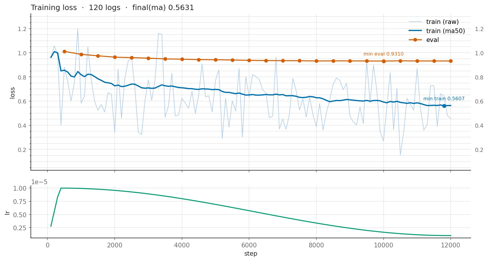
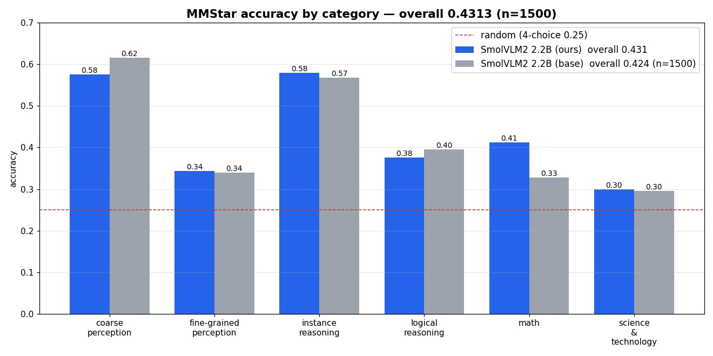
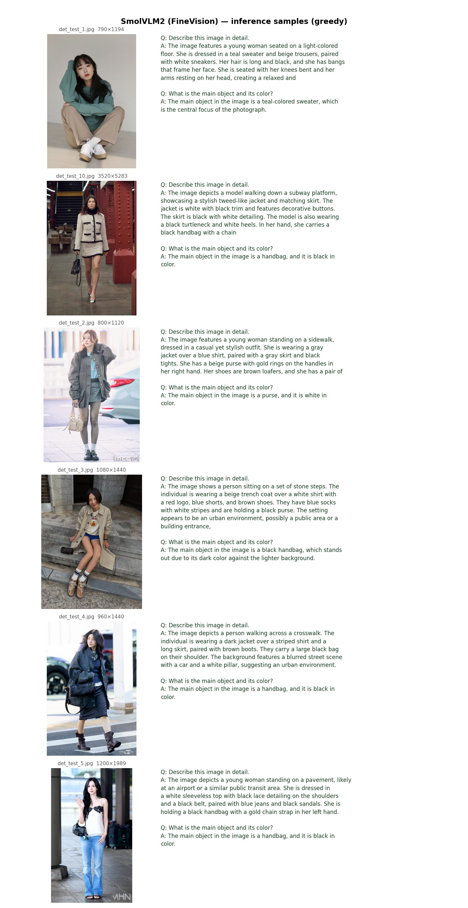

# SmolVLM2 — 코드 기반 전체 플로우

Pierrot-VLM-Lab 의 SmolVLM2 구현을 **실제 코드 흐름** 그대로 따라가는 문서다.
학습 1스텝과 추론 1회가 코드에서 어떤 함수를 어떤 순서로 통과하는지 추적한다.

> 이 저장소는 **추론 배포본**이다. 학습 스크립트(`training/`)·하이퍼파라미터(`args/`)·
> 데이터 빌더는 들어 있지 않으므로, 본문에서 그런 파일을 가리키는 링크는 학습 저장소
> [Pierrot-VLM-Lab](https://github.com/Pierrot-vision/Pierrot-VLM-Lab) 로 연결된다.

> 백본 요약: **SigLIP 비전 인코더 → 픽셀셔플 커넥터 → SmolLM2(Llama 계열) 언어 디코더**.
> PaliGemma 계열과 달리 **prefix-LM 마스크가 없다**. 채팅 템플릿(`User:`/`Assistant:`)
> 기반 **일반 causal LM** 으로, 라벨 마스킹(-100)으로 assistant(정답) 토큰에만 손실을 건다.
> 큰 이미지는 **image_size 정사각 타일 격자 + 글로벌 축소본**(Idefics3 방식)으로 나눠 본다.

---

## 0. 파일 지도

```
Pierrot_VLM/
├── args/smolvlm2.py                # 하이퍼파라미터 단일 소스 (PARAMS dict → 평탄한 args)
├── training/train_smolvlm2.py      # 학습 진입점
├── infer/infer_smolvlm2.py         # 추론 진입점
└── pierrot/
    ├── core/                          # 모델-비의존 학습 인프라 (paligemma2/nanovlm 과 공유)
    │   ├── registry.py                #   ModelSpec 인터페이스 + 레지스트리
    │   ├── engine.py                  #   Trainer (Accelerate 학습 루프)
    │   └── scheduler.py               #   warmup + cosine LR
    ├── data/                          # 공용 데이터 소스 (모델 간 공유)
    │   ├── jsonl.py                   #   JsonlDataset ({image,prefix,suffix})
    │   ├── coco.py                    #   CocoDetectionSource
    │   └── detection.py               #   DetectionPromptDataset (프롬프트 모드 인덱싱)
    └── models/smolvlm2/
        ├── config.py                  # SmolVLMVisionConfig / SmolLM2TextConfig / SmolVLM2Config
        ├── modeling/
        │   ├── vision.py              #   SigLIP 비전 인코더 (CLS 없음, 양방향)
        │   ├── connector.py           #   픽셀셔플 + 선형 투영 커넥터
        │   ├── text.py                #   SmolLM2 디코더 (RMSNorm+RoPE+GQA+SwiGLU, +KVCache)
        │   └── smolvlm2.py            #   최상위: 병합(inputs_merger) + causal forward + loss + generate
        ├── processor.py               # 타일 분할 + 챗 프롬프트 토크나이즈 + 라벨 생성
        ├── dataset.py                 # JSONL/COCO 어댑터 + collate
        ├── detection.py               # 텍스트 좌표 파싱/시각화
        ├── weights.py                 # HF Hub 다운로드 + safetensors 로드 (+HF AutoConfig 해석)
        └── spec.py                    # 레지스트리 어댑터 (@register_model "smolvlm2")
```

두 종류의 "config" 를 구분하는 것이 이해의 핵심이다:

| 종류 | 클래스 | 어디서 오나 | 무엇 |
|---|---|---|---|
| **실험 설정** | `args` (평탄 네임스페이스) | [args/smolvlm2.py](https://github.com/Pierrot-vision/Pierrot-VLM-Lab/blob/main/args/smolvlm2.py) | lr, batch, epochs, 어느 체크포인트, 동결, 타일 분할 |
| **모델 구조** | `SmolVLM2Config` 등 | 체크포인트 `config.json` (+HF AutoConfig) | hidden_size, 레이어 수, head 수, scale_factor... (자동) |

> **PaliGemma2(args/paligemma2.py) / nanovlm(args/nanovlm.py) 와 완전히 분리**되어 있다. 파일 이름이
> 전부 `_smolvlm2` 접미사를 달고, 레지스트리 이름 `'smolvlm2'` 로만 연결된다.

---

## 1. 학습 전체 플로우 (training/train_smolvlm2.py 진입 → 저장)

```
python training/train_smolvlm2.py
   │
   ├─(a) from args.smolvlm2 import args      # PARAMS → 평탄한 args
   │
   ├─(0) _preflight(args)                    # ★ 체크포인트 다운로드(수 GB) '전에'
   │       annotations·이미지 경로를 먼저 검사 (잘못된 데이터로 늦게 실패 방지)
   │
   ├─(b) spec = get_model_spec("smolvlm2")   # registry.py 에서 어댑터 조회
   │
   ├─(c) model, processor = spec.build(args) # ── 모델/프로세서 생성 (2절)
   │        args.pretrained 있으면 → 공개 가중치 로드 (파인튜닝)
   │        args.pretrained None  → 랜덤 초기화 (스크래치)
   │
   ├─(d) train_ds = spec.build_dataset(args,"train",processor)  # JSONL 또는 COCO
   │     collate  = spec.collate_fn(processor, args)            # 배치 → 텐서 (3절)
   │     train_loader = DataLoader(train_ds, collate_fn=collate, ...)
   │
   └─(e) Trainer(model, train_loader, args, ...).fit()          # Accelerate 루프 (5절)
              └─ 학습 종료 후 outputs/.../final/ 에 model.pt + config.json + tokenizer 저장
```

관련 코드: [training/train_smolvlm2.py](https://github.com/Pierrot-vision/Pierrot-VLM-Lab/blob/main/training/train_smolvlm2.py) · [spec.py](https://github.com/Pierrot-vision/Pierrot-VLM-Lab/blob/main/pierrot/models/smolvlm2/spec.py) · [engine.py](https://github.com/Pierrot-vision/Pierrot-VLM-Lab/blob/main/pierrot/core/engine.py)

---

## 2. 모델 생성 — `spec.build(args)`

[spec.py](https://github.com/Pierrot-vision/Pierrot-VLM-Lab/blob/main/pierrot/models/smolvlm2/spec.py) 의 `SmolVLM2Spec.build`:

```
args.pretrained 가 있으면 (파인튜닝/추론):
   weights.load_pretrained(args.pretrained)                    # weights.py:175
      1) resolve_model_dir()   : HF Hub id 면 snapshot_download 로 다운로드
      2) config_from_json()    : config.json → SmolVLM2Config  ★ 아래 주의
      3) build_processor()     : 토크나이저 로드 → SmolVLM2Processor (공식 longest_edge 반영)
      4) config.image_token_id = processor.image_token_id      # <image> id 일치 보장
      5) SmolVLM2ForConditionalGeneration(config)              # 스크래치 모델 인스턴스
      6) _load_state_dict()    : *.safetensors (또는 model.pt) → state_dict
         model.load_state_dict(state, strict=False)
         (tie 모델이고 lm_head.weight 누락 시에만 tie_weights)
      7) _verify_load()        : 로드 텐서 비율 출력 + 랜덤 초기화(hard missing) 방어

args.pretrained 가 None 이면 (스크래치):
   _config_from_extra(model_extra) → SmolVLM2Config (기본/오버라이드)
   _build_processor(tokenizer)     → 특수 토큰 확정 → config.image_token_id 반영
   build_model_from_config(config) → 랜덤 초기화 모델

공통 마무리:
   _apply_freezing(model, args)             # freeze_vision / freeze_projector
   if args.gradient_checkpointing: model.gradient_checkpointing_enable()
```

- **HF 키 호환**: 모듈 이름을 `model.vision_model.*` / `model.connector.*` /
  `model.text_model.layers.N.self_attn.q_proj` … 로 HF SmolVLM(Idefics3) 체크포인트와
  동일하게 맞춰 `load_state_dict(strict=False)` 로 공개 가중치가 그대로 들어간다.
- **★ config 해석 주의** ([weights.py:58](../pierrot/models/smolvlm2/weights.py#L58) `config_from_json`):
  공식 SmolVLM 체크포인트는 `config.json` 에서 **크기마다 다른 키를 생략**하고 HF 클래스
  기본값에 의존한다(256M/500M 은 vision `intermediate_size` 등, 2.2B 는 vision `hidden_size`
  등). 그래서 raw JSON 을 우리 dataclass 기본값으로 채우면 크기별로 어긋난다 →
  `model_type` 이 SmolVLM 계열이면 **HF `AutoConfig` 로 기본값까지 해석**한 뒤 매핑한다
  (`_config_from_hf`). 우리 학습 산출물(전 필드 명시, `model_type` 없음)은 raw + `_filter`.
- **크기 자동 대응**: 256M / 500M / 2.2B 를 같은 코드로 정확히 로드한다. 이미지 크기(384/512)·
  패치(14/16)·`scale_factor`·이미지 토큰 수가 모두 config 에서 자동으로 온다.
- **weight tying**: 공식 2.2B 는 `tie_word_embeddings=False` 라 `lm_head.weight` 가 실제로
  존재해 tie 경로를 타지 않는다. tie 모델(소형)에서만 임베딩 공유로 채운다.

관련 코드: [weights.py](../pierrot/models/smolvlm2/weights.py) · [config.py](../pierrot/models/smolvlm2/config.py)

---

## 3. 데이터 → 배치 플로우

### 3.1 데이터 형식 (JSONL)
```json
{"image": "images/cat.jpg", "prefix": "Describe this image.", "suffix": "A cat on a table."}
```
- `prefix`: 프롬프트(User 발화, **손실 X**)
- `suffix`: 정답(Assistant 발화, **손실 O**)

### 3.2 Dataset ([dataset.py](https://github.com/Pierrot-vision/Pierrot-VLM-Lab/blob/main/pierrot/models/smolvlm2/dataset.py))
- **jsonl**: 공용 `JsonlDataset` 을 그대로 재사용 → `{"image": PIL, "prefix": str, "suffix": str}`
- **coco(검출)**: `SmolVLM2DetectionDataset` (공용 `DetectionPromptDataset` 상속) — 3.4 참고

### 3.3 이미지 타일 분할 + 챗 프롬프트 + 라벨 ([processor.py](../pierrot/models/smolvlm2/processor.py))

`make_collate_fn` 이 배치의 각 샘플을 `processor.encode_one(image, prefix, suffix)` 로 넘기고,
`collate_encoded` 가 **우측 패딩**으로 배치를 맞춘다(causal LM 표준).

**① 이미지 타일 분할** (`process_image`, [processor.py:132](../pierrot/models/smolvlm2/processor.py#L132)):
```
원본 이미지
  → 긴 변을 size_longest_edge 로 정규화(비율 유지, 짧은 변 짝수 올림)
  → image_size 배수 격자로 올림 → n_rows × n_cols (max_splits_per_side 로 상한)
  → 각 타일을 image_size 정사각으로 crop + 마지막에 글로벌 축소본 1장
  → 각 타일 (3, size, size), /255 후 (x-0.5)/0.5 → [-1,1]
```
- 공식 SmolVLM 전처리(2단계 resize)를 재현해 공개 체크포인트 processor 와 픽셀을 맞춘다.
- 모든 타일이 정확히 정사각 → 비전 패치가 전부 유효 → **patch_attention_mask 불필요**.
- 분할 없음/작은 이미지: 글로벌 1장, `grid=(0,0)`.

**② 이미지 프롬프트 문자열** — 타일 순서와 정확히 일치하는 placeholder 배치:
```
분할:   <fake><row_1_col_1><image>×S ... <fake><row_1_col_2><image>×S ... \n
        ... (각 행) ...
        \n<fake><global-img><image>×S<fake>          ← 마지막 글로벌
단일:   <fake><global-img><image>×S<fake>
```
`S` = `image_seq_len` = 타일당 `<image>` 토큰 수.

**③ 챗 시퀀스 + 라벨** (`encode_one`):
```
User:{이미지문자열}{prefix}<end_of_utterance>\nAssistant:{suffix}<end_of_utterance>
└──────────────── prompt (labels = -100) ─────────────────┘ └── answer (labels = 정답 id) ──┘
  bos 는 맨 앞에 1개.  labels 는 미시프트(input_ids 정렬) — 시프트는 forward 가 처리(4.4).
```

`collate_encoded` 가 만들어 배치로 쌓는 텐서:

| 텐서 | 의미 |
|---|---|
| `pixel_values` (B, max_tiles, 3, H, W) | 타일 스택. 부족분은 **zero 타일**로 패딩 |
| `input_ids` (B, L) | 위 시퀀스, 우측 pad |
| `attention_mask` (B, L) | 1=유효, 0=pad |
| `labels` (B, L) | prompt/이미지/pad=-100, answer=정답 id |

- **`max_tiles`**: 배치 내 최대 타일 수. `_encode_images`(4.1)가 zero 패딩 타일을 골라내 버린다.
- **길이 초과**: `max_length` 초과 시 **절단 없이 `ValueError`** — 검출 라벨 손상을 막는다.

### 3.4 검출(detection) — 어떤 모델로 학습하나

**검출 전용 모델/head 는 없다.** 캡셔닝과 **완전히 동일한 `SmolVLM2ForConditionalGeneration`
전체 모델**([smolvlm2.py](../pierrot/models/smolvlm2/modeling/smolvlm2.py))을 그대로 파인튜닝한다.
검출은 박스를 **평문 숫자 좌표로 생성하는 텍스트 생성 태스크**일 뿐이라, 4절의 forward·
suffix-only 손실 경로를 캡셔닝과 그대로 공유한다. 캡셔닝과 **다른 것은 데이터뿐**.

> **PaliGemma2 와의 차이**: SmolVLM 토크나이저엔 `<loc>` 특수토큰이 **없다**. 그래서 좌표를
> `<locNNNN>` 토큰이 아니라 **0~999 정규 정수 평문 숫자**로 쓴다
> ([dataset.py](https://github.com/Pierrot-vision/Pierrot-VLM-Lab/blob/main/pierrot/models/smolvlm2/dataset.py) `bbox_to_text`).

**데이터 → 시퀀스 변환** ([dataset.py:33](https://github.com/Pierrot-vision/Pierrot-VLM-Lab/blob/main/pierrot/models/smolvlm2/dataset.py#L33) `SmolVLM2DetectionDataset`):
```
prefix : detect {클래스1} ; {클래스2} ; ...            (DetectionPromptDataset 이 구성)
suffix : {클래스}: x0,y0,x1,y1 ; {클래스}: x0,y0,x1,y1 ; ...
         └ 원본 W/H 대비 0~999 로 정규화한 정수 (xyxy 순서)
```
- 시퀀스 구성·라벨(-100)·손실은 3.3 과 동일 → **answer(suffix)에만** 손실이 걸린다.
- 출력(텍스트 → 박스) 역변환은 [detection.py](../pierrot/models/smolvlm2/detection.py) `parse_detections`.

**검출용 주요 설정**([args/smolvlm2.py](https://github.com/Pierrot-vision/Pierrot-VLM-Lab/blob/main/args/smolvlm2.py)):

| 키 | 의미 |
|---|---|
| `dataset_format='coco'` | Roboflow 스타일 COCO 검출 데이터 사용 |
| `detect_prompt=None` | None → 데이터셋 전체 클래스로 prefix 자동 구성 |
| `detect_prompt_mode='per_class'` | 클래스 불균형엔 per_class 권장 |
| `max_objects=20` | 객체 수 초과 이미지 skip(시퀀스 초과 방지) |
| `do_image_splitting=True` | 타일 분할(작은 객체 유리). VRAM 부족 시 축소 |

즉 **모델**은 캡셔닝과 같은 `SmolVLM2ForConditionalGeneration` 전체로, **해상도/타일**은
`pretrained` 체크포인트 config + 분할 설정으로 결정된다. 실행은 캡셔닝과 동일(`python training/train_smolvlm2.py`).

---

## 4. 모델 forward — `SmolVLM2ForConditionalGeneration.forward`

[smolvlm2.py:162](../pierrot/models/smolvlm2/modeling/smolvlm2.py#L162) 의 `forward(input_ids, pixel_values, attention_mask, labels)`:

```
(1) 텍스트 임베딩
    inputs_embeds = embed_tokens(input_ids)          # <image> 자리는 임시 임베딩   [smolvlm2.py:171]

(2) 실제 타일만 비전 → 커넥터 인코딩 (_encode_images) # [4.1]
    image_hidden = vision_model(pv) → connector(...)  # (N_real, S, D)

(3) 이미지 병합 (_merge_image_features)              # [4.2]
    <image> placeholder(S개 단위) 자리에 이미지 임베딩 블록을 순서대로 삽입 (길이 보존)

(4) position_ids (_position_ids)                     # [4.3]
    유효 토큰을 앞에서부터 0,1,2,... (pad 위치는 1)

(5) 언어 디코더 (text_model)                          # [4.4]
    hidden = SmolLM2TextModel(inputs_embeds, attention_mask, position_ids)  # (B,T,D)

(6) 손실 (labels 있을 때)                             # [4.5]
    shift 후 -100 아닌 위치(=suffix)의 hidden 만 lm_head 통과 → cross_entropy
    (전체 (B,T,V) 로짓을 만들지 않아 메모리 절약)
    return {"loss"}   /   labels 없으면 {"logits"}
```

### 4.0 텍스트와 이미지는 **별개 경로**로 인코딩된다
`SmolVLMVisionTransformer` 는 **이미지만** 인코딩한다. 텍스트는 언어 모델의 임베딩
테이블(`embed_tokens`)이 따로 처리한다. 둘은 서로 다른 경로로 인코딩된 뒤 병합된다.

```
이미지  pixel_values ─► vision_model(SigLIP) ─► connector(픽셀셔플+투영) ─┐
                        (패치 → 특징)            (S²압축 + 차원 D 로 투영)   │ 병합
                                                                            ▼ inputs_merger
텍스트  input_ids ────► embed_tokens (nn.Embedding, 언어 모델 안) ─► 텍스트 임베딩 ┘  <image> 자리에
                        (토큰 id → 벡터)                                          이미지 특징 삽입
```

각 화살표에 해당하는 `forward` 코드 라인 (`generate` 프리필도 동일 순서):

| # | 다이어그램 단계 | 코드 |
|---|---|---|
| ① | 텍스트: 토큰 id → 임베딩 | [smolvlm2.py:171](../pierrot/models/smolvlm2/modeling/smolvlm2.py#L171) `get_input_embeddings()(input_ids)` |
| ② | 실제 타일 비전 인코딩 | [smolvlm2.py:174](../pierrot/models/smolvlm2/modeling/smolvlm2.py#L174) 호출 → [구현 L97-108](../pierrot/models/smolvlm2/modeling/smolvlm2.py#L97-L108) `_encode_images` |
| ③ | 픽셀셔플 + 차원 투영 | [connector.py:60-62](../pierrot/models/smolvlm2/modeling/connector.py#L60-L62) `SmolVLMConnector.forward` |
| ④ | `<image>` 자리에 삽입 | [smolvlm2.py:175](../pierrot/models/smolvlm2/modeling/smolvlm2.py#L175) 호출 → [구현 L117-152](../pierrot/models/smolvlm2/modeling/smolvlm2.py#L117-L152) `_merge_image_features` |

> `generate`(추론)에서도 동일한 ①~④ 가 프리필 단계에 반복된다: [smolvlm2.py:220-223](../pierrot/models/smolvlm2/modeling/smolvlm2.py#L220-L223).

### 4.1 실제 타일만 인코딩 (`_encode_images`) + SigLIP 비전 인코더

`pixel_values` 는 `(B, num_images, C, H, W)` 인데, `num_images` 는 배치 정렬용으로 **최대 타일
수까지 zero 패딩**되어 있다. `_encode_images` ([smolvlm2.py:97](../pierrot/models/smolvlm2/modeling/smolvlm2.py#L97))가
**전부 0 인 패딩 타일을 골라 버리고** 실제 타일(`N_real`)만 비전+커넥터에 넣는다(HF Idefics3 규약).
정규화가 `(x-0.5)/0.5` 라 실제 픽셀은 0 이 되지 않아 zero 패딩과 안전하게 구분된다.

**SigLIP 비전 인코더** ([vision.py](../pierrot/models/smolvlm2/modeling/vision.py)):
```
타일 (N_real, 3, 384, 384)
  → Conv2d(patch=14, stride=14)  → 패치 (N_real, 729, 1152)   (384/14 → 27×27=729)
  → + 위치 임베딩 (CLS 없음)      ★ 위치 id 는 arange 가 아니라 bucketize 스킴 [아래]
  → 27 × [pre-norm 셀프어텐션(마스크 없음, 완전 양방향) + MLP(gelu-tanh)]
  → post_layernorm
  ⇒ (N_real, 729, 1152)
```
- **★ 위치 id — bucketize 스킴** ([vision.py:33](../pierrot/models/smolvlm2/modeling/vision.py#L33) `_full_grid_position_ids`):
  HF Idefics3/SmolVLM 은 가변해상도(NaFlex)용으로 위치 임베딩을 `bucketize` 로 학습했다.
  이 프레임워크는 타일을 항상 정사각(모든 패치 유효)으로 넣으므로 id 가 **상수** → 버퍼로 캐시.
  단순 `arange` 가 아니라 이 스킴을 재현해야 공개 위치 임베딩 가중치가 정확히 맞는다.

<a id="projector"></a>
### 4.2 픽셀셔플 커넥터 + 이미지 병합

**픽셀셔플** ([connector.py:45](../pierrot/models/smolvlm2/modeling/connector.py#L45) `pixel_shuffle`)

한마디로 **"인접한 `s×s` 패치를 하나로 묶어(=토큰 수 ÷s²) 대신 채널을 s²배로 늘리는"** 연산이다.
공간 정보를 버리지 않고 **토큰 축 → 채널 축으로 옮겨 담는다**.

*알고리즘* — 비전 패치는 원래 `27×27` 격자다. `s=3` 이면 `3×3` 이웃 블록을 한 칸으로 접는다:
```
 27×27 격자 (729 패치)                     9×9 격자 (81 토큰)
 ┌──┬──┬──┬─ ─ ─                          ┌─────────┬─ ─ ─
 │p0│p1│p2│                    s=3        │ p0..p8  │           각 칸 = 원래 3×3=9개 패치를
 ├──┼──┼──┤   3×3 블록  ──────────────►    │ 이어붙인 │           채널로 이어붙임
 │p3│p4│p5│   하나로 접기                   │ 한 벡터  │           → 1152 × 9 = 10368 차원
 ├──┼──┼──┤                               ├─────────┼─ ─ ─
 │p6│p7│p8│                               │  ...    │
```
```
(N_real, 729, 1152)  ─픽셀셔플(s=3)→  (N_real, 81, 1152·9=10368)  ─선형투영→  (N_real, 81, 2048)
        토큰↓ 채널유지                      토큰 ÷9, 채널 ×9                토큰 그대로, 채널→text D
```
코드는 이 "블록 접기"를 반복 루프 없이 `view/permute/reshape` 몇 번으로 처리한다(HF Idefics3 와 동일).

*왜 하나* — 고해상도 타일(+글로벌, 최대 17장)을 그대로 언어 모델에 넣으면 이미지 토큰이
`729 × 17 = 12,393` 개까지 폭발한다. 어텐션 비용은 시퀀스 길이의 **제곱**이라 감당이 안 된다.

*효과* — 타일당 토큰이 `729 → 81` (÷9) 로 줄어(2.2B 기준), 어텐션 연산·KV 캐시·메모리가 크게
준다. 그러면서 **버리는 픽셀 없이** 3×3 블록의 정보를 한 벡터 안에 모아 두므로, 뒤이은 선형
투영(`modality_projection`)이 그 압축된 표현에서 필요한 특징을 뽑아 언어 모델 차원 `D`(2048)로 맞춘다.
즉 **정보량은 유지하되 "토큰 개수"라는 비싼 축만 줄이는** 것이 픽셀셔플의 핵심이다.

**이미지 병합** ([smolvlm2.py:117](../pierrot/models/smolvlm2/modeling/smolvlm2.py#L117) `_merge_image_features`,
HF `SmolVLMModel.inputs_merger` 와 동일 로직):
- 샘플별 `<image>` 토큰을 **S개씩(=이미지 1장)** 끊어, `image_hidden_states` 블록 `(S, D)` 를
  배치 순서대로 소비하며 그 자리에 끼워 넣는다(out-of-place, `torch.cat` 로 세그먼트 재조립).
- **시퀀스 길이 보존**: `<image>` 토큰 1개 ↔ 이미지 임베딩 1행 교체.
- `<image>` 수가 S 의 배수가 아니면 `ValueError`. 텍스트 전용 샘플은 길이 0 슬라이스를 이어
  붙여 비전 인코더가 그래프에 남게 한다(분산 학습 안정).

> **PaliGemma2 와의 차이**: PaliGemma2 는 `masked_scatter` + `/sqrt(hidden)` 스케일 상쇄
> 트릭을 쓰지만, SmolVLM2 는 스케일 상쇄가 없고 세그먼트 재조립(cat)으로 타일 블록을
> 순서대로 삽입한다(다중 타일/글로벌 구조 때문).

### 4.3 position_ids — prefix-LM 마스크는 없다

SmolVLM2 는 **prefix-LM 4D 마스크가 없다**. 마스크는 언어 디코더 어텐션 안에서
`attention_mask`(1=유효/0=pad)를 **causal + padding additive bias** 로 합쳐 만든다(4.4).
`_position_ids` ([smolvlm2.py:83](../pierrot/models/smolvlm2/modeling/smolvlm2.py#L83))는 RoPE/causal
용으로 유효 토큰을 앞에서부터 `0,1,2,...` 로 센다(pad 위치는 1 로 채워 음수 인덱스 방지).

<a id="chat-template"></a>

#### 4.3.1 "챗 템플릿(일반 causal)" 이란 — 다른 두 모델과의 위치 비교

README 비교표의 `시퀀스/마스킹` 행에서 SmolVLM2 는 **`챗 템플릿 (일반 causal)`** 로 표기돼
있다. 이 행은 **같은 층위가 아니라** 두 축이 섞여 있으니 구분해서 읽어야 한다:

| 축 | 무엇을 정하나 | SmolVLM2 | PaliGemma2 | nanoVLM |
|---|---|---|---|---|
| **① 시퀀스 표기법** | role/턴을 어떤 마크업으로 쓰나 | **평문 챗 템플릿** — `User:` / `Assistant:` | `<bos>` + `\n` 구분 (role 개념 없음) | ChatML — `<\|im_start\|>` 특수토큰 |
| **② 어텐션 마스크** | 누가 누구를 볼 수 있나 | **일반 causal** | prefix-LM (4D 커스텀) | 일반 causal |

**① 표기법 — 특수토큰이 아니라 평문 role 라벨.**
nanoVLM 의 ChatML 이 `<|im_start|>user` 같은 **특수토큰**으로 role 을 박는 것과 달리,
SmolVLM2 는 Idefics3 · SmolVLM 관습대로 **그냥 텍스트 `User:` / `Assistant:`** 를 쓴다
(구분자만 `<end_of_utterance>` 특수토큰):

```
User:{이미지문자열}{prefix}<end_of_utterance>\nAssistant:{suffix}<end_of_utterance>
└──────────── prompt (labels = -100) ─────────────┘ └──── answer (labels = 정답 id) ────┘
```

`apply_chat_template` 을 호출하지 않고 [processor.py:226](../pierrot/models/smolvlm2/processor.py#L226)
에서 **f-string 으로 직접 조립**한다. 추론 시엔 `Assistant:` 까지만 만들어 넣는다(3.3, 6절).

**② 마스크 — prefix-LM 이 아닌 표준 causal (README 괄호의 의미).**
`(B,1,L,L)` 4D 마스크를 **모델에서 만들지 않는다**. 언어 디코더가 `attention_mask`(1=유효/0=pad)를
causal + padding additive bias 로 합쳐 쓸 뿐이다(4.4). 모델 최상위가 준비하는 건 `_position_ids` 뿐.

- **장점**: 밀집 prefix mask 를 들고 있을 필요가 없다. PaliGemma2 는 896에서 L≈4096+ 의
  `(B,1,L,L)` 마스크가 그 자체로 큰 메모리인데, SmolVLM2 는 그 비용이 없고 SDPA 최적화 경로를 탄다.
- **단점**: 이미지 토큰도 causal 안에 들어가 **앞쪽 타일이 뒤쪽 타일을 못 본다**. PaliGemma2 는
  이미지+프롬프트를 인코더처럼 양방향으로 열어 이미지 전체 맥락을 쓴다(그 대가가 위 마스크 비용).
- 패딩도 이 차이를 따라간다: causal LM 표준대로 **우측 패딩**(3.3). (nanoVLM 은 좌측 패딩.)

**공통점**: 세 모델 모두 **손실 마스킹 원리는 동일** — 이미지·prompt·pad = `-100`,
정답(Assistant/suffix) 토큰에만 cross-entropy([4.5]). SmolVLM2 는 labels 를 **미시프트**로
두고 시프트를 forward 가 처리한다(nanoVLM 은 데이터셋에서 미리 `roll(-1)`).

### 4.4 SmolLM2 언어 디코더 ([text.py](../pierrot/models/smolvlm2/modeling/text.py))
```
inputs_embeds (B,T,D)
  → RoPE(position_ids) → cos/sin
  → 24 × SmolLM2DecoderLayer     # 아래 prenorm 블록
  → 최종 RMSNorm
  ⇒ hidden (B,T,D)     (lm_head 는 디코더 밖에서 적용 — 손실/생성에서)
```
**SmolLM2DecoderLayer** ([text.py:180](../pierrot/models/smolvlm2/modeling/text.py#L180)) — 표준 Llama prenorm:
```
h ─┬─ input_layernorm(RMSNorm) ─ self_attn ─┬─ (+)
   └──────────── residual ───────────────────┘
h ─┬─ post_attention_layernorm(RMSNorm) ─ MLP(SwiGLU) ─┬─ (+)
   └─────────────────── residual ──────────────────────┘
```
**self_attn** (`SmolLM2Attention`, [text.py:87](../pierrot/models/smolvlm2/modeling/text.py#L87)):
- **GQA**: Q `n_heads` / KV `n_kv_heads` → `repeat_interleave` 로 KV 확장 (2.2B 는 MHA=32/32, 소형은 GQA)
- **RoPE**: Q,K 회전 (`rope_theta` 기본 130000)
- **KV 캐시**: `block_kv_cache` 로 K/V 를 시퀀스 축 concat(생성 시 재사용)
- **마스크**: pad 없으면 `is_causal=True` 로 SDPA fast path; pad 있으면 causal+padding 을
  하나의 additive bias 로 합침. 전부 pad 인 행은 **대각선(self)만 허용**해 NaN 방지.
- soft-capping **없음**(Gemma2 와 다른 점), attention bias **없음**.

**MLP** (`SmolLM2MLP`): SwiGLU — `down(silu(gate(x)) · up(x))`, bias 없음.

> **PaliGemma2(Gemma2) 와의 차이**: sandwich 4-RMSNorm·attn/final soft-capping·sliding
> window·local/global 교차가 **전부 없다**. SmolLM2 는 순수 Llama 계열(2-RMSNorm prenorm,
> 전 레이어 global causal, RoPE+GQA+SwiGLU).

### 4.5 손실 (suffix-only, 메모리 절약형)
```
shift_labels   = labels[..., 1:]                 # 다음 토큰 예측용 한 칸 시프트
keep[..., :-1] = shift_labels != -100            # 손실 걸 위치(=answer)만 True
logits_kept    = lm_head(hidden[keep])           # ★ 해당 위치 hidden 만 lm_head 통과 (N, V)
loss           = cross_entropy(logits_kept, shift_labels[shift_labels != -100])
```
labels 에서 prompt/이미지/pad 는 이미 `-100` 이라 **정답(answer) 토큰에만** 손실이 걸린다.
전체 `(B,T,V)` 로짓을 만들지 않고 **필요한 위치만** lm_head 에 통과시켜 메모리를 아낀다.
정답 토큰이 하나도 없으면 그래프 유지를 위해 `hidden.sum()*0.0` 을 반환한다.

---

## 5. 학습 루프 — `Trainer.fit` (Accelerate)

[engine.py](https://github.com/Pierrot-vision/Pierrot-VLM-Lab/blob/main/pierrot/core/engine.py). **PyTorch Lightning 미사용** — 루프를 직접 작성하되
디바이스/정밀도/누적/분산/체크포인트만 Accelerate 에 위임한다. (paligemma2/nanovlm 과 **공유**)

```
__init__:
   Accelerator(mixed_precision, gradient_accumulation_steps=grad_accum)
   optimizer = AdamW(trainable params, lr, weight_decay)
   model, optimizer, train_loader = accelerator.prepare(...)     # DDP/정밀도 래핑
   scheduler = warmup + cosine (수동 step)

fit():
   for epoch, for batch in train_loader:
      with accelerator.accumulate(model):          # grad accumulation 관리
         loss = model(**batch)["loss"]             # 4절 forward
         accelerator.backward(loss)
         if sync_gradients: clip_grad_norm_(max_grad_norm)
         optimizer.step(); optimizer.zero_grad()
      if sync_gradients:                            # 실제 업데이트 경계
         scheduler.step(); global_step += 1
         _on_step_end():  로그 / (주기적) evaluate / save_state
   저장: save_pretrained(output_dir/final)         # model.pt + config.json + tokenizer
```

- **유효 배치** = `batch_size × grad_accum × GPU수` (기본 1×16 = 16)
- `save_state()` → 재개용 전체 상태(optimizer/scheduler 포함, `checkpoint-<step>/`)
- `save_pretrained()` → 추론용 (`model.pt` + `config.json` + tokenizer)
- 재개: `args.resume_from='latest'` 시 `accelerator.load_state`
- **NaN 방어**: `abort_on_nan=True` 면 loss/grad NaN·Inf 시 즉시 중단
- **VRAM 주의**: 2.2B + vision unfreeze + 분할(최대 17타일/장)은 메모리가 크다. OOM 이면
  `freeze_vision=True` / `do_image_splitting=False` / `max_splits_per_side↓` / batch↓.

관련: [scheduler.py](https://github.com/Pierrot-vision/Pierrot-VLM-Lab/blob/main/pierrot/core/scheduler.py)

---

## 6. 추론 전체 플로우 (infer/infer_smolvlm2.py)

```
python infer/infer_smolvlm2.py --model HuggingFaceTB/SmolVLM2-2.2B-Instruct \
       --image cat.jpg --prompt "Describe this image."
   │
   ├─ load_pretrained(model, do_image_splitting/max_splits/longest_edge=PARAMS...)  # ★
   │     전처리(타일 분할)를 학습과 동일하게 — args/smolvlm2.py 값 그대로 전달
   ├─ inputs = processor([image], text=[prompt])   # suffix 없음 → labels 없음, 우측 패딩
   ├─ model.generate(...)                          # KV 캐시 autoregressive (아래)
   └─ 프롬프트 뒤 새 토큰만 tokenizer.decode → 출력 (+ --detect 시 박스 파싱/시각화)
```

> **★ 전처리 일치**: `do_image_splitting`/`max_splits_per_side`/`size_longest_edge` 를
> 학습과 똑같이 넘겨야 이미지 토큰 수가 맞는다. 안 맞추면 파인튜닝 때와 달라져 성능이 떨어진다.
> 그래서 `infer/infer_smolvlm2.py` 는 이 값을 `args/smolvlm2.py`(단일 소스)의 `PARAMS` 에서 읽는다.

`generate` ([smolvlm2.py:208](../pierrot/models/smolvlm2/modeling/smolvlm2.py#L208), 배치=1 · 패딩 없는 프롬프트 가정):
```
프리필(step 0):
   이미지 병합된 inputs_embeds → 언어 디코더 한 번 → KVCache 채움 + 마지막 위치 logits → 첫 토큰

디코드(step ≥ 1):
   새 토큰 1개만 임베딩, position=캐시 길이, kv_cache 재사용 → 다음 토큰
   greedy(argmax) 또는 top-p 샘플링, <end_of_utterance>(eos) 만나면 종료
```
`generate` 는 **전체 시퀀스**를 반환하므로, 프롬프트 길이 이후 토큰만 `decode` 한다.

---

## 7. 텐서 shape 흐름 요약 (2.2B, image_size=384, s=3 기준)

```
타일    (N_real, 3, 384, 384)
  └ SigLIP     → (N_real, 729, 1152)
  └ 픽셀셔플    → (N_real, 81, 10368)
  └ 커넥터투영  → (N_real, 81, 2048)        ─┐
텍스트  input_ids (B, T)                     │ 병합 (inputs_merger)
  └ embed      → (B, T, 2048)              ─┘ <image> 자리(S=81개/장) 교체, 길이 보존
               → SmolLM2 24층 → (B, T, 2048)
               → (suffix 위치만) lm_head → logits_kept (N, vocab)
               → CE(ignore=-100) → loss (스칼라)
```

| 이름 | 값 (SmolVLM2-2.2B) |
|---|---|
| 타일 크기 / 패치 | 384 / 14 → 타일당 패치 **729** |
| SigLIP hidden / 레이어 / 헤드 | 1152 / 27 / 16 |
| scale_factor s / 타일당 이미지 토큰 S | 3 / **81** (729//9) |
| SmolLM2 hidden / 레이어 | 2048 / 24 |
| SmolLM2 헤드 (Q/KV) | 32 / 32 (MHA) · head_dim 64 · rope_theta 130000 |
| 최대 타일 수(정사각 4×4+글로벌) | 17 → 1377 이미지 토큰 |

> 256M/500M 은 image_size=512·patch=16·s=4(타일당 64토큰)·소형 GQA 로 자동 전환된다
> (전부 config.json + HF AutoConfig 에서 온다).

---

## 8. 한눈에 보는 전체 그림

```
                 args/smolvlm2.py (PARAMS 단일 소스)
                        │  args.lr, args.pretrained, do_image_splitting, ...
        ┌───────────────┴──────────────────┐
        ▼                                   ▼
   spec.build(args)                    Trainer(args)  ── Accelerate 루프
   ├ weights.load_pretrained            └ for batch: model(**batch).loss
   │   ├ config_from_json (+HF AutoConfig)    ├ backward / clip / step
   │   └ *.safetensors → strict=False         └ save_pretrained(final)
   ├ SmolVLM2ForConditionalGeneration               │
   │   ├ vision_model (SigLIP)                       ▼
   │   ├ connector (픽셀셔플+투영)         output_dir/final/{model.pt, config.json, tokenizer}
   │   └ text_model (SmolLM2)                        │
   └ SmolVLM2Processor (타일분할+챗)                 ▼
        │                                infer/infer_smolvlm2.py: load_pretrained → generate
        └────── DataLoader(collate) ─────►  (전처리 설정을 PARAMS 로 학습과 일치)
```

**핵심 4가지** (PaliGemma2 대비 SmolVLM2 구현의 특징):
1. **prefix-LM 마스크 없음** — 챗 템플릿 기반 일반 causal LM, 라벨 마스킹으로 suffix-only 손실 ([4.3]·[4.5])
2. **이미지 타일 분할 + 글로벌** — Idefics3 방식, 실제 타일만 인코딩(zero 패딩 제거) ([3.3]·[4.1])
3. **픽셀셔플 커넥터** — 비전 시퀀스를 s² 배 압축해 이미지 토큰 수 감소 ([4.2])
4. **크기 자동 대응** — HF AutoConfig 로 256M/500M/2.2B 의 생략된 config 키까지 해석 ([2])

---

# 9. Pierrot_VLM 이식 & 학습 실험 로그 (2026-08-03 ~ 08-04)

## 9.1 이식 개요

다섯 번째 등록 모델. HuggingFace **SmolVLM(=Idefics3) 아키텍처**를 순수 PyTorch 로 재구현하고
(`pierrot/models/smolvlm2/`), 모듈/파라미터 이름을 HF 체크포인트 키와 **1:1** 로 맞춰
`load_state_dict(strict=False)` 로 공개 가중치가 바로 로드되게 했다.

- 비전 [modeling/vision.py](../pierrot/models/smolvlm2/modeling/vision.py) · 커넥터 [modeling/connector.py](../pierrot/models/smolvlm2/modeling/connector.py)
  · 텍스트 [modeling/text.py](../pierrot/models/smolvlm2/modeling/text.py) · 최상위 [modeling/smolvlm2.py](../pierrot/models/smolvlm2/modeling/smolvlm2.py)
- **정합성 검증(실제 transformers 4.56 대조)**:
  - state_dict 키 **100% 일치**(missing/unexpected 0), HF 가중치 로드 → 소형 랜덤 config forward **max diff 5.96e-08**(bit-exact)
  - **실제 256M 체크포인트 로드** 471/471 키, forward vs 공식 `AutoModelForImageTextToText` **max diff 1.85e-4 · argmax 100%** · 생성문 정상
  - 비전 **위치 id 는 arange 가 아니라 HF 의 bucketize 스킴**(NaFlex)을 재현해야 픽셀셔플 이전 특징이 일치 ([4.1] 참고)

## 9.2 코드리뷰 6라운드에서 잡은 실제 결함 ★

이식 직후 단위테스트는 통과했지만, **"기본 설정으로 학습이 시작되는가 / 공식 체크포인트가 실제로
로드되는가"** 를 파고든 반복 리뷰에서 아래 결함들이 드러났다. (단위테스트만으론 안 잡혔다 —
*실제 체크포인트를 로드해봐야* 나오는 것들)

| # | 결함 | 증상 | 수정 |
|---|------|------|------|
| 1 (Critical) | 최상위 `pad_token_id`(2.2B=128002)를 text_config 로 전파 | `nn.Embedding(vocab=49280, padding_idx=128002)` → 즉시 크래시 | [config.py](../pierrot/models/smolvlm2/config.py) 전파 제거 + text 임베딩 범위 가드 |
| 2 (Critical) | dataclass 기본값으로 생략 config 키를 채움 | 256M/500M vision `intermediate_size`·`layers` 생략(HF 기본 3072·12에 의존) → **shape mismatch 로 로드 실패** | [weights.py](../pierrot/models/smolvlm2/weights.py) `config_from_json` 이 **HF AutoConfig 로 기본값 해석** |
| 3 | 학습·추론 전처리 불일치 | 학습 max_splits=2, 추론 기본 4 → 이미지 토큰 수 달라짐 | 추론이 학습과 같은 PARAMS 전달 + **sidecar**(9.3) |
| 4 | 256M/500M 공식 `size_longest_edge`(2048) 미반영 | 타일 수가 공식과 어긋남 | preprocessor_config.json 자동 읽기 + `image_size×4` 도출 |
| 5 | RoPE cos/sin(float32)이 q·k 만 승격 | **bf16 추론에서 SDPA dtype 불일치로 죽음** | [text.py](../pierrot/models/smolvlm2/modeling/text.py) `apply_rotary_pos_embd` 가 q dtype 으로 캐스팅(HF Llama 동일) |

부수적으로 **전처리 재현성**을 위해 산출물에 `smolvlm2_preprocessor.json`(sidecar)을 저장하고
(엔진 훅 + [processor.py](../pierrot/models/smolvlm2/processor.py) `save_preprocessor_config`), 로드 시
**① CLI 명시 → ② sidecar → ③ 공식 preprocessor → ④ 안전 기본값** 우선순위로 복원한다.
→ Hub repo id 로 올린 파인튜닝 모델도 다운로드 후 sidecar 로 학습 전처리가 자동 복원된다.

## 9.3 학습 설정 (`args/smolvlm2.py`)

- **`pretrained = HuggingFaceTB/SmolVLM2-2.2B-Instruct`** — ★ **공식 base 가중치에서 시작해 파인튜닝**.
  (nanoVLM 이 백본+랜덤 커넥터로 "밑바닥 학습"인 것과 달리, SmolVLM2 는 **완성된 base 의 FT**다. "from scratch"
  는 *모델 코드 재구현*을 뜻하지 가중치 랜덤 초기화가 아니다.)
- 데이터 **FineVision**(멀티턴 챗, `turns` → `encode_chat` 로 한 시퀀스 패킹), dtype `float32`,
  `do_image_splitting=True`, `max_splits_per_side=2`(최악 5타일), `size_longest_edge` 자동(2.2B=1536)
- **12000 step / 5 epoch** 완주. train_loss **1.0 → 0.53**, eval_loss **1.0 → 0.931**(단조 하강, 과적합 없음)



## 9.4 평가 하니스 — MMStar (nanoVLM 것 재사용)

[eval/eval_smolvlm2_bench.py](../eval/eval_smolvlm2_bench.py) — nanoVLM 의 MMStar 하니스를 SmolVLM2 API
(`pixel_values`/`generate(do_sample=False)`)에 맞춘 것. **likelihood 모드**(선택지 글자별 첫 답토큰
로그확률 argmax)가 기본. `--max-splits-per-side` 로 타일 해상도 통제.

## 9.5 결과 요약 — MMStar (n=1500, likelihood)

전부 **같은 harness**(우리 코드, likelihood)로 측정 — ours vs 공식 base 를 공정 비교한다.

| 모델 | 초기화 | MMStar 전체 |
|---|---|---|
| **SmolVLM2 2.2B (ours)** | 공식 base + FineVision FT | **43.13%** (647/1500) |
| SmolVLM2 2.2B (base) | 공식 원본 `HuggingFaceTB/SmolVLM2-2.2B-Instruct` | 42.40% (636/1500) |
| **nanoVLM 450M (ours)** | 백본 + 랜덤 커넥터 → FineVision 학습 | 34.20% (513/1500) |
| nanoVLM 450M (base) | 공식 원본 `lusxvr/nanoVLM` | 37.53% (563/1500) |
| — random(4지선다) | — | 25% |

**SmolVLM2 개별 비교(ours vs base):**



> 4모델 통합 비교(nanoVLM 포함)는 [README](https://github.com/Pierrot-vision/Pierrot-VLM-Lab/blob/main/README.md#-통합-평가--mmstar-ours-vs-공식-base) 참고.

- **모델 크기 순으로 정렬**되고(2.2B ~43% > 450M ~35% > 랜덤 25%), 카테고리 프로파일 일관(지각·instance 강, math·science 약).
- **SmolVLM2: ours(43.1) ≥ base(42.4)** — base 파인튜닝이 안 망가지고 소폭 개선. **우리 재구현 코드로 base 를 돌려도 42.40%** 라 코드 충실성도 뒷받침.
- **nanoVLM: ours(34.2) < base(37.5)** — 우리 "백본+랜덤커넥터 → FineVision 12k step" 학습이 공식 nanoVLM 레시피(데이터·스텝·튜닝)에 아직 ~3.3점 못 미친다. 정직한 격차이자 다음 개선 여지.
- **해상도 탓 아님 확인**(SmolVLM2): max_splits **2→4** 로 올려도 ours 43.13→43.60, base 42.40 그대로.
- 공식 발표 ~46%(2.2B)와의 ~3점 차 = **평가 프로토콜 차이**(likelihood+자체 프롬프트 vs 공식 generation). base 조차 우리 harness 에선 42.4% 로 내려가므로 **차이는 harness, 결론은 공정**.
- **함정(수정함)**: 공식 nanoVLM safetensors 는 **tie 된 임베딩을 dedup**(`decoder.head.weight`만 저장)해 우리 strict 로더가 `token_embedding.weight` 누락으로 거부했다 → [nanovlm/weights.py](../pierrot/models/nanovlm/weights.py) 에서 로드 전 임베딩 미러링으로 수정.

## 9.6 "base 파인튜닝인데 왜 +0.7% 뿐인가"

학습은 건강했다(loss 매끄러운 하강, 발산·망각 없음). 미미한 MMStar 상승은 **예상된 결과**:
1. **base 가 이미 유사 데이터로 instruct-튜닝됨** — FineVision 은 그 SFT 믹스와 상당히 겹쳐 새 신호가 적다.
2. **MMStar 는 FineVision 의 타깃이 아님** — 광범위 캡션/VQA/OCR SFT 는 "어려운 시각추론" 벤치를 직접 올리지 않는다(객관식 학습도 거의 없음).
3. **harness 가 범위를 압축**(9.5).

→ 파인튜닝의 실제 이득은 **캡션/지시따르기·FineVision 류 과제**에서 나오며, MMStar 는 그걸 측정하지 못한다.
MMStar 를 올리려면 광범위 캡션이 아니라 **추론/객관식 중심 데이터**가 필요.

## 9.7 정성 샘플 — 자유형 캡션/VQA

[eval/infer_smolvlm2_viewer.py](../eval/infer_smolvlm2_viewer.py) 로 생성. 옷·색·자세·소품까지
**세밀하고 일관된 묘사**(간혹 색상 오류만). 파인튜닝의 이득이 여기서 정성적으로 드러난다.



## 9.8 산출물 & 재현

```bash
# 학습(2.2B FT) — args/smolvlm2.py 단일 소스
/home/ubuntu/miniforge3/envs/flux2/bin/python training/train_smolvlm2.py
# MMStar 평가(전체 1500, likelihood) → results/smolvlm2/*.json/.html
python eval/eval_smolvlm2_bench.py --ckpt outputs/smolvlm2_finevision/final --device cuda:0
# 공식 base 대조
python eval/eval_smolvlm2_bench.py --ckpt HuggingFaceTB/SmolVLM2-2.2B-Instruct --device cuda:1
# 결과 JPG(loss/추론/MMStar) — pt210_py312(matplotlib)
/home/ubuntu/miniforge3/envs/pt210_py312/bin/python3 tools/render_smolvlm2_jpg.py --res-dir results/smolvlm2
/home/ubuntu/miniforge3/envs/pt210_py312/bin/python3 tools/render_mmstar_compare.py   # 모델 비교
```

## 9.9 남은 과제

- **nanoVLM ours(34.2) < 공식 base(37.5)** — 우리 밑바닥 학습이 공식 레시피에 못 미침. 데이터/스텝/LR 재검토로 격차를 좁힐 여지(공식 base 비교는 tie-dedup 수정 후 가능해짐).
- SmolVLM2 의 MMStar 를 실제로 올리려면 광범위 캡션이 아니라 **추론/객관식 중심 데이터**로 재파인튜닝(현재는 광범위 SFT).
- `generate` 모드 MMStar / FineVision held-out 지표로 파인튜닝 이득 재확인(캡션 품질은 정성적으로 확인됨).
