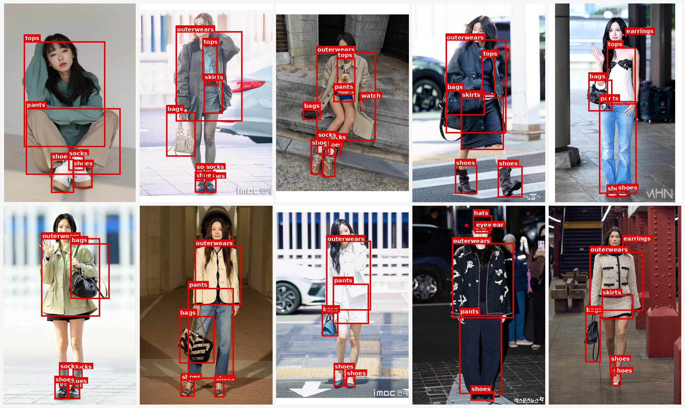
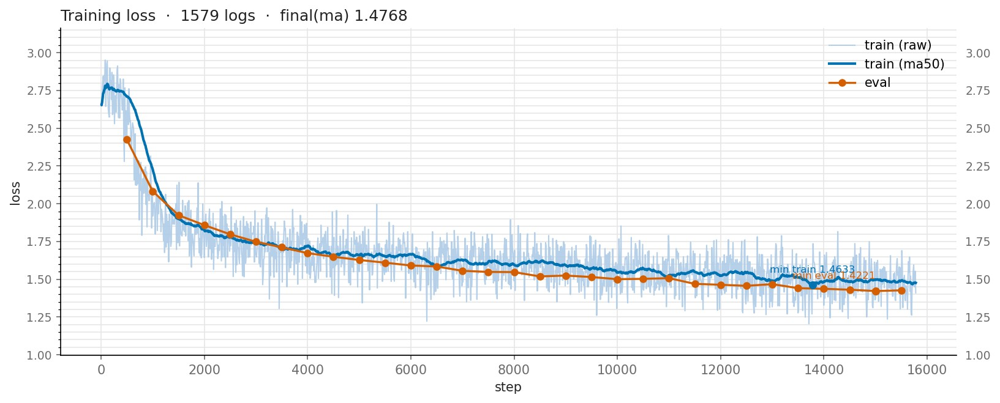
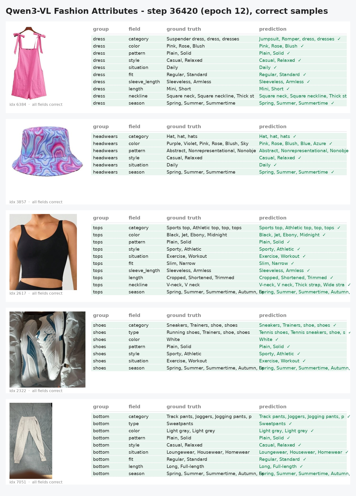
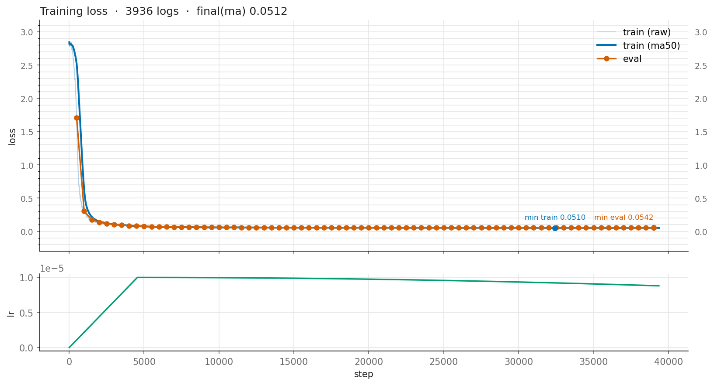
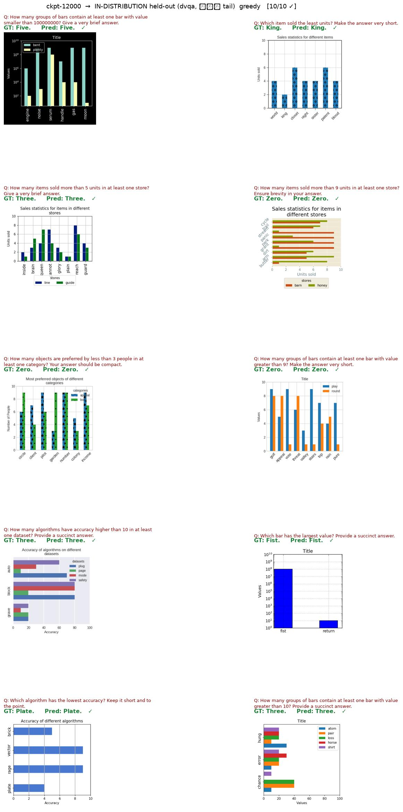
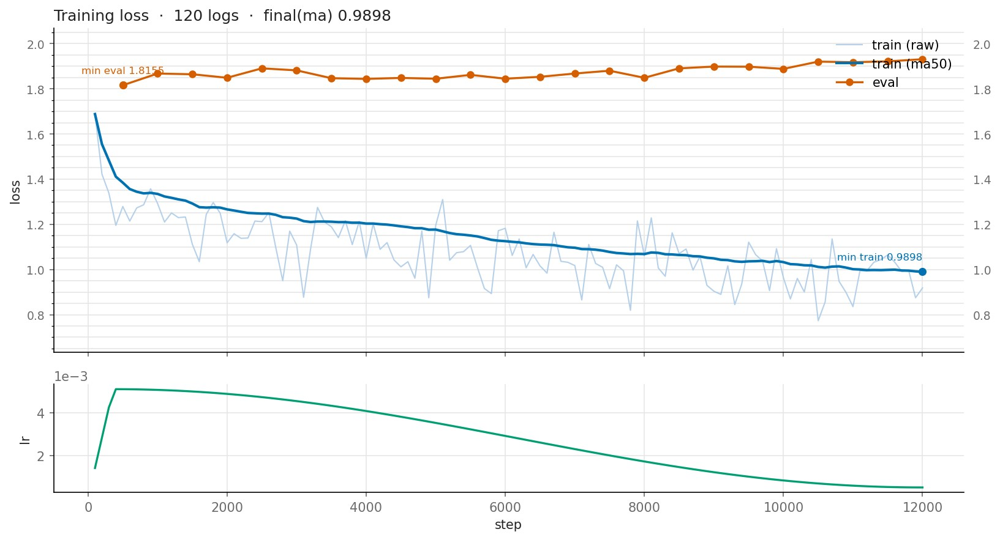
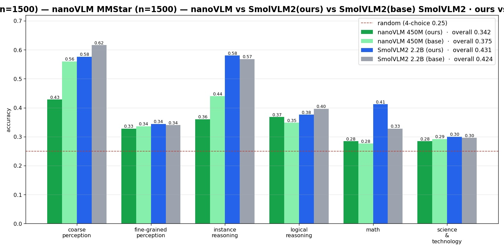

<h1 align="center">🔮 PIERROT VLM</h1>

<p align="center">
  <b>PyTorch VLM research framework</b>
</p>

<p align="center">
  
  
  
  
  
  
  
</p>

<p align="center">
  <a href="README.md">한국어</a> | <b>English</b>
</p>

---

## 💡 Introduction

**PIERROT VLM** is a one-person **VLM (vision-language model)** research and development project,
and this repository is the **inference distribution** for the models that finished training.

**PIERROT VLM** is where I reproduce, adapt, and push on leading VLM algorithms — and try out my
own ideas. [VLM-OCR](https://github.com/Pierrot-vision/Pierrot-VLM-OCR) lives in its own separate
place.

> **Origin of the name** — Pierrot is originally a pantomime clown character who **mimics and
> imitates others**. It resonates with [Pierrot Universe](https://github.com/Pierrot-vision)'s first
> philosophy (MimiC) — following and combining the good parts of existing research — which is why we use this name.

* The training code and trained weights are not publicly released at this time.

## 📰 News

- 2026-08-22 — 🚀 **Inference code released** (PaliGemma2 · nanoVLM · SmolVLM2 · Qwen3-VL · Qwen3.5)
- 2026-08-04 — 📊 Published **MMStar combined evaluation** (reimpl vs official base)
- 2026-08-04 — 🔵 Published **SmolVLM2 (FineVision)** training results
- 2026-08-01 — 🟢 Published **nanoVLM (FineVision)** training results
- 2026-07-29 — 🟣 Published **Qwen3-VL (Fashion Attribute)** results
- 2026-07-28 — 🧩 Added **Qwen3.5-4B** (5th model)
- 2026-07-28 — 🎯 Published **PaliGemma2 (Detection)** results
- 2026-07-24 — 🟣 Added **Qwen3-VL** (4th model)
- 2026-07-23 — 🟩 Added **SmolVLM2** (3rd model)
- 2026-07-22 — 🚀 **First release** (PaliGemma2 · nanoVLM)

---

## 🧩 Supported Models

All five have their **model code written from scratch in pure PyTorch**, with module and parameter
names matched to the public checkpoints so `load_state_dict` just works. Each model's package,
entrypoint, and config are **fully separated** from the others.

| | **PaliGemma2** | **nanoVLM** | **SmolVLM2** | **Qwen3-VL** | **Qwen3.5** |
|---|---|---|---|---|---|
| Vision encoder | SigLIP-So400m | SigLIP2 ViT | SigLIP | Dynamic-res ViT | Dynamic-res ViT |
| Language model | [Gemma 2 — 4 norms · local/global alternating · soft-cap](LAB/paligemma2.md#decoder) | [SmolLM2 — RMSNorm·RoPE·GQA·SwiGLU](LAB/nanovlm.md#decoder) | [SmolLM2 — same family](LAB/smolvlm2.md#decoder) | [Qwen3 — **QK-Norm** · interleaved M-RoPE](LAB/qwen3vl.md#decoder) | [Qwen3.5 hybrid — **Gated DeltaNet 3:1**](LAB/qwen35.md#decoder) |
| Projector | [Linear](LAB/paligemma2.md#projector) | [Pixel-shuffle](LAB/nanovlm.md#projector) | [Pixel-shuffle](LAB/smolvlm2.md#projector) | [Patch merger](LAB/qwen3vl.md#projector) | [Patch merger](LAB/qwen35.md) |
| Sequence | [`<bos>`+`\n`](LAB/paligemma2.md#prefix-lm) | [ChatML](LAB/nanovlm.md#chatml) | [Chat template](LAB/smolvlm2.md#chat-template) | [ChatML](LAB/qwen3vl.md) | [ChatML](LAB/qwen35.md) |
| Attention mask | [prefix-LM](LAB/paligemma2.md#prefix-lm) | plain causal | plain causal | plain causal | plain causal |
| Layers (vision/text) | 27 / 26 | 12 / 32 | 27 / 24 | 24 / 28 | 24 / 32 |
| Parameters | ~3B | ~450M | 256M/500M/2.2B | ~2B | ~4B |
| Weight memory | ~6 GB | ~0.9 GB | ~0.5/1/4.4 GB | ~4 GB | ~8 GB |
| Image tokens | fixed (896→4096) | dynamic tiles (64/tile) | dynamic tiles | no tiling (dynamic) | no tiling (dynamic) |

---

## ✅ Verified

Models actually put through training and experiments. **Qwen3.5 is a from-scratch port only** —
it has not been used in a training run or experiment yet.

- [x] **paligemma2**
- [x] **nanovlm**
- [x] **smolvlm2**
- [x] **qwen3vl**
- [ ] **qwen35**

---

## 📊 Results

Training and experiments happened in the training repo; what follows are the results you can
reproduce through this distribution's inference path. For the design notes and failures, see the
[LAB notes](#-lab-notes).

### 🎯 PaliGemma2 — Detection

10 unseen images, `per_class` inference:



> Resource constraints meant we **stopped mid-training once feasibility was confirmed** — these are the results from that point.

**Training curve** — fine-tuning with negative samples included:



### 🟣 Qwen3-VL — Fashion attribute recognition

**Predictions (GT vs Prediction)**



**Training curve**



### 🟢 nanoVLM — FineVision from-scratch training

Held-out from the training distribution (unseen dvqa tail), greedy:



> Trained from the backbones (SigLIP2 + SmolLM2) from scratch for 12,000 steps on 18 FineVision
> subsets (with multi-turn packing and the overfitting fix applied). Near-perfect in-distribution
> (dvqa held-out 10/10); commonsense reasoning (aokvqa, OOD) is weak because it is absent from the
> training mix — see [LAB/nanovlm.md](LAB/nanovlm.md) §10 for the diagnosis.

**Training curve** — train loss / token accuracy (full 12,000 steps):



### 🔵 SmolVLM2 — FineVision fine-tuning

Free-form captioning/VQA, greedy:


> Fine-tuned on FineVision (12,000 steps) starting from the official `SmolVLM2-2.2B-Instruct`
> weights — detailed, consistent descriptions down to clothing, color, pose, and props. ("From
> scratch" here means the **model code was reimplemented**; the weights start from the official
> base, so this differs in character from nanoVLM's ground-up training.)

**Training curve** — train / eval loss (full 12,000 steps):


### 📊 Combined evaluation — MMStar (ours vs official base)

Both reimplemented models compared against the official originals under an **identical harness**
(likelihood, n=1500). Reproducible here with [eval/eval_nanovlm_bench.py](eval/eval_nanovlm_bench.py)
and [eval/eval_smolvlm2_bench.py](eval/eval_smolvlm2_bench.py).



| Model | Initialization | MMStar |
|---|---|---|
| **SmolVLM2 2.2B (ours)** | official base + FineVision FT | **43.1%** |
| SmolVLM2 2.2B (base) | official `SmolVLM2-2.2B-Instruct` | 42.4% |
| nanoVLM 450M (base) | official `lusxvr/nanoVLM` | 37.5% |
| **nanoVLM 450M (ours)** | backbones + random connector → FineVision | 34.2% |
| random (4-way multiple choice) | — | 25% |

- **SmolVLM2**: fine-tuned from the official base, so **ours (43.1) ≥ base (42.4)** — and running the base through *our* reimplementation also gives 42.4%, which backs up the code's fidelity.
- **nanoVLM**: **ours (34.2) < base (37.5)** — the gap comes from **data** (base = all of FineVision, 24M samples across 200+ sources, vs ours = 18 sources, ~1M). Details in [LAB/nanovlm.md](LAB/nanovlm.md) §10.17.

---

## 📦 Installation

```bash
# 1) Create · activate a conda environment
conda create -n pierrot-infer python=3.10 -y
conda activate pierrot-infer

# 2) Install dependencies
cd Pierrot-VLM
pip install -r requirements.txt
```

---

## 🔮 Inference

`--model` accepts both a **HF Hub id** and a **local training output (`final/`)**. If omitted, the
default checkpoint from [infer/defaults.py](infer/defaults.py) is used.

```bash
# ── PaliGemma2 ──
# Run straight off the public pretrained model
python infer/infer_paligemma2.py --model google/paligemma2-3b-pt-224 \
    --images cat.jpg --prompt "caption en"
# Detection: parse loc tokens into boxes + save visualization (<name>_pred.jpg)
python infer/infer_paligemma2.py --model ./outputs/paligemma2_ft/final --images img.jpg \
    --prompt "detect earrings ; necklaces ; watch" --detect --save-dir preds

# ── nanoVLM ──
python infer/infer_nanovlm.py --model lusxvr/nanoVLM-450M --image img.jpg --prompt "What is this?"

# ── SmolVLM2 ──
python infer/infer_smolvlm2.py --model HuggingFaceTB/SmolVLM2-2.2B-Instruct \
    --image img.jpg --prompt "Describe this image."

# ── Qwen3-VL ──
python infer/infer_qwen3vl.py --model Qwen/Qwen3-VL-2B-Instruct --image img.jpg --prompt "What is this?"
# Detection: parse text coordinates into boxes + save visualization
python infer/infer_qwen3vl.py --model ./outputs/qwen3vl_ft/final --image img.jpg \
    --prompt "detect earrings ; necklaces ; watch" --detect --save-viz out.jpg
# Fashion attributes (per-region JSON): restores roi to pixel coordinates
python infer/infer_qwen3vl.py --model ./outputs/qwen3vl_fashion/final --image img.jpg --fashion

# ── Qwen3.5 ──
python infer/infer_qwen35.py --model Qwen/Qwen3.5-4B --image img.jpg --prompt "What is this?"
```

**Key per-model flags**

| Flag | Models | Description |
|---|---|---|
| `--detect` / `--save-viz` | paligemma2 · smolvlm2 · qwen3vl | Parse coordinate output into boxes and draw them |
| `--fashion` | qwen3vl | Parse fashion-attribute JSON + restore roi (0–999) to pixels |
| `--max-pixels` / `--min-pixels` | qwen3vl · qwen35 | Image token budget (≈ `max_pixels`/1024 tokens) |
| `--max-splits-per-side` | smolvlm2 | Max tiles per side (small-object detail ↔ sequence length) |
| `--dtype` | all | `bfloat16` (default) / `float16` / `float32` |

> ⚠️ **Preprocessing must match training.** The knobs that decide the image token count (`max_pixels`
> for the Qwen family, tile splitting for SmolVLM2) change the sequence layout, and quality drops if
> they differ from training. Training outputs ship these values in a sidecar
> (`<model>_preprocessor.json`) that is **inherited automatically**, so it is safest not to override
> them on the CLI.

### Straight from Python

```python
from PIL import Image
from pierrot.models.qwen3vl import load_pretrained

model, processor = load_pretrained("Qwen/Qwen3-VL-2B-Instruct", device="cuda")
model.eval()

enc = processor(images=[Image.open("img.jpg").convert("RGB")], text=["Describe this image."])
enc = {k: v.to("cuda") for k, v in enc.items()}
out = model.generate(enc["input_ids"], enc["pixel_values"], enc["image_grid_thw"],
                     enc["attention_mask"], max_new_tokens=200,
                     eos_token_id=processor.eos_token_id)
print(processor.tokenizer.decode(out[0][enc["input_ids"].shape[1]:], skip_special_tokens=True))
```

---

## 📈 Evaluation

MMStar multiple-choice accuracy through a **self-contained harness** (no lmms-eval). The default
`likelihood` mode compares the log-probability of each option letter, so a verbose model is still
scored fairly.

```bash
# nanoVLM (default: all 1500 MMStar val questions)
python eval/eval_nanovlm_bench.py --ckpt lusxvr/nanoVLM-450M
python eval/eval_nanovlm_bench.py --ckpt ./outputs/nanovlm_mix/final --limit 200   # smoke test

# SmolVLM2
python eval/eval_smolvlm2_bench.py --ckpt HuggingFaceTB/SmolVLM2-2.2B-Instruct

# SmolVLM2 free-form inference → single large-font HTML viewer (images embedded)
python eval/infer_smolvlm2_viewer.py --model ./outputs/smolvlm2_finevision/final \
    --glob 'images/*.jpg' --limit 6
```

**Numerical parity against the official implementations** (opt-in; downloads public weights):

```bash
python tools/parity_qwen3vl.py     # needs transformers>=4.57
python tools/parity_qwen35.py      # needs transformers>=5.1
```

They compare four stages in order — preprocessing (input_ids · grid · pixel_values), vision tower
output, full-forward logit argmax, and greedy generation — and exit non-zero if any stage diverges.

---

## 📁 Directory Structure

```
Pierrot-VLM/                    # repository root (git clone directory)
├── infer/                      # ★ per-model inference entrypoints
│   ├── defaults.py             #   single source for inference defaults (checkpoint · dtype · pixel budget)
│   ├── infer_paligemma2.py     #   detection (loc tokens) · GT comparison · per-step logs
│   ├── infer_nanovlm.py
│   ├── infer_smolvlm2.py
│   ├── infer_qwen3vl.py        #   detection + fashion attributes (JSON · roi restore)
│   └── infer_qwen35.py
├── eval/                       # benchmarks · viewer
│   ├── eval_nanovlm_bench.py   #   MMStar accuracy (likelihood/generate)
│   ├── eval_smolvlm2_bench.py  #   same, on the SmolVLM2 API
│   └── infer_smolvlm2_viewer.py#   free-form inference → single HTML viewer
├── tools/
│   ├── parity_qwen3vl.py       # numerical parity vs official HF implementation (opt-in)
│   └── parity_qwen35.py
├── requirements.txt
├── LAB/                        # five experiment notes (see below)
├── docs/images/                # figures for LAB · README
└── pierrot/
    └── models/                 # algorithm packages (inference path only)
        ├── paligemma2/         #   SigLIP-So400m + linear projector + Gemma2
        │   ├── config.py       #     SigLIP/Gemma2/PaliGemma2 config (1:1 with HF config.json)
        │   ├── modeling/       #     siglip · gemma2 · projector · paligemma2 (prefix-LM + generate)
        │   ├── processor.py    #     image preprocessing + <image> placeholder prompt
        │   ├── detection.py    #     loc-token parsing & visualization
        │   └── weights.py      #     HF Hub download + safetensors loading
        ├── nanovlm/            #   SigLIP2 ViT + pixel-shuffle + SmolLM2
        │   ├── transforms.py   #     dynamic resize + tile splitting (+global tile)
        │   └── ...
        ├── smolvlm2/           #   SigLIP + pixel-shuffle connector + SmolLM2 (Idefics3-style tiling)
        ├── qwen3vl/            #   dynamic-res ViT + DeepStack + patch merger + Qwen3 (M-RoPE)
        └── qwen35/             #   dynamic-res ViT + Gated DeltaNet 3:1 hybrid decoder
```

Unlike the training distribution, there is no `args/`, `training/`, `pierrot/core` (Accelerate
engine), `pierrot/data`, or per-model `dataset.py` / `spec.py`. Training paths — loss computation,
activation checkpointing, parameter groups — are also gone from the model code. **Inference numerics
are identical to the training repo.**

---

## 🧪 LAB Notes

Per-model design, code flow, and experiment records. They document the **traps and failures**, not
just the wins.

| Document | Contents |
|---|---|
| [LAB/paligemma2.md](LAB/paligemma2.md) | prefix-LM mask · linear projector · **detection training experiment** (negative samples fixing false positives) |
| [LAB/nanovlm.md](LAB/nanovlm.md) | pixel shuffle · tiling · **5-way port review · multi-turn packing fix · overfitting · eval-set diagnosis** |
| [LAB/smolvlm2.md](LAB/smolvlm2.md) | Idefics3 tiling · **6-way review · pad/config/RoPE traps · MMStar evaluation** |
| [LAB/qwen3vl.md](LAB/qwen3vl.md) | dynamic resolution · DeepStack · M-RoPE · **fashion attribute training experiment** |
| [LAB/qwen35.md](LAB/qwen35.md) | [Gated DeltaNet **3:1 hybrid** decoder](LAB/qwen35.md#하이브리드-배치--4층마다-하나만-full-attention) from scratch · chunked + recurrent implementations · **1:1 tensor verification against the official checkpoint** |

Links in those documents that point at `args/`, `training/`, or `tools/build_*` resolve to the
**training repository** [Pierrot-VLM-Lab](https://github.com/Pierrot-vision/Pierrot-VLM-Lab) — those files
are not part of this distribution.

---

## 📚 Reference

Paper notes · reviews → [Pierrot-vision/Reading-Papers — VLM](https://github.com/Pierrot-vision/Reading-Papers#-vlm)

- **[Pierrot-VLM-Lab](https://github.com/Pierrot-vision/Pierrot-VLM-Lab)** — training repository (full code)
- **[Pierrot-VLM-OCR](https://github.com/Pierrot-vision/Pierrot-VLM-OCR)** — document parsing (OCR) inference distribution

---

## 📄 License

This project (code · documentation) is licensed under **CC BY-NC-SA 4.0** — Attribution · NonCommercial · ShareAlike. See [LICENSE](LICENSE) for details. (Third-party datasets · models · libraries used remain under their own licenses.)

> ⛔ **NonCommercial** — for non-commercial use only. Please contact us separately if you need commercial use.

---

## 📮 Contact

- Please reach out via [email](mailto:peternara@naver.com) or a [GitHub Issue](https://github.com/Pierrot-vision/Pierrot-VLM/issues). We will answer as best we can.
- That said, please understand that we may not respond to questions already answered on GitHub (README · code · docs).
